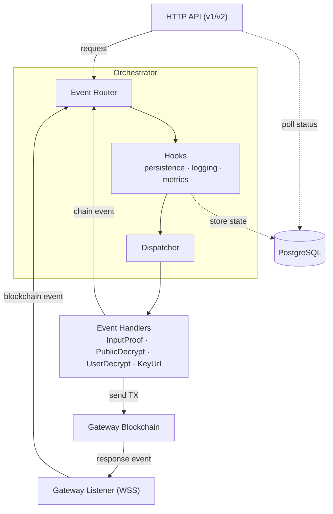

# FHEVM Relayer Service

The FHEVM (Fully Homomorphic Encryption Virtual Machine) Relayer is the bridge between FHEVM host chains (e.g. Ethereum) and the Gateway.

It exposes the following capabilities:

- **Public Decryption**: Relay HTTP public decryption requests and return plaintext responses.
- **Input Proof Verification**: Relay HTTP input-proof verification requests and return validity attestations.
- **User Decryption**: Relay HTTP user decryption requests to re-encrypt data under a user-provided public key (with ciphertext-handle access control).
- **Key Material**: Expose key material URLs (FHE public key and CRS URLs).

## Table of Contents

- [Architecture](#architecture)
- [Project Structure](#project-structure)
- [Prerequisites](#prerequisites)
- [Getting Started](#getting-started)
  - [Run the relayer test suite](#run-the-relayer-test-suite)
  - [Devnet & Testnet](#devnet--testnet)
  - [Local Stack](#local-stack-recommended-for-testing-version-releases-only)
- [API Endpoints](#api-endpoints)
- [Observability Policy](#observability-policy)
- [Troubleshooting](#troubleshooting)

## Architecture

The system follows an event-driven architecture with these key components:

- **Orchestrator**: Central coordinator for event flow and handling
- **Gateway listeners/handlers**: Listen and process gateway events
- **HTTP Handlers**: Process v1/v2 API requests
- **SQL Repositories**: Persist request state and support status polling
- **Transaction Engine + Throttlers**: Reliable TX management and backpressure
- **Metrics + Tracing**: Runtime observability for APIs, queues and blockchain flows



## Project Structure

```text
src
├── bin/                     # Binary entry points
│   └── fhevm-relayer.rs     # Main relayer service binary
├── config/                  # Configuration loading and validation
├── core/                    # Core domain events, IDs, and shared types
├── gateway/                 # Gateway listeners, handlers, and tx engine
│   ├── arbitrum/            # Arbitrum listener and transaction processing
│   └── readiness_check/     # Readiness-check processing pipeline
├── http/                    # HTTP server, API handlers, and middleware
│   ├── admin/               # Runtime admin endpoints
│   ├── endpoints/           # API implementations (common, v1, v2)
│   ├── middleware/          # OpenAPI/docs and request middleware
│   ├── retry_after/         # Dynamic Retry-After estimation
│   └── utils/               # Parsing and validation helpers
├── logging/                 # Structured logging helpers
├── metrics/                 # Prometheus metrics and dashboard docs
├── orchestrator/            # Event orchestration system
├── store/sql/               # SQL models and repositories
├── lib.rs                   # Library entry point
├── startup.rs               # Service startup wiring
├── startup_recovery.rs      # Startup recovery orchestration
└── tracing.rs               # Tracing initialization

relayer-migrate/             # Separate crate: DB migrations with connection retry and rollback support
config/local.yaml.example    # Local config template
dev/docker-compose.yaml      # Local Postgres compose
tests/                       # Integration and API tests
test-support/                # Test helpers (e.g. Ethereum RPC mock)
docs/                        # Supplemental project documentation
design-docs/                 # Design and architecture notes
openapi-current.yaml         # Current OpenAPI specification
openapi-async-design.yaml    # Async OpenAPI design draft
Makefile                     # Test, lint, and migration helpers
```

## Prerequisites

- Rust toolchain + Cargo
- Docker + Docker Compose v2 (used for local Postgres and optional full-stack deployment)
- PostgreSQL (provided via `dev/docker-compose.yaml`; required for integration tests and local runs)
- Node.js + npm (required for `make api-lint`)
- Gateway chain information (for Devnet/Testnet/production)
  - RPC endpoints (HTTP, WSS)
  - Chain ID
  - Contract addresses: Decryption, InputVerification

### Configuration

Configuration is handled via:

- YAML file (`config/local.yaml` by default if present)
- Optional CLI config file (`--config-file`)
- Environment variables with `APP_` prefix and `__` for nesting (override file values)
  - Example: `APP_GATEWAY__BLOCKCHAIN_RPC__HTTP_URL=https://rpc.example.org`

## Getting Started

For the relayer to work properly (outside unit and integration tests), it must be connected to the Zama protocol. Available options are:

- Connecting your local relayer instance to a deployed test environment (Devnet, Testnet)
- Running the complete Zama protocol locally (with the `fhevm-cli` from the fhevm repository)

For active development, connecting to an existing test environment (Devnet or Testnet) is recommended.

### Run the relayer test suite

For testing, linting, and formatting, a Makefile is available:

```bash
# Display all available commands
make help

# Quick development loop
make test-unit                    # Fast unit tests (no Postgres required)
make clippy                       # Lint checks
make fmt                          # Format checks
```

To run the full relayer test suite, complete:

- [Start local Postgres](#shared-start-local-postgres)
- [Run DB migrations](#shared-run-db-migrations)

Now you can run all available tests:

```bash
make test-all-no-long-running
```

When done, run [Stop local Postgres](#shared-stop-local-postgres).

### Devnet & Testnet

#### Update relayer configuration

##### Pre-built template - Recommended

To configure the relayer for Devnet or Testnet, use the pre-built templates `local.devnet.yaml` and `local.testnet.yaml` available on the Notion page [**Relayer Devnet/Testnet Configuration Templates**](https://www.notion.so/zamaai/Relayer-Devnet-Testnet-Configuration-Template-3095a7358d5e803e94d4d0d52efd9252?source=copy_link).

<details>
<summary>Manual setup - Not Recommended</summary>

You can still create your own environment specific config from `config/local.yaml.example`.

```bash
cp config/local.yaml.example config/local.devnet.yaml
# or
cp config/local.yaml.example config/local.testnet.yaml
```

If you choose manual setup, fill the environment-specific values listed below.
Stable constants are provided inline; sensitive or rotatable values must be sourced from the referenced external systems.

##### Devnet (chain ID: 10900)

| Field                                          | Value                                                                                                                                                                 |
| ---------------------------------------------- | --------------------------------------------------------------------------------------------------------------------------------------------------------------------- |
| `gateway.blockchain_rpc.http_url`              | See Notion ["Blockchain Accesses"](https://www.notion.so/zamaai/Blockchain-Access-1a55a7358d5e807d9711d80f9b19bb99?source=copy_link#25c5a7358d5e8099b532e967fe3e82c4) |
| `gateway.blockchain_rpc.read_http_url`         | See Notion "Blockchain Accesses"                                                                                                                                      |
| `gateway.listener_pool.listeners[*].url`       | See Notion "Blockchain Accesses"                                                                                                                                      |
| `gateway.blockchain_rpc.chain_id`              | `10900`                                                                                                                                                               |
| `gateway.tx_engine.private_key`                | Your wallet private key (never commit)                                                                                                                                |
| `gateway.contracts.decryption_address`         | `0xA4dc265D54D25D41565c60d36097E8955B03decD`                                                                                                                          |
| `gateway.contracts.input_verification_address` | `0xf091D9B4C2da7ecd11858cDD1F4515a8a767D755`                                                                                                                          |
| `keyurl.fhe_public_key.url`                    | See [gitops repository](https://github.com/zama-zws/gitops/blob/75eeacf51e248c5a790b4bcb2b7ce94c4d27f09e/values/relayer/relayer/values-relayer-dev.yaml#L198-L206)    |
| `keyurl.crs.url`                               | See gitops repository                                                                                                                                                 |

##### Testnet (chain ID: 10901)

| Field                                          | Value                                                                                                                                                                  |
| ---------------------------------------------- | ---------------------------------------------------------------------------------------------------------------------------------------------------------------------- |
| `gateway.blockchain_rpc.http_url`              | See Notion ["Blockchain Accesses"](https://www.notion.so/zamaai/Blockchain-Access-1a55a7358d5e807d9711d80f9b19bb99?source=copy_link#1c95a7358d5e80d1896ecfb5a814e669)  |
| `gateway.blockchain_rpc.read_http_url`         | See Notion "Blockchain Accesses"                                                                                                                                       |
| `gateway.listener_pool.listeners[*].url`       | See Notion "Blockchain Accesses"                                                                                                                                       |
| `gateway.blockchain_rpc.chain_id`              | `10901`                                                                                                                                                                |
| `gateway.tx_engine.private_key`                | Your wallet private key (never commit)                                                                                                                                 |
| `gateway.contracts.decryption_address`         | `0x5D8BD78e2ea6bbE41f26dFe9fdaEAa349e077478`                                                                                                                           |
| `gateway.contracts.input_verification_address` | `0x483b9dE06E4E4C7D35CCf5837A1668487406D955`                                                                                                                           |
| `keyurl.fhe_public_key.url`                    | See [gitops repository](https://github.com/zama-zws/gitops/blob/75eeacf51e248c5a790b4bcb2b7ce94c4d27f09e/values/relayer/relayer/values-relayer-testnet.yaml#L219-L227) |
| `keyurl.crs.url`                               | See gitops repository                                                                                                                                                  |

</details>

##### Wallet Setup

Before starting the relayer, prepare the wallet on your target network.

1. Get funds in your wallet.
   Use a faucet, or bridge from Arbitrum Sepolia:
   - Devnet: Bridge & Faucet links displayed on Notion [Blockchain Accesses](https://www.notion.so/zamaai/Blockchain-Access-1a55a7358d5e807d9711d80f9b19bb99?source=copy_link#25c5a7358d5e800cbda0dc6cd6edf3c1)
   - Testnet: Bridge & Faucet links displayed on Notion [Blockchain Accesses](https://www.notion.so/zamaai/Blockchain-Access-1a55a7358d5e807d9711d80f9b19bb99?source=copy_link#2a45a7358d5e80ec9e79fb548da3016b)
2. Mint `$ZAMA` from the token contract explorer.
   - NOTE: On Devnet you can freely mint $ZAMA. On Testnet, minting is restricted; Ask a team member to transfer $ZAMA to your address.
   - Open the token explorer link from the table below, then go to `Contract` > `Read/Write Contract` > `Connect Wallet`, and call `mint(address to, uint256 amount)`.
3. Approve `ProtocolPayment` to spend your `$ZAMA`.
   - On the same token contract page, go to `Contract` > `Read/Write Contract` > `Connect Wallet`, then call `approve(address spender, uint256 value)`. Use the `ProtocolPayment` address for your target network from the table below.

| Network           | `$ZAMA` token explorer address                                                                                                                 | `ProtocolPayment` contract address           |
| ----------------- | ---------------------------------------------------------------------------------------------------------------------------------------------- | -------------------------------------------- |
| Devnet (`10900`)  | [`0xD582Ec82a1758322907DF80dA8A754e12A5acB95`](https://explorer-zama-devnet-0.t.conduit.xyz/token/0xD582Ec82a1758322907DF80dA8A754e12A5acB95)  | `0x2a770251c390b3464f98b52304135d10525d1961` |
| Testnet (`10901`) | [`0xcE762c7FDaac795D31a266B9247F8958c159c6d4`](https://explorer-zama-testnet-0.t.conduit.xyz/token/0xcE762c7FDaac795D31a266B9247F8958c159c6d4) | `0xaa1d9d4927a62f842f0de5ad6b8dfdb074fa62f2` |

#### Deploy a local instance of the relayer

Before starting the relayer, complete:

- [Start local Postgres](#shared-start-local-postgres)
- [Run DB migrations](#shared-run-db-migrations)

##### Run relayer

```bash
cargo run --bin fhevm-relayer -- --config-file <path/to/your/config/local.devnet.yaml>
# or
cargo run --bin fhevm-relayer -- --config-file <path/to/your/config/local.testnet.yaml>
```

Your relayer is now connected to the Devnet/Testnet environment.

##### Verify service health

Run [Verify service health](#shared-verify-service-health).

##### Stop local Postgres

Run [Stop local Postgres](#shared-stop-local-postgres).

### Local Stack (Recommended for Testing Version Releases Only)

This mode runs the entire Zama protocol locally. Make sure your Docker daemon is running.

#### Deploy the Zama Protocol

Deploy the entire stack using the `fhevm-cli` tool from the [`fhevm` repository](https://github.com/zama-ai/fhevm) (separate from `console`).

```bash
git clone git@github.com:zama-ai/fhevm.git
cd fhevm/test-suite/fhevm
./fhevm-cli deploy
```

#### Inject a local relayer build into the `fhevm` Docker Compose stack

The relayer services from `./fhevm-cli deploy` expect:

- `ghcr.io/zama-ai/console/relayer:${RELAYER_VERSION}`
- `ghcr.io/zama-ai/console/relayer-migrate:${RELAYER_MIGRATE_VERSION}`

To use a local relayer build in the stack deployed by `./fhevm-cli`, tag local images with a custom version, then upgrade relayer services to that tag.

##### Build local relayer image with custom tag

```bash
# Make sure you are at the root of the console repository.
# You can use any tag value.
LOCAL_RELAYER_TAG=local-relayer-$(date +%Y%m%d%H%M%S)

docker build --platform linux/amd64 -f docker/relayer/Dockerfile -t ghcr.io/zama-ai/console/relayer:${LOCAL_RELAYER_TAG} .

docker build --platform linux/amd64 -f docker/relayer-migrate/Dockerfile -t ghcr.io/zama-ai/console/relayer-migrate:${LOCAL_RELAYER_TAG} .
```

BuildKit notes:

- These Dockerfiles rely on BuildKit features (`RUN --mount`).
- If BuildKit is disabled, enable it before building:

```bash
export DOCKER_BUILDKIT=1
```

##### Redeploy relayer services in the `fhevm` stack with your local tag

```bash
# Move to your fhevm/test-suite/fhevm folder
RELAYER_VERSION=${LOCAL_RELAYER_TAG} \
RELAYER_MIGRATE_VERSION=${LOCAL_RELAYER_TAG} \
./fhevm-cli upgrade relayer
```

You now have the full local stack pointing to your custom relayer version.

##### Validate running image tags

```bash
docker inspect fhevm-relayer --format '{{.Config.Image}}'
docker inspect relayer-db-migration --format '{{.Config.Image}}'
```

You can now use the tests available in `./fhevm-cli` to trigger flows within your local relayer instance.

##### Verify service health

Run [Verify service health](#shared-verify-service-health).

##### Stop local services

To stop the whole local stack:

```bash
./fhevm-cli clean
```

### Shared Local Runtime Steps (Reference)

Use these commands only when referenced by your workflow.

<a id="shared-start-local-postgres"></a>

#### Start local Postgres

```bash
docker compose -f dev/docker-compose.yaml up -d
```

<a id="shared-run-db-migrations"></a>

#### Run DB migrations

You can run the `relayer-migrate` binary directly, or install `sqlx-cli`.

**Option A (no sqlx CLI required):**

```bash
cp relayer-migrate/.env.example relayer-migrate/.env
cargo run --manifest-path relayer-migrate/Cargo.toml --bin relayer-migrate
```

**Option B (with sqlx CLI):**

```bash
# install once
cargo install sqlx-cli --no-default-features --features rustls,postgres

make sqlx-migrate
```

<a id="shared-verify-service-health"></a>

#### Verify service health

```bash
curl -sS http://localhost:3000/liveness
curl -sS http://localhost:3000/healthz
curl -sS http://localhost:3000/version
curl -sS http://localhost:9898/metrics | head
```

Expected:

- `/liveness`: HTTP `200` with `{"status":"alive"}`
- `/healthz`: HTTP `200` with `{"status":"healthy",...}`

OpenAPI docs are available at:

- `http://localhost:3000/docs`

<a id="shared-stop-local-postgres"></a>

#### Stop local Postgres

```bash
docker compose -f dev/docker-compose.yaml down
```

Use `-v` only when you intentionally want to delete local Postgres data.

## API Endpoints

### Service and Docs Endpoints

- `GET /liveness`
- `GET /healthz`
- `GET /version`
- `GET /docs`

### Production APIs

V1 and V2 APIs are both available. V2 endpoints follow async job semantics: `POST` submits a request and returns a `job_id`, then `GET .../{job_id}` polls status and returns the result when ready.

Available operations:

| Operation                 | V1                        | V2                                |
| ------------------------- | ------------------------- | --------------------------------- |
| Input proof verification  | `POST /v1/input-proof`    | `POST /v2/input-proof`            |
| Public decryption         | `POST /v1/public-decrypt` | `POST /v2/public-decrypt`         |
| User decryption           | `POST /v1/user-decrypt`   | `POST /v2/user-decrypt`           |
| Delegated user decryption | --                        | `POST /v2/delegated-user-decrypt` |
| Key material URLs         | `GET /v1/keyurl`          | `GET /v2/keyurl`                  |

For complete request/response schemas, use:

- Runtime docs: `GET /docs`
- Source spec: `openapi-current.yaml`

### Admin Endpoints (Optional)

`/admin/config` routes are always mounted:

- When `enable_admin_endpoint: true`, requests are processed normally.
- When `enable_admin_endpoint: false`, the endpoints return `403 Forbidden`.

Endpoints:

```text
GET /admin/config
POST /admin/config
```

Supported runtime parameters include throttler TPS and retry-after tuning fields.

## Observability Policy

For observability operations and implementation details, use these sources:

- Logging and tracing policy: `LOGGING_POLICY.md`
- Metrics and dashboard guidance: `src/metrics/docs_and_dashboards/http_metrics.md`

Runtime observability endpoints:

- Application metrics: `GET /metrics` on the metrics server endpoint (default `0.0.0.0:9898`)
- Metrics health: `GET /health` on the metrics server

## Troubleshooting

### Postgres uses port 5433, not 5432

The local Postgres instance in `dev/docker-compose.yaml` is mapped to **port 5433** to avoid conflicts with any host Postgres. This port is used consistently across `config/local.yaml.example`, `relayer-migrate/.env.example`, test configs, and the Makefile. If you see "connection refused" errors, check you are targeting port 5433.

### sqlx offline metadata must stay up to date

The Docker build relies on pre-computed query metadata in the `.sqlx/` directory. If you add or modify SQL queries, run `make sqlx-prepare` to regenerate it before building Docker images.

### Git worktrees break the relayer Docker build

The relayer Dockerfile mounts `.git/HEAD`, `.git/objects`, and `.git/refs` for build-time version embedding. In a Git worktree `.git` is a file (not a directory), so the mount fails. Build from a primary clone instead. The `relayer-migrate` Dockerfile does not have this limitation.

### Config template contains localhost/mock URLs

`config/local.yaml.example` ships with `localhost:8757` RPC URLs and `0.0.0.0:3001` key URLs that only work against a local mock stack. When targeting Devnet or Testnet, replace all URLs, contract addresses, and the private key with values from the [Devnet & Testnet](#devnet--testnet) section above.

### Docker memory for full local stack

Running `./fhevm-cli deploy` (Local Stack mode) requires at least **12 GB** of Docker memory. Check Docker Desktop settings before deploying.

## License

BSD 3-Clause Clear License
