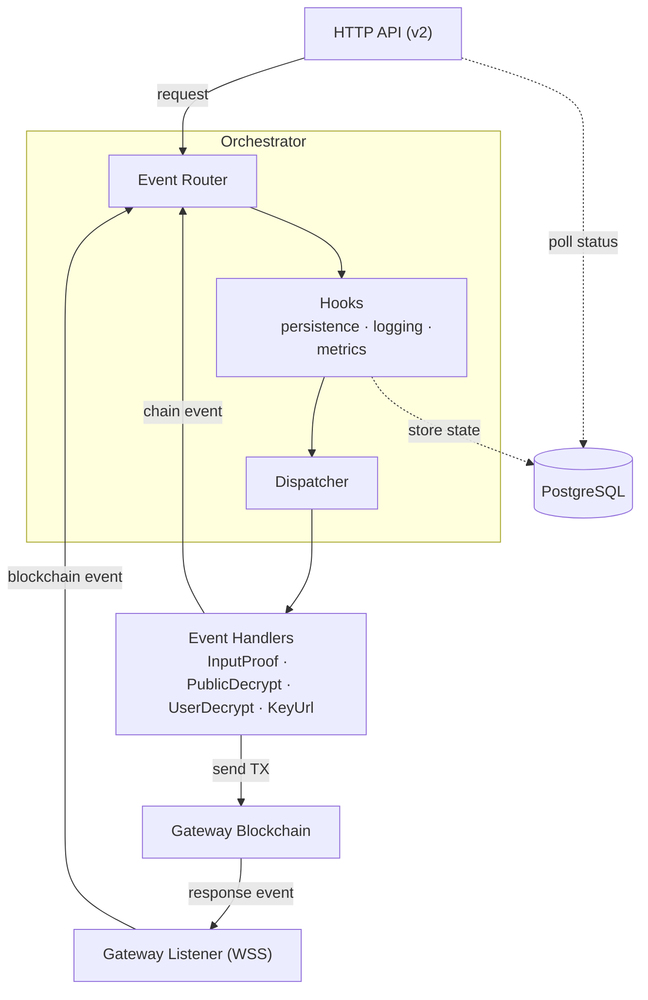

# FHEVM Relayer Service

The FHEVM (Fully Homomorphic Encryption Virtual Machine) Relayer is the bridge between FHEVM host chains (e.g. Ethereum) and the Gateway.

It exposes the following capabilities:

- **Public Decryption**: Relay HTTP public decryption requests and return plaintext responses.
- **Input Proof Verification**: Relay HTTP input-proof verification requests and return validity attestations.
- **User Decryption**: Relay HTTP user decryption requests to re-encrypt data under a user-provided public key (with ciphertext-handle access control).
- **Key Material**: Expose key material URLs (FHE public key and CRS URLs).

## Table of Contents

- [Architecture](#architecture)
- [Project Structure](#project-structure)
- [Prerequisites](#prerequisites)
- [Getting Started](#getting-started)
  - [First-time setup](#first-time-setup)
  - [Run the test suite](#run-the-test-suite)
  - [Testnet & Devnet](#testnet--devnet)
  - [Local Stack](#local-stack-for-testing-version-releases)
- [API Endpoints](#api-endpoints)
- [Observability](#observability)
- [Data Retention Policy](#data-retention-policy)
- [Troubleshooting](#troubleshooting)

## Architecture

The system follows an event-driven architecture with these key components:

- **Orchestrator**: Central coordinator for event flow and handling
- **Gateway listeners/handlers**: Listen and process gateway events
- **HTTP Handlers**: Process V2 API requests
- **SQL Repositories**: Persist request state and support status polling
- **Transaction Engine + Throttlers**: Reliable TX management and backpressure
- **Metrics + Tracing**: Runtime observability for APIs, queues and blockchain flows



## Project Structure

```text
src
├── bin/                     # Binary entry points
│   └── fhevm-relayer.rs     # Main relayer service binary
├── config/                  # Configuration loading and validation
├── core/                    # Core domain events, IDs, and shared types
├── gateway/                 # Gateway listeners, handlers, and tx engine
│   ├── arbitrum/            # Arbitrum listener and transaction processing
│   └── readiness_check/     # Readiness-check processing pipeline
├── http/                    # HTTP server, API handlers, and middleware
│   ├── admin/               # Runtime admin endpoints
│   ├── endpoints/           # API implementations (common, v2)
│   ├── middleware/          # OpenAPI/docs and request middleware
│   ├── retry_after/         # Dynamic Retry-After estimation
│   └── utils/               # Parsing and validation helpers
├── logging/                 # Structured logging helpers
├── metrics/                 # Prometheus metrics and dashboard docs
├── orchestrator/            # Event orchestration system
├── store/sql/               # SQL models and repositories
├── lib.rs                   # Library entry point
├── startup.rs               # Service startup wiring
├── startup_recovery.rs      # Startup recovery orchestration
└── tracing.rs               # Tracing initialization

relayer-migrate/             # Separate crate: DB migrations with connection retry and rollback support
config/local.yaml.example    # Local config template
dev/docker-compose.yaml      # Local Postgres compose
tests/                       # Integration and API tests
test-support/                # Test helpers (e.g. Ethereum RPC mock)
docs/                        # Supplemental project documentation
design-docs/                 # Design and architecture notes
openapi-async-design.yaml    # OpenAPI specification
Makefile                     # Test, lint, and migration helpers
```

## Prerequisites

- Rust toolchain + Cargo
- Docker + Docker Compose v2
- [Foundry (`cast`)](https://www.getfoundry.sh/) — only needed for network onboarding (`make preflight-*`, `make mint-zama-*`, `make approve-payment-*`)
- Node.js + npm (for `make api-lint` only)

Run `make help` to see all available targets.

### Configuration

Configuration is handled via:

- YAML file (`config/local.yaml` by default if present)
- Optional CLI config file (`--config-file`)
- Environment variables with `APP_` prefix and `__` for nesting (override file values)
  - Example: `APP_GATEWAY__BLOCKCHAIN_RPC__HTTP_URL=https://rpc.example.org`

## Getting Started

A local PostgreSQL instance is required for integration tests and running the relayer outside of unit tests; `make setup` handles this automatically.

### First-time setup

```bash
make setup    # Start Postgres, run migrations, copy config templates
```

### Run the test suite

```bash
make test-unit                    # Fast unit tests (no Postgres required)
make test-all-no-long-running     # Full suite (requires Postgres)
make ci                           # Reproduce CI locally (lint + db + tests)
```

### Testnet & Devnet

#### 1. Configure and verify wallet readiness

Pre-built config examples are provided in `config/`. The `preflight` target handles everything: it runs `init` (copies the example config + prompts for your private key) if needed, then checks your wallet address, ETH balance, `$ZAMA` balance, and `ProtocolPayment` approval — offering to mint and approve interactively:

```bash
make preflight-testnet  # or: make preflight-devnet
```

Individual targets are also available if needed:

```bash
make init-testnet              # Copy example config, prompt for private key
make init-devnet
make mint-zama-testnet         # Instructions for Testnet (not self-service)
make mint-zama-devnet          # Self-service mint on Devnet
make approve-payment-testnet   # Approve ProtocolPayment spending on Testnet
make approve-payment-devnet
```

#### 2. Run the relayer

```bash
make run-testnet    # or: make run-devnet
make dev-testnet    # Hot-reload with cargo-watch (or: make dev-devnet)
```

#### 3. Verify service health

```bash
make health
```

#### 4. Run E2E tests

End-to-end tests live in the [`fhevm` repository](https://github.com/zama-ai/fhevm) under `fhevm/test-suite/e2e`.

To run them against your local relayer:

1. Follow the [E2E test setup instructions](https://www.notion.so/zamaai/Run-e2e-test-on-Sepolia-testnet-2b05a7358d5e8006999bd0e5433f70d9).
   - This Notion page primarily targets Testnet. If you target Devnet, follow it using devnet-specific values instead. Check [Blockchain Access](https://www.notion.so/zamaai/Blockchain-Access-1a55a7358d5e807d9711d80f9b19bb99) if needed
2. Set the `RELAYER_URL` environment variable from `fhevm/test-suite/e2e/.env` to point to your local relayer: `RELAYER_URL=http://localhost:3000/v2`. The route version must be provided in the url.
3. Run the E2E test suite from `fhevm/test-suite/e2e`.

#### 5. Stop local Postgres

```bash
make db-stop        # Stop Postgres (preserves data)
make db-destroy     # Stop Postgres and wipe all data
```

### Local Stack (for testing version releases)

This mode runs the entire Zama protocol locally using the `fhevm-cli` tool from the [`fhevm` repository](https://github.com/zama-ai/fhevm).

#### Deploy the Zama Protocol

```bash
git clone git@github.com:zama-ai/fhevm.git
cd fhevm/test-suite/fhevm
./fhevm-cli deploy
```

#### Inject a local relayer build

Build local images with registry-prefixed names (`ghcr.io/zama-ai/console/relayer:TAG` and `ghcr.io/zama-ai/console/relayer-migrate:TAG`), which is what the `fhevm-cli` Docker Compose stack expects:

```bash
LOCAL_RELAYER_TAG=local-relayer-$(date +%Y%m%d%H%M%S)

make docker-release TAG=${LOCAL_RELAYER_TAG}
```

Then upgrade the relayer in the fhevm stack:

```bash
# From fhevm/test-suite/fhevm
RELAYER_VERSION=${LOCAL_RELAYER_TAG} \
RELAYER_MIGRATE_VERSION=${LOCAL_RELAYER_TAG} \
./fhevm-cli upgrade relayer
```

Validate running image tags:

```bash
docker inspect fhevm-relayer --format '{{.Config.Image}}'
docker inspect relayer-db-migration --format '{{.Config.Image}}'
```

#### Run E2E tests via fhevm-cli

You can use `./fhevm-cli` to trigger the `fhevm` E2E tests against your local stack:

```bash
./fhevm-cli test input-proof
```

#### Stop the local stack

```bash
./fhevm-cli clean
```

## API Endpoints

### Service Endpoints

| Endpoint        | Description              |
| --------------- | ------------------------ |
| `GET /liveness` | Liveness probe           |
| `GET /healthz`  | Readiness / health check |
| `GET /version`  | Build version info       |
| `GET /docs`     | OpenAPI documentation    |

### Production APIs

V2 endpoints follow async job semantics: `POST` submits a request and returns a `job_id`, then `GET .../{job_id}` polls for the result.

| Operation                 | Endpoint                          |
| ------------------------- | --------------------------------- |
| Input proof verification  | `POST /v2/input-proof`            |
| Public decryption         | `POST /v2/public-decrypt`         |
| User decryption           | `POST /v2/user-decrypt`           |
| Delegated user decryption | `POST /v2/delegated-user-decrypt` |
| Key material URLs         | `GET /v2/keyurl`                  |

For complete schemas, see `GET /docs` or `openapi-async-design.yaml`.

### Admin Endpoints

```text
GET  /admin/config
POST /admin/config
```

Controlled by `enable_admin_endpoint` (returns `403 Forbidden` when disabled). Supports runtime tuning of throttler TPS and retry-after fields.

## Observability

- Logging and tracing policy: `LOGGING_POLICY.md`
- Metrics and dashboard guidance: `src/metrics/docs_and_dashboards/http_metrics.md`
- Application metrics: `GET /metrics` on port `9898`

## Data Retention Policy

The relayer automatically purges stale request data from the database to manage storage growth. Old records for public decryption, user decryption, and input proof verification are periodically **deleted** based on configurable retention windows. This cleanup process runs as a background cron job and is implemented in `src/store/sql/repositories/expiry_repo.rs`.

## Troubleshooting

### Postgres uses port 5433, not 5432

The local Postgres in `dev/docker-compose.yaml` maps to **port 5433** to avoid conflicts. If you see "connection refused" errors, check you are targeting port 5433.

### sqlx offline metadata must stay up to date

The Docker build relies on pre-computed query metadata in `.sqlx/`. After adding or modifying SQL queries, run `make sqlx-prepare` before building Docker images.

### Git worktrees break the relayer Docker build

The relayer Dockerfile mounts `.git/HEAD`, `.git/objects`, and `.git/refs` for build-time version embedding. In a Git worktree `.git` is a file (not a directory), so the mount fails. Build from a primary clone instead.

### Config template contains localhost/mock URLs

`config/local.yaml.example` ships with `localhost:8757` RPC URLs and `0.0.0.0:3001` key URLs that only work against a local mock stack. When targeting Devnet or Testnet, use `make preflight-testnet` / `make preflight-devnet` which copies the correct example config automatically.

### Docker memory for full local stack

Running `./fhevm-cli deploy` requires at least **12 GB** of Docker memory.

## License

BSD 3-Clause Clear License
