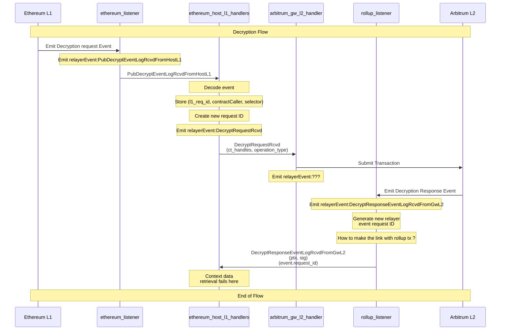

# Decryption flow

In this document, we try to describe the decryption flow within the code and among all the different event types. 

```mermaid
sequenceDiagram
    participant L1 as Ethereum L1
    participant EL as ethereum_listener
    participant EH as ethereum_host_l1_handlers
    participant AGH as arbitrum_gw_l2_handler
    participant RL as rollup_listener
    participant L2 as Arbitrum L2

    Note over L1,L2: Decryption Flow
    
    L1->>EL: Emit Decryption request Event
    Note over EL: Emit relayerEvent:PubDecryptEventLogRcvdFromHostL1
    EL->>EH: PubDecryptEventLogRcvdFromHostL1
    Note over EH: Decode event
    Note over EH: Store (l1_req_id, contractCaller, selector)
    Note over EH: Create new request ID
    Note over EH: Emit relayerEvent:DecryptRequestRcvd
    
    EH->>AGH: DecryptRequestRcvd<br/>(ct_handles, operation_type)
    AGH->>L2: Submit Transaction
    Note over AGH: Emit relayerEvent:???
    
    L2->>RL: Emit Decryption Response Event
    Note over RL: Emit relayerEvent:DecryptResponseEventLogRcvdFromGwL2
    Note over RL: Generate new relayer<br/>event request ID
    Note over RL: How to make the link with rollup tx ?
    RL->>EH: DecryptResponseEventLogRcvdFromGwL2<br/>(ptx, sig)<br/>(event.request_id)
    Note over EH: Context data<br/>retrieval fails here
    Note over L1,L2: End of Flow
```
