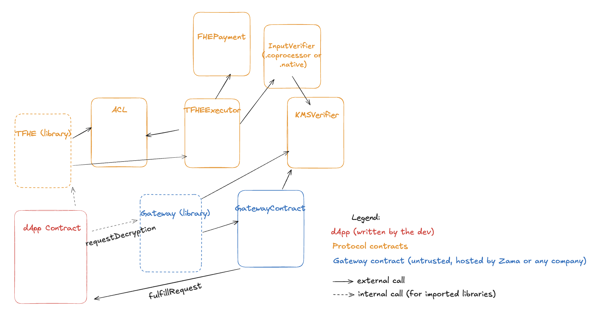

# Diagram - fhEVM contracts on the host chain



# Contracts fundamentals

The fhEVM employs symbolic execution - essentially, inputs to FHE operations are symbolic values (also called handles) that refer to ciphertexts. We check constraints on these handles, but ignore their actual values.

Inside the Executor (in fhEVM-native) and inside the Coprocessor, we actually execute the FHE operations on the ciphertexts the handles refer to. If a new ciphertext is generated as a result of an FHE operation, it is inserted into the blockchain for fhEVM-native (into the ciphertext storage contract, see [Storage](native/storage.md)) or into the DB and DA for Coprocessor under a handle that is deterministically generated by the FHEVMExecutor contract.

_Note_: All those contracts are initially deployed behind UUPS proxies, so could be upgraded by their owner at any time. Unless if the owner renounces ownership, after which the protocol could be considered imumutable.

## FHEVMExecutor Contract

Symbolic execution on the blockchain is implemented via the [FHEVMExecutor](../../../contracts/contracts/FHEVMExecutor.sol) contract. One of its main responsibilites is to deterministically generate ciphertext handles. For this, we hash the FHE operation requested and the inputs to produce the result handle H:

```
H = keccak256(fheOperation, input1, input2, ..., inputN)
```

Inputs can either be other handles or plaintext values.

## ACL Contract

The [ACL](../../../contracts/contracts/ACL.sol) contract enforces access control for ciphertexts. The model we adopt is very simple - a ciphertext is either allowed for an address or not. An address can be any address - either an EOA address or a contract address. Essentially, it is a mapping from handle to a set of addresses that are allowed to use the handle.

Access control applies to transfering ciphertexts from one contract to another, for FHE computation on ciphertexts, for decryption and for reencryption of a ciphertext to a user-provided key.

### Garbage Collection of Allowed Ciphertexts Data

Data in the ACL contract grows indefinitely as new ciphertexts are produced. We might want to expose ways for developers to reclaim space by marking that certain ciphertexts are no longer needed and, consequently, zeroing the slot in the ACL. A future effort will look into that.

## KMSVerifier Contract

The [KMSVerifier](../../../contracts/contracts/KMSVerifier.sol) contract allows any dApp to verify a received decryption. This contract exposes a function `verifyDecryptionEIP712KMSSignatures` which receives the decryption result and signatures coming from the TKMS.

KMS signers addresses are stored and updated in the contract.

The KMSVerifier contract is also responsible for checking the signatures of KMS signers when a user is inputing a new ciphertext, since this process involves the user firstly sending a ZKPoK to be verified by the KMS nodes. If the proof verifies successfully at the KMS, each KMS signer will sign a hash of the new user input and the signatures will be returned to the user, who will then be able to input new handles onchain. This is done via the `verifyInputEIP712KMSSignatures` function.

## InputVerifier Contract

The InputVerifier checks the coprocessors accounts' signatures which include the computed handles (the KMS signatures only include the hash of the packed ciphertext, not the handles).
We trust the handles computation done by the coprocessors before using them in transactions onchain.

## FHEGasLimit Contract

This contract is needed for security, especially for coprocessor where we could not tweak native gas to be used for FHE operations as for native: [FHE gas price constants](../../../contracts/contracts/FHEGasLimit.sol#L33-L34).

This contract tracks the FHEGas consumed in each block, and reverts the transactions inside a block if the FHEGas block limit is exceeded.

## DecryptionOracle Contract

The [DecryptionOracle](../../../contracts/decryptionOracle/DecryptionOracle.sol) is an onchain contract designed to interact with an offchain Gateway component that handles decryption requests. When a dApp calls the `requestDecryption` function, the `DecryptionOracle` contract emits an event that is caught by the Gateway service.

_Note_: It is possible to have multiple Gateways, so multiple Gateway contracts can also be deployed. This is the only contract from this documentation page that is not strictly part of "core fhEVM" contracts, and as such, it should not be considered as a "trusted" contract. We only trust the KMS and the core fhEVM contracts. The Gateway is only bridging trust from host chain to KMS chain via storage proofs, and from KMS chain to the host chain via the signatures from KMS signers.
