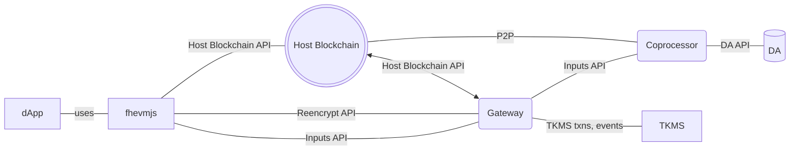

# Architecture

The following diagram shows an fhEVM-coprocessor that is integrated alongside an existing host blockchain.

An important note to point out is that the Coprocessor is an offchain component. It contains the following sub-components:
 * host blockchain **full node** that executes all blocks on the host blockchain
 * an **executor** that does FHE computation
 * a local **database** for storing FHE ciphertexts

Essentially, as the Coprocessor executes blocks and when an FHE operation is detected, the executor sub-component would actually execute the FHE computation and load/store FHE ciphertexts from the local database (and the DA). For more on execution, please look at [Symbolic Execution](../symbolic_execution.md) and [FHE Computation](fhe_computation.md).

The Data Availability (DA) is a publicly-verifiable database that is a mirror of the local Coprocessor database. The reason for having is to allow anyone to verify the behaviour of the Coprocessor by examining the results it posts to it.

The Gateway is responsible for handling input verification, decryption and reencryption and host blockchain validator set updates, all via/in the KMS.