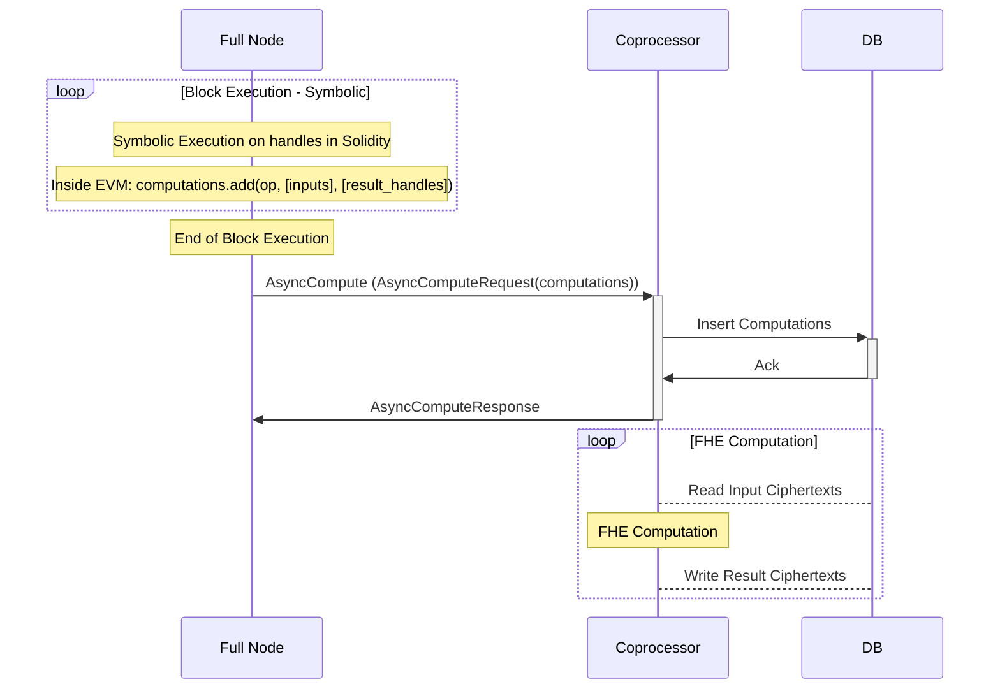

# FHE Computation

Block execution in fhEVM-coprocessor is split into two parts:

- Symbolic Execution (onchain)
- FHE Computation (offchain)

Symbolic execution happens onchain, inside the [FHEVMExecutor](../../../../contracts/contracts/FHEVMExecutor.sol) contract (inside the EVM). Essentially, the EVM accumulates all requested FHE operations in a block with their input handles and the corresponding result handles. Then, at the end of block execution, it sends an `AsyncCompute` request to the coprocessor such that FHE computation can be done **eventually**. Note that FHE computation can be done at a future point in time, after the block has been committed on the host blockchain. We can do that, symbolic execution only needs handles and doesn't actual FHE ciphertexts. Actual FHE ciphertexts are needed only on **decryption** and **reencryption**, i.e. when a user wants to see the plaintext value.

For more on symbolic execution, please see [Symbolic Execution](../symbolic_execution.md).

Note that, for now, we omit the Data Availability (DA) layer. It is still work in progress and the Coprocessor only inserts FHE ciphertexts into its local DB. Eventually, we would like that FHE ciphertexts are also inserted into the DA.

## Parallel Execution

Since the Coprocessor can extract data dependencies from the `AsyncCompute` request, it can use them to execute FHE computations in parallel.

At the time of writing, the Coprocessor uses a simple policy to schedule FHE computation on multiple threads. More optimal policies will be introduced in the future and made configurable.
