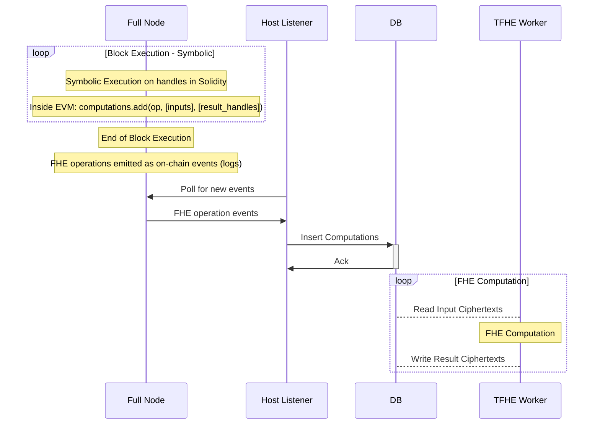

# FHE Computation

Block execution in FHEVM-coprocessor is split into two parts:

- Symbolic Execution (onchain)
- FHE Computation (offchain)

Symbolic execution happens onchain, inside the [FHEVMExecutor](../../../../contracts/contracts/FHEVMExecutor.sol) contract (inside the EVM). Essentially, the EVM accumulates all requested FHE operations in a block with their input handles and the corresponding result handles. These operations are emitted as on-chain events (logs) that the host-listener ingests into the coprocessor database, such that FHE computation can be done **eventually**. Note that FHE computation can be done at a future point in time, after the block has been committed on the host blockchain. We can do that, symbolic execution only needs handles and doesn't need actual FHE ciphertexts. Actual FHE ciphertexts are needed only on **decryption** and **reencryption**, i.e. when a user wants to see the plaintext value.

```mermaid
sequenceDiagram
    participant Full Node
    participant Host Listener
    participant DB
    participant TFHE Worker

    loop Block Execution - Symbolic
        Note over Full Node: Symbolic Execution on handles in Solidity
        Note over Full Node: Inside EVM: computations.add(op, [inputs], [result_handles])
    end

    Note over Full Node: End of Block Execution
    Note over Full Node: FHE operations emitted as on-chain events (logs)

    Host Listener->>Full Node: Poll for new events
    Full Node->>Host Listener: FHE operation events
    Host Listener->>+DB: Insert Computations
    DB->>-Host Listener: Ack

    loop FHE Computation
        TFHE Worker --> DB: Read Input Ciphertexts
        Note over TFHE Worker: FHE Computation
        TFHE Worker --> DB: Write Result Ciphertexts
    end
```

For more on symbolic execution, please see [Symbolic Execution](../symbolic_execution.md).

Note that, for now, we omit the Data Availability (DA) layer. It is still work in progress and the Coprocessor only inserts FHE ciphertexts into its local DB. Eventually, we would like that FHE ciphertexts are also inserted into the DA.

## Parallel Execution

Since the coprocessor can extract data dependencies from the ingested events, it can use them to execute FHE computations in parallel.

At the time of writing, the Coprocessor uses a simple policy to schedule FHE computation on multiple threads. More optimal policies will be introduced in the future and made configurable.

## Slow Lane for Dependent Operations

When a single chain submits a large burst of FHE operations that all depend on each other (a deep dependency chain), those operations must execute sequentially — they can starve other chains' operations from being processed.

The **slow lane** is a scheduling mechanism that detects chains with an unusually high number of dependent operations per ingested block, and deprioritises them so that independent operations from other chains continue to make progress.

A chain is placed in the slow lane when the number of dependent operations inserted for it in a single block exceeds the `dependentOpsMaxPerChain` threshold. Once the pressure drops, the chain is automatically promoted back to the normal lane.

The slow lane is **disabled by default** (`dependentOpsMaxPerChain: 0`). See [Configuration](../../../getting_started/fhevm/coprocessor/configuration.md#slow-lane) for how to enable it.
