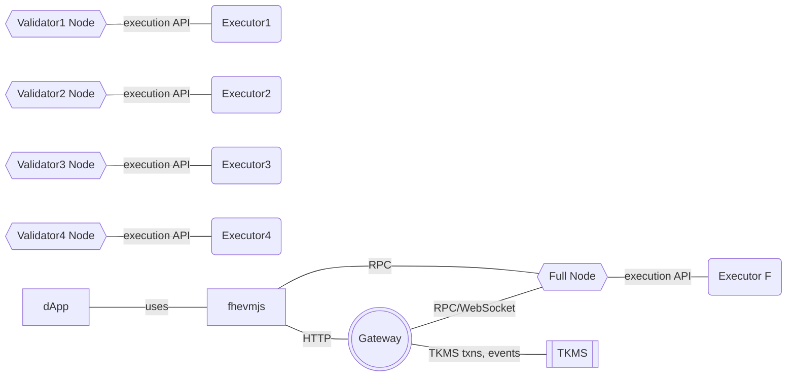

# Architecture

The following diagram shows an fhEVM-native blockchain with 4 validators.

_Note:_ For brevity, we don't show P2P connections between validators and the full node in the diagram.

Each validator has two components:
 * the validator node software that executes blocks and connects to other validators over the blockchain's P2P network
 * the Executor that is responsible for the actual FHE computation

The Executor exposes an API that the validator node uses to send FHE computation requests.

A full node is similar to validators in the sense that it executes all blocks. The difference is that the full node doesn't have stake in the network and, therefore, cannot propose blocks. The full node has all the blockchain data locally. It can be used by the Gateway over RPC or WebSocket endpoints, allowing the Gateway to fetch storage proofs, fetch ciphertexts, listen for events on the fhEVM blockchain, etc.

The Gateway is a client from the TKMS' perspective and sends decryption/reencryption transactions, listens for "decryption ready" events, etc.

A dApp uses the **fhevmjs** library to interact with the fhEVM. Some examples are:
 * connect over HTTP to the Gateway for reencryptions
 * encrypt and decrypt data from the blockchain
 * send transactions via a full node
 * get the FHE public key from a full node

The TKMS is used to manage secret FHE key material and securely execute decryptions, reencryptions, key generation, etc. The TKMS is itself a blockchain. See [TKMS](../../tkms/architecture.md).
