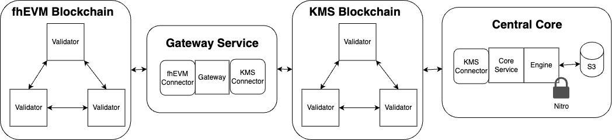
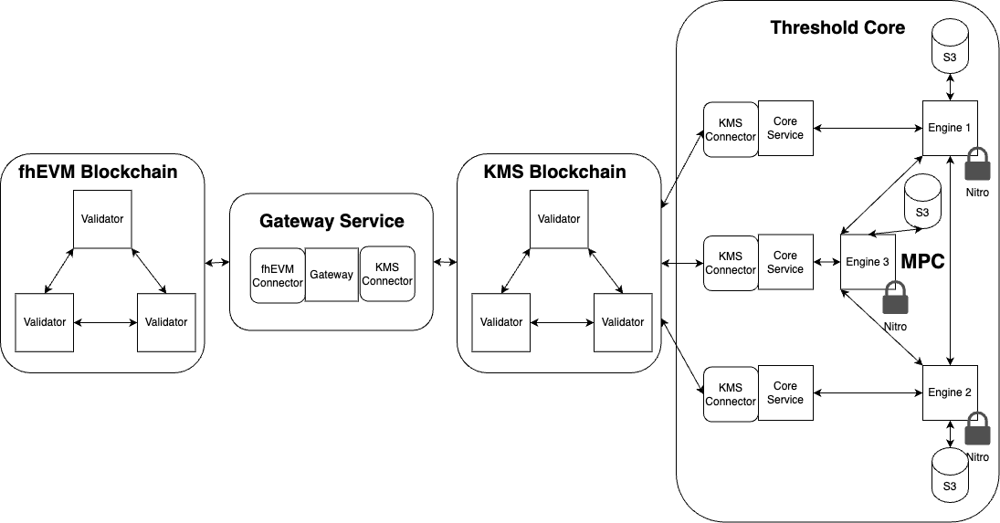

# Overall architecture

The following describes how the KMS is used in conjunction with an fhEVM blockchain, including the external components needed.
While the KMS can be used with multiple fhEVMs, for simplicity, we will in the following document assume there is only a single fhEVM.

At the highest level, the system consists of two subsystems: an *fhEVM blockchain* and a *KMS*. The KMS in turn consists of a *KMS blockchain* and a *KMS core*. These are in turn composed of the following components, which we illustrate in the pictures below

- *fhEVM validator*: The validator node running the fhEVM blockchain.

- *Gateway*: An intermediate component which is responsible to act as a bridge and facilitate communication between the fhEVM and the KMS. The actual gateway which relays requests and responses between the fhEVM and the KMS blockchain.

- *Gateway KMS Connector*: A light-client which will reads results and updates from the KMS blockchain and pass them onward to the Gateway. It is also responsible for writing requests from the fhEVM to the KMS blockchain after receiving them from the Gateway.

- *KMS validator*

- *Core*

- *KMS*: The Key Management System, which is responsible for managing the keys used by the fhEVM. It consists of components:
  - Frontend: The frontend makes up the public interface of the KMS, through which all requests are going. It consists of the following the KMS blockchain, and more specifically an Application Smart Contract (ASC) which provides the link between the KMS and each fhEVM by holding all the requests and responses to be relayed between the KMS and the fhEVM.
  - Backend: The actual cryptographic system that handles key management requests. It comes in both a _centralized_ and _threshold_ flavor. Regardless it consists of the following components:
    - Connector: A light-client which is responsible for reading requests from the KMS blockchain and relaying these to the KMS Core. Similarly, it is responsible for polling the KMS Core for results and post these back to the KMS blockchain.
    - Core Service: gRPC server which asynchronously handles requests from the Connector and forwards these either to an internal centralized cryptographic _Engine_ or to the threshold cryptographic _Engine_ depending on the mode.

On the fhEVM blockchain the following smart contracts are deployed:

- *ACL smart contract*: Smart contract deployed on the fhEVM blockchain to manage access control of ciphertexts. dApp contracts use this to persists their own access rights and to delegate access to other contracts.

- *Gateway smart contract*: Smart contract deployed on the fhEVM blockchain that is used by a dApp smart contract to request a decrypt. This emits an event that triggers the gateway.

- *KMS smart contract*: Smart contract running on the fhEVM blockchain that is used by a dApp contract to verify decryption results from the KMS by containing the identity of the KMS.

Finally, dApp smart contracts use the *TFHE* Solidity library to perform operations on encrypted data on the fhEVM blockchain. This library is embedded into the dApp smart contract, and calls an executor smart contract under the hood.

Below we now go in detail on each of these components, their features and why they have been designed as they are.

## fhEVM Architecture
The design the fhEVM ensures fully decentralized security and robustness, up to the security of the key management as results from the KMS and updates to it will be validated directly in smart contracts.

TODO not sure what we want to write here. Maybe just a pointer?

## Gateway Service
The Gateway Service is designed _not_ to be required to be trusted, thus a malicious Gateway Service will _not_ be able to compromise correctness or privacy of the system, but at most be able to block requests and responses between the fhEVM and the KMS. However, this can be prevented by simply deploying multiple Gateways Services.

Furthermore we observe that it is possible to implement payment to a Gateway service through the KMS blockchain, thus incentivizing such a service to be honest and reliable.

The Gateway Service consists of two different Connectors in order to decouple a specific fhEVM from a specific KMS. This will make it simpler to roll new blockchain protocols on either the fhEVM or KMS side without requiring modifications to the Gateway, but instead only require the writing of new Connectors.

## Key Management System Architecture

The Key Management System (KMS) is a self-contained service facilitated through a blockchain (the KMS blockchain) and currently it offers the following services:

- **FHE key generation**: Generate a fresh FHE keypair; the secret key is stored securely inside the KMS and the public key is made available for download. This generation also includes bootstrapping keys with a secret PRF seed for randomness generation.
- **FHE decryption**: Decrypt a ciphertext encrypted under an FHE key known by the KMS and return the plaintext.
- **FHE reencryption**: Decrypt a ciphertext encrypted under an FHE key known by the KMS and return the plaintext encrypted under a client supplied public key.
- **Public material download**: Return URIs and signed fingerprints of the public material.
- **CRS generation**: Generate a fresh CRS, and make it available for download.
- _Coming soon_ **Refreshing**: The possibility of refreshing the shares of each of the generated keys; known as *proactive security*.

### Frontend
Similarly to the fhEVM the security of the frontend is designed to be supplied from underlying blockchain assumptions. More specifically the guarantees given by the KMS blockchain.
Hence breakage of correctness, privacy and availability of this component can only happen if the underlying blockchain security is broken.

The frontend makes up the public interface of the KMS, through which all requests are going. It consists of the KMS blockchain together with a collection of smart contracts. This gives it several desirable properties:

- Decentralized enforcement of policies.
- Trustable log of all actions performed by the KMS.
- Support for payments of the operators.
- Total ordering of requests (which is useful for some backends).

As previously mentioned a KMS instance can support multiple applications at the same time. This is implemented via a per Application Smart Contracts (ASCs) running in the KMS. These smart contracts are customizable to for instance implement application specific authorization logic (e.g. ACLs). For instance, an ASC for an fhEVM blockchain holds the identity of the current set of validators, so that access controls lists (ACLs) in decryption and reencryption requests can be validated by checking state inclusion proofs against the state roof of the fhEVM blockchain (_coming soon_).

Note that the KMS blockchain may be operated by a single validator if decentralization is not needed, or either in a permissioned or permissionless fashion for the decentralized setting.
For now this is realized using *CometBFT*.

TODO I guess we should also write something about KV-store. 

### Backend
The KMS backend is the most security critical component of the entire system and a compromise of this could lead to breakage of both correctness, confidentiality and robustness.
Because of this we have designed it to support threshold security and Enclave support, along with isolation of the security critical _Engine_ from the general Internet.

The backend fulfills the requests as determined by the frontend.
More specifically the coordinator listens for events from the ASC (received through the Connector) and triggers the Core to fulfill operations. This means that the blockchain is the ground truth of which requests are processed, and each backend instance can independently authenticate these. The backend make use of a vault to keep and share sensitive material.

The design of the backend consisting of multiple components is done to make it possible to isolate the cryptographic _Engine_ from the public Internet and make it completely agnostic to the fhEVM and even the KMS blockchain.
It will simply only communicate with the Core Service and trust its requests blindly.
However, this does not pose a security risk as the Core Service and Connector _must_ be executed on the same machine and will only issue commands if signed and finalized by the KMS blockchain.

Each Core Service holds a signature key which is used to validate the authenticity of the operations which will eventually get passed back down to the fhEVM.
More specifically this key is used to sign fulfillment transactions and fingerprints of public material.

The Core Service and Engine is also AWS-friendly, in the sense that it can take advantage of AWS Nitro and AWS KMS to offer additional security. However, they can also be operated in a "developer mode" where the use of AWS components is bypassed, and the sensitive material is simply kept in clear-text on disc. This mode is useful for developers to run a KMS on for instance their laptops.

(_Coming soon_) A S3-compatible storage system can also be used to store the key material for easy public access. When used with Nitro private material can also be stored in signcrypted form, allowing easy rolling of servers since they can then be stateless.

Note that two-way attestation happen between the Coordinator and Core Service, along with the Core Service and Connector to ensure e.g. that the Coordinator is not triggering other operations than those approved by the frontend.

Note that while the backend protects secret material, selective failure attacks may allow an adversary to extract secret keys by submitting malformed ciphertexts for decryption and reencryption. The KMS itself has no built in mechanism for protecting against this, so there is an implicit trust assumption that only well-formed ciphertexts are submitted to the KMS for decryption and reencryption. This in turn means that there is an implicit trust assumption that whoever produced the ciphertexts did so "honestly", which must be ensured externally (e.g. by the fhEVM).

Note also that the threshold assumption used by the threshold backend is not based on PoS but rather on a classic MPC threshold assumption that remains unjustified from an incentive point of view. Future work aims to address this.
