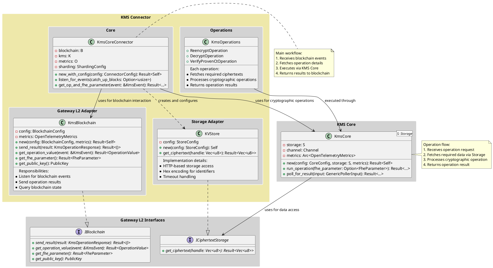
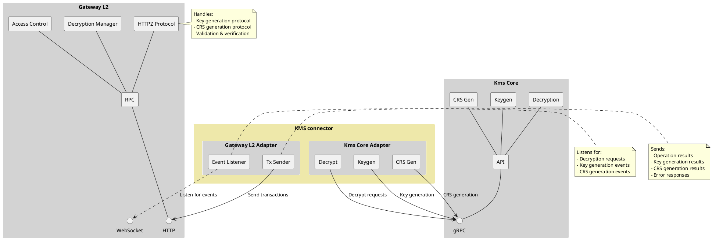
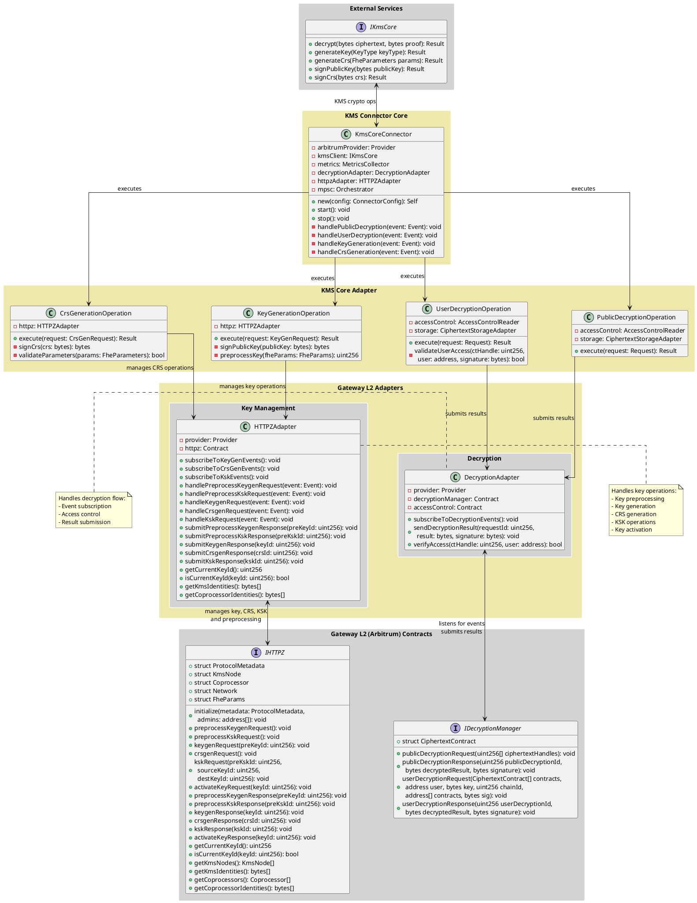
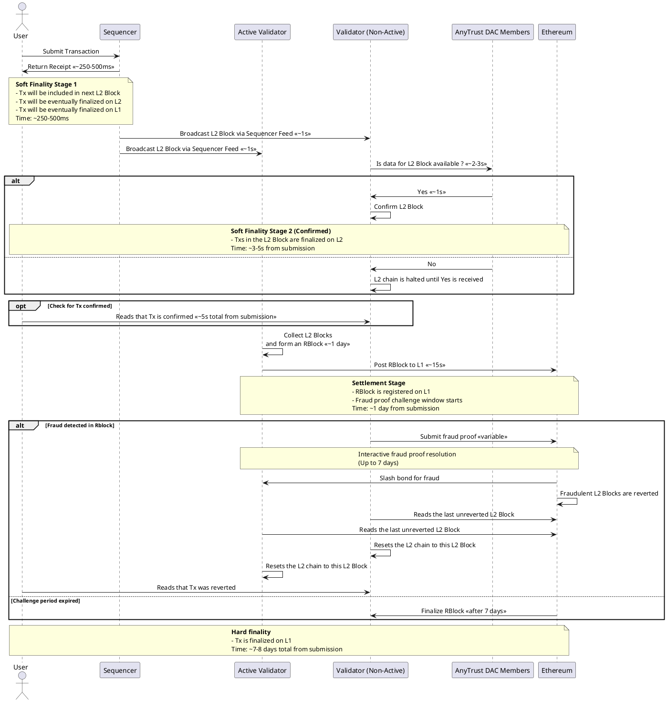

# Quick Intro

The old KMS Connector architecture was designed with a simple Cosmos blockchain and KV storage interface in mind. However, integrating with Arbitrum L2 introduces new requirements and complexities that the old design cannot efficiently handle.

Visually Connector methods-oriented current (old) arch design may be presented like this, roughly:



After analyzing the codebase, it is recommended to implement a brand new connector design rather than refactoring the old one for the following reasons:

1. **Structural / Functional Differences**:

    - **Old**: Simple layered architecture with basic interfaces and a lot of redundant components (KVStore, Cosmos components penetrating a lot of Connector structs, outdated io logic, etc)
    - **New**: Complex adapter-based design with multiple specialized components. Need to follow HTTPZ logic and naming conventions
    - **Verdict**: Too many fundamental structural changes needed

2. **Code Organization**:

    - **Old**: Monolithic components with tight coupling
    - **New**: Modular adapters with clear boundaries
    - **Verdict**: Complete reorganization required. It's very hard to squeeze new implementation into existing code structure

3. **Multi-Contract Management**:

    - **Old**: Single contract interface
    - **New**: Coordinated interaction with multiple specialized contracts each having its own interface:
        - Decryption Manager
        - HTTPZ Protocol

4. **Event-Driven Architecture Requirements**:

    - **New**: Asynchronous event handling with MPSC-based orchestration for multiple contract events. It's suggested to have an improved version of shared Orchestrator component as developed by GW team.

## **Recommended Solution**

1. Create new crate `kms-connector/`
2. Implement new architecture from scratch (see images bellow)
3. Keep both (Old/New) connectors code in the kms-core repo during transition
4. Deprecate Old connector once migration is complete

This is a KMS Connector-focused extract from the general system diagram as presented here (but with corrections for L2 storage) [SEE IMAGE HERE](https://github.com/zama-ai/fhevm-relayer/blob/main/out/design-docs/full-architecture-highe-level-interactions/gateway-external-connections.svg)



Detailed KMS Connector diagram reflecting current L2 smart-contract interfaces (pls note that `reencryption` is renamed to `userDecryption`) Also iHTTPZ SC interface is about to be finalized... so I put my vision to be clarified once finalization is done



## Additional Functionality

1. Endpoints shall have ability to notify about request statuses as was developed here: <https://github.com/zama-ai/kms-core/pull/1868>

2. Polling for a new L2 events shall account to Arbitrum soft-finality rules where all operations but for KeyGen shall have almost instant finality (upon tx inclusion into L2 block), while KeyGen tx (due to its price) is suggested to have finality up to 7-8 days (end or arbitrage term).



### **Benefits of New Implementation**

- Components and their naming follow HTTPZ workflow doc
- Clean codebase without legacy code
- No risk of breaking existing functionality
- Better testing coverage from start
- Clear separation from old implementation
- Easier to maintain and extend

## Suggested Project Structure Within `kms-core` Repo

```rust
kms-connector/
├── Cargo.toml
├── README.md
└── src/
    ├── core/
    │   ├── mod.rs
    │   ├── connector.rs        // KmsCoreConnector implementation
    │   ├── config.rs           // Configuration structures
    │   └── orchestrator.rs     // MPSC-based event orchestration (might be a module jointly used with the GW)
    │
    ├── kms_core_adapter/
    │   ├── mod.rs
    │   ├── public_decryption.rs
    │   ├── user_decryption.rs
    │   ├── key_generation.rs
    │   └── crs_generation.rs
    │
    ├── gwl2_adapters/
    │   ├── mod.rs
    │   ├── decryption/
    │   │   ├── mod.rs
    │   │   └── adapter.rs      // DecryptionAdapter
    │   └── key_management/
    │       ├── mod.rs
    │       └── httpz.rs        // HTTPZAdapter (keys + CRS)
    │
    ├── gwl2_contracts/        // Alloy bindings
    │   ├── mod.rs
    │   ├── decryption.rs       // IDecryptionManager
    │   └── httpz.rs            // IHTTPZ
    │
    ├── provider.rs             // Arbitrum provider
    ├── error.rs
    ├── types.rs
    └── lib.rs
```
