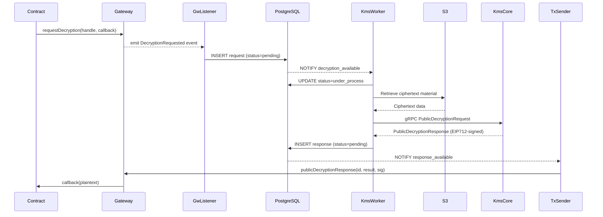
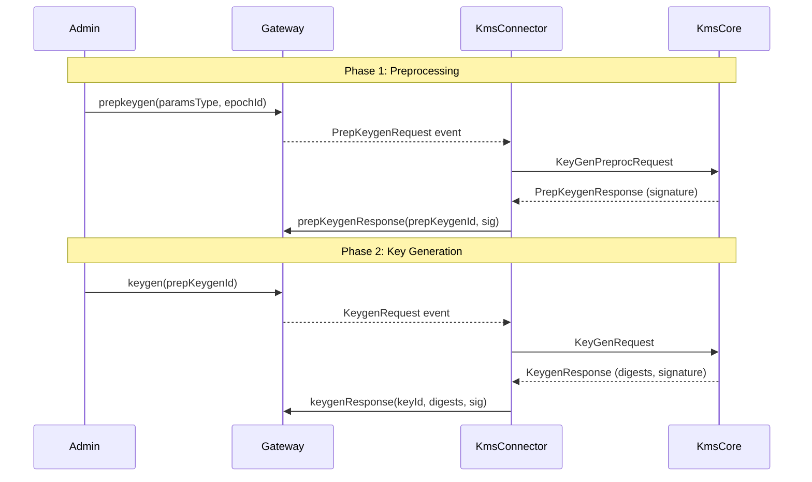

# KMS Connector 🔥

**Location**: `/kms-connector/`
**Status**: Active Development
**Purpose**: Interface between the Gateway and Key Management System (KMS Core)

## Overview

The KMS Connector bridges the Gateway contracts with the external KMS Core service that manages encryption keys using multi-party computation (MPC). This ensures no single party ever holds the complete decryption key.

## Key Crates

| Crate | Purpose |
|-------|---------|
| `gw-listener` | Monitors Gateway for key-related events |
| `kms-worker` | Forwards requests to KMS Core service |
| `transaction-sender` | Submits signed responses back to Gateway |
| `utils` | Shared utilities and types |

## Supported Key Operations

- **Key generation** - Initial setup of encryption keys
- **Preprocessing keygen** - Pre-generated key material for faster operations
- **Key reshare (rotation)** - Distribute key shares to new node set
- **CRS generation** - Common Reference String for cryptographic protocols
- **Decryption signing** - Threshold signatures for decryption results

## Architecture

```
Gateway Events → gw-listener → kms-worker → KMS Core (external)
                                               ↓
Gateway Contracts ← transaction-sender ← Signed Response
```

**Flow:**
1. Gateway emits key operation event (e.g., DecryptionRequest)
2. `gw-listener` detects event and creates job
3. `kms-worker` forwards request to external KMS Core
4. KMS Core performs MPC protocol across threshold nodes
5. KMS Core returns EIP712-signed response
6. `transaction-sender` submits signed result to Gateway contract

## Key Files

- `gw-listener/src/main.rs` - Event listener entry point
- `kms-worker/src/main.rs` - KMS request handler
- `Cargo.toml` - Workspace dependencies

## Relationships

KMS Connector listens to `KMSGeneration` and `Decryption` events from Gateway contracts. It forwards requests to the external KMS Core (not in this repo) and submits EIP712-signed responses back to the chain.

## Recent Development Focus (Dec 2025)

### Garbage Collection
Implementation of automatic cleanup for stale database entries:
- `spawn_garbage_collection_routine()` runs periodically in transaction-sender
- Deletes `completed` and `failed` requests/responses after configurable expiry
- Unlocks items stuck in `under_process` state beyond timeout
- Uses PostgreSQL `updated_at` timestamps for staleness detection

### Database Status Management
Migration from boolean `under_process` to proper status enum:
```sql
CREATE TYPE operation_status AS ENUM ('pending', 'under_process', 'completed', 'failed');
```
- Enables precise tracking of request lifecycle
- Triggers auto-update `updated_at` on status changes
- Auto-completes requests when responses are inserted

### Nonce Manager
`NonceManagedProvider` for reliable transaction submission:
- Wraps Alloy provider with internal nonce tracking
- Recovers nonce state on transaction failure
- Ensures sequential nonce assignment for ordered delivery
- Prevents nonce gaps that would stall the queue

### Polling Improvements
Hybrid notification + polling architecture:
- Primary: PostgreSQL LISTEN/NOTIFY for real-time events
- Fallback: Configurable polling interval when no notifications received
- Ensures catch-up after downtime without manual intervention
- Independent tickers per event/response type

### Configuration Updates
- WebSocket to HTTP migration for Gateway RPC connections
- Environment variable support with TOML override precedence
- Flexible wallet configuration (private key or AWS KMS)

## KMS Integration Flow

The KMS Connector orchestrates the complete flow from decryption request to signed response delivery. The system is designed to handle thousands of decryptions per second while ensuring no events are ever missed.

### Decryption Request Lifecycle



### Component Responsibilities

**gw-listener** (`/kms-connector/crates/gw-listener/`)
- Monitors multiple Gateway RPC nodes for redundancy
- Listens for 7 event types: `PublicDecryptionRequest`, `UserDecryptionRequest`, `PrepKeygenRequest`, `KeygenRequest`, `CrsgenRequest`, `PrssInit`, `KeyReshareSameSet`
- Stores events in PostgreSQL with `ON CONFLICT DO NOTHING` for duplicate handling
- Tracks `last_block_polled` per event type for catch-up after downtime
- Supports backup RPC node URLs per listener

**kms-worker** (`/kms-connector/crates/kms-worker/`)
- Receives PostgreSQL NOTIFY when new events arrive
- Picks events atomically: `UPDATE...SET status='under_process' FOR UPDATE SKIP LOCKED`
- Retrieves ciphertext material from S3 buckets
- Sends gRPC requests to KMS Core (supports multiple shards)
- Stores signed responses in database, triggering auto-deletion of requests

**transaction-sender** (`/kms-connector/crates/tx-sender/`)
- Single instance to ensure transaction ordering
- Picks responses via PostgreSQL notification
- Calls Gateway contract methods: `publicDecryptionResponse()`, `userDecryptionResponse()`, `prepKeygenResponse()`, `keygenResponse()`, `crsgenResponse()`
- Manages nonces with recovery on failure
- Retries with configurable attempts and intervals

### Database Notification Flow

The system uses PostgreSQL LISTEN/NOTIFY as the primary event mechanism with polling fallback:

```sql
-- Trigger on request insertion
CREATE TRIGGER trigger_from_public_decryption_requests_insertions
AFTER INSERT ON public_decryption_requests
FOR EACH STATEMENT EXECUTE FUNCTION notify_public_decryption_request();

-- Notification function
CREATE FUNCTION notify_public_decryption_request() RETURNS trigger AS $$
BEGIN
    NOTIFY public_decryption_request_available;
    RETURN NULL;
END;
$$ LANGUAGE plpgsql;
```

### Error Handling Patterns

| Error Type | Action | Retry Behavior |
|------------|--------|----------------|
| **Recoverable** | Reset status to `pending` | Automatic retry on next notification/poll |
| **Irrecoverable** | Mark as `failed` | No retry; requires manual intervention |
| **Max attempts exceeded** | Mark as `failed` | Configurable limit (default: 3 for decryption) |
| **Connection lost** | Mark as `pending`, cancel token | Graceful shutdown, resume on restart |

Key management operations (`PrepKeygen`, `Keygen`, `Crsgen`) have no retry limit - they must be manually cleaned up if stuck.

---

## Threshold Signature Scheme

The KMS implements MPC-based threshold cryptography where the secret FHE key is split across multiple independent parties. This ensures no single party can decrypt data alone.

### MPC Security Model

**Threshold Configuration**: t-of-n (e.g., 9-of-13 nodes)
- At least `t` parties must participate to perform any operation
- Adversary must compromise more than `t` nodes to break security
- System remains operational if up to `n-t` nodes are offline

**Security Properties**:

| Property | Description |
|----------|-------------|
| **Statistically Robust** | Security doesn't depend on computational assumptions; cannot be broken regardless of adversary's compute power |
| **Maliciously Robust** | Protocol completes correctly even with up to `t` parties running rogue software or not participating |
| **Proactive Security** | Key shares can be refreshed to "undo" leakage; stolen material becomes useless after refresh |

### Trust Model

- **Honest majority assumption**: Protocol tolerates up to 1/3 malicious nodes
- **Guaranteed output delivery**: Decryption completes even with some misbehaving nodes
- **No single point of trust**: No individual party ever sees the complete key
- **Byzantine fault tolerance**: Resilient against arbitrary node failures

### Secure Execution Environment

Each KMS node runs inside an **AWS Nitro Enclave**:
- Isolated execution environment with attestation
- Prevents node operators from accessing their own key shares
- Mitigates insider risks (unauthorized reconstruction, share selling)
- Key material loaded into RAM on boot, never exposed externally

### Decryption Protocol

1. Gateway broadcasts decryption request to all KMS nodes
2. Each node performs partial decryption using its key share
3. At least `t` partial results are combined to recover plaintext
4. Each node signs the result; threshold signature is generated
5. Signed result posted back to Gateway for on-chain verification

---

## Key Lifecycle Management

The KMS supports the complete key lifecycle following NIST SP 800-57 guidelines, from generation through destruction.

### Key Operation Types

| Operation | Purpose | Response Expected |
|-----------|---------|-------------------|
| `PrepKeygen` | Preprocessing for faster key generation | Signature only |
| `Keygen` | Full key generation (links to PrepKeygen) | Key digests + signature |
| `Crsgen` | Common Reference String generation | CRS digest + signature |
| `PrssInit` | PRSS (Pseudo-Random Secret Sharing) initialization | None |
| `KeyReshareSameSet` | Redistribute shares without changing key | None |

### Key Generation Flow



### NIST SP 800-57 Lifecycle States

| State | Description | Operations Allowed |
|-------|-------------|-------------------|
| **Pre-activation** | Key created but not yet in use | None |
| **Active** | Key in full operational use | Encryption + Decryption |
| **Suspended** | Temporarily replaced during rotation | Decryption only |
| **Deactivated** | Archived, no longer active | Decryption only |
| **Compromised** | Flagged for potential misuse | Decryption only |
| **Destroyed** | Key material permanently deleted | None |

### Preprocessing Benefits

Separating preprocessing from key generation provides:
- **Faster operations**: Expensive setup done in advance during low-load periods
- **Emergency rotation**: Rapid key generation when preprocessing already complete
- **Resource efficiency**: Preprocessing can be batched and scheduled

### Key Reshare/Rotation

`KeyReshareSameSet` enables validator set rotation without changing the underlying key:
- Redistributes key shares to new set of operators
- Links to new `PrepKeygenId` for fresh preprocessing
- Fire-and-forget operation (no response expected)
- Used during planned validator rotations

### Garbage Collection

Recent implementation cleans up stale data:

```rust
// Configurable routine spawned at startup
spawn_garbage_collection_routine(
    period: Duration,           // How often to run
    decryption_expiry: Interval,  // When to delete completed/failed
    under_process_limit: Interval, // When to unlock stuck items
    db_pool: Pool<Postgres>,
    cancel_token: CancellationToken,
)
```

**Operations performed**:
- Delete completed/failed requests older than `decryption_expiry`
- Delete completed/failed responses older than `decryption_expiry`
- Unlock items stuck in `under_process` longer than `under_process_limit`

---

## EIP712 Signing Format

All KMS responses are signed using EIP712 structured data, enabling on-chain verification.

### Domain Structure

```rust
struct Eip712Domain {
    name: String,           // Contract domain name (from config)
    version: String,        // Default: "1"
    chain_id: U256,         // BE-encoded chain ID
    verifying_contract: Address,  // Gateway contract address
    salt: Option<[u8; 32]>, // Optional salt value
}
```

**Validation**: Domain names are checked for control characters and non-ASCII characters during config parsing to ensure EIP712 encoding compatibility.

### Signed Response Types

| Response Type | Signed Fields |
|---------------|---------------|
| `PublicDecryptionResponse` | `decryption_id`, `decrypted_result`, `extra_data` |
| `UserDecryptionResponse` | `decryption_id`, `user_decrypted_shares`, `user_address`, `public_key` |
| `PrepKeygenResponse` | `prep_keygen_id` |
| `KeygenResponse` | `key_id`, `key_digests[]` (type + digest pairs) |
| `CrsgenResponse` | `crs_id`, `crs_digest` |

### On-Chain Verification

The `KMSVerifier` contract on the host chain:
1. Receives signed response from transaction-sender
2. Recovers signer addresses from EIP712 signature
3. Validates signers are registered KMS nodes
4. Confirms threshold number of valid signatures
5. Approves callback delivery to requesting contract

---

## External KMS Core Integration

The KMS Connector communicates with the external KMS Core service via gRPC. The KMS Core is not part of this repository.

### gRPC API Contract

**Request Types**:
```protobuf
// Decryption operations
rpc PublicDecryption(PublicDecryptionRequest) returns (PublicDecryptionResponse)
rpc UserDecryption(UserDecryptionRequest) returns (UserDecryptionResponse)

// Key management operations
rpc PrepKeygen(KeyGenPreprocRequest) returns (PrepKeygenResponse)
rpc Keygen(KeyGenRequest) returns (KeygenResponse)
rpc Crsgen(CrsGenRequest) returns (CrsgenResponse)

// Fire-and-forget operations (no response)
rpc PrssInit(InitRequest) returns (Empty)
rpc KeyReshareSameSet(InitiateResharingRequest) returns (Empty)
```

### Connection Handling

```rust
pub struct KmsClient {
    inners: Vec<CoreServiceEndpointClient<Channel>>,  // Multiple shards
    grpc_request_retries: u8,
}
```

**Features**:
- Multiple shard support with independent connections
- Configurable retry delays and attempts
- Backup endpoint support per shard
- Automatic reconnection on connection loss

### Deployment Patterns

| Pattern | Description | Use Case |
|---------|-------------|----------|
| **Centralized** | Single KMS Core with full key material | Development, testing |
| **Threshold** | N distributed parties with secret-shared keys | Production |

**Threshold deployment**:
- 13 MPC nodes operated by different organizations (typical)
- Each node in AWS Nitro Enclave
- Communication secured via mTLS with gRPC
- Key shares split using threshold secret sharing

### Performance Characteristics

- **Target throughput**: Thousands of decryptions per second
- **Batch processing**: 64 events for decryption, 1 for key management
- **Notification-first**: Real-time via PostgreSQL NOTIFY
- **Polling fallback**: Catches missed events after downtime
- **Concurrent processing**: Configurable task limits per worker

### Operational Considerations

**Ciphertext retrieval**: Ciphertexts stored in S3-compatible storage; URLs provided in Gateway events with fallback to configured defaults.

**Wallet configuration**: Transaction-sender requires wallet for signing:
- Private key (development only)
- AWS KMS wallet (production)

---

**Related:**
- [Gateway Contracts](gateway-contracts.md) - Emits events that trigger KMS operations
- [Key Concepts](../key-concepts.md) - Understanding the role of KMS in FHEVM
- [Workflows: Decryption Pipeline](../workflows/decryption-pipeline.md) - How KMS fits in decryption flow
