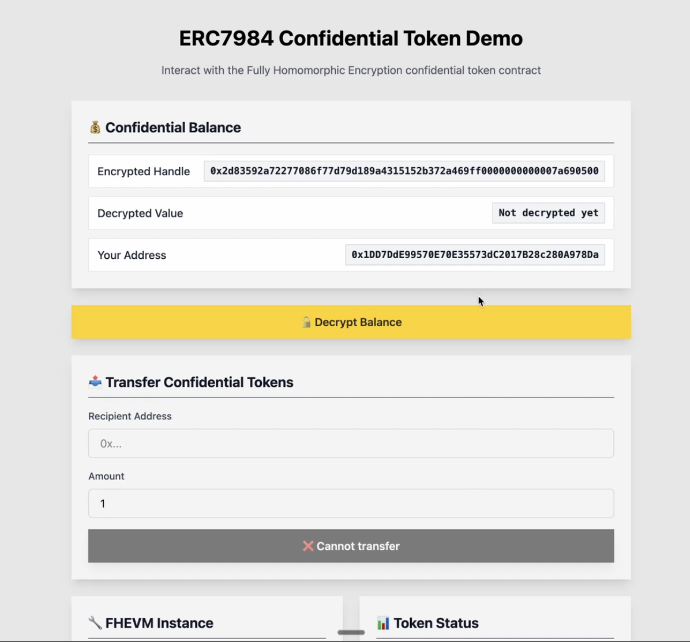
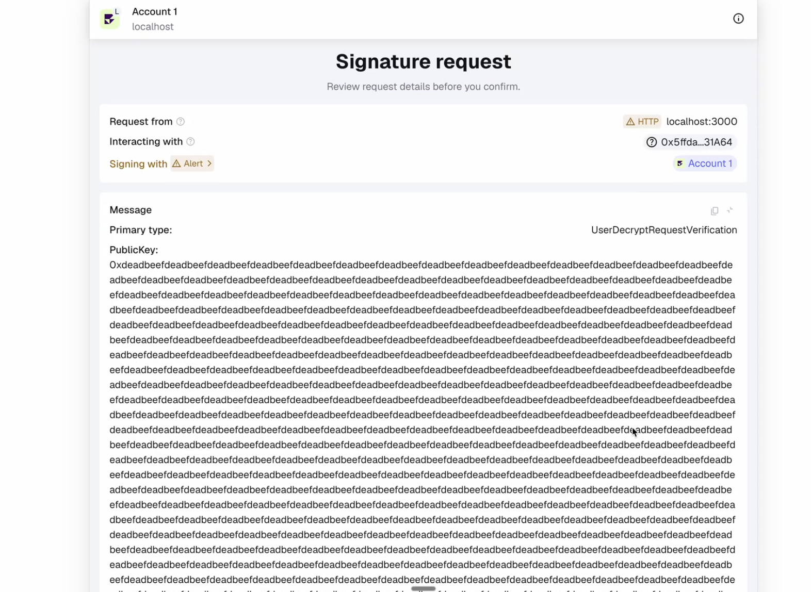
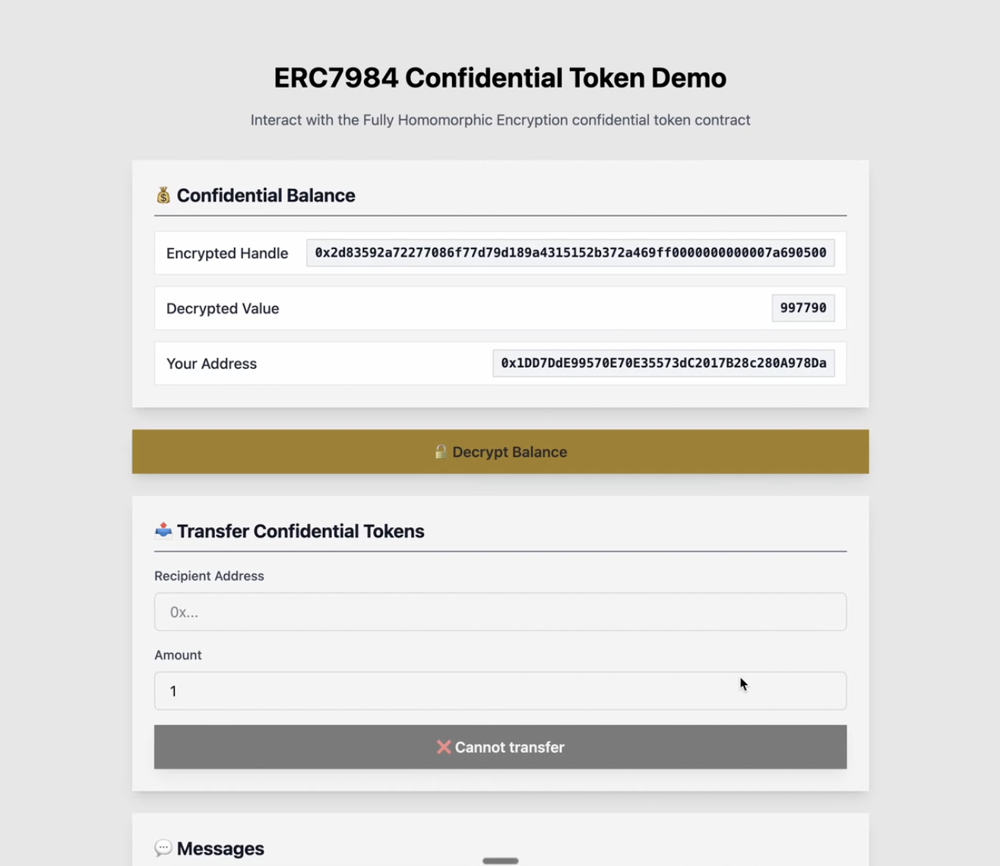
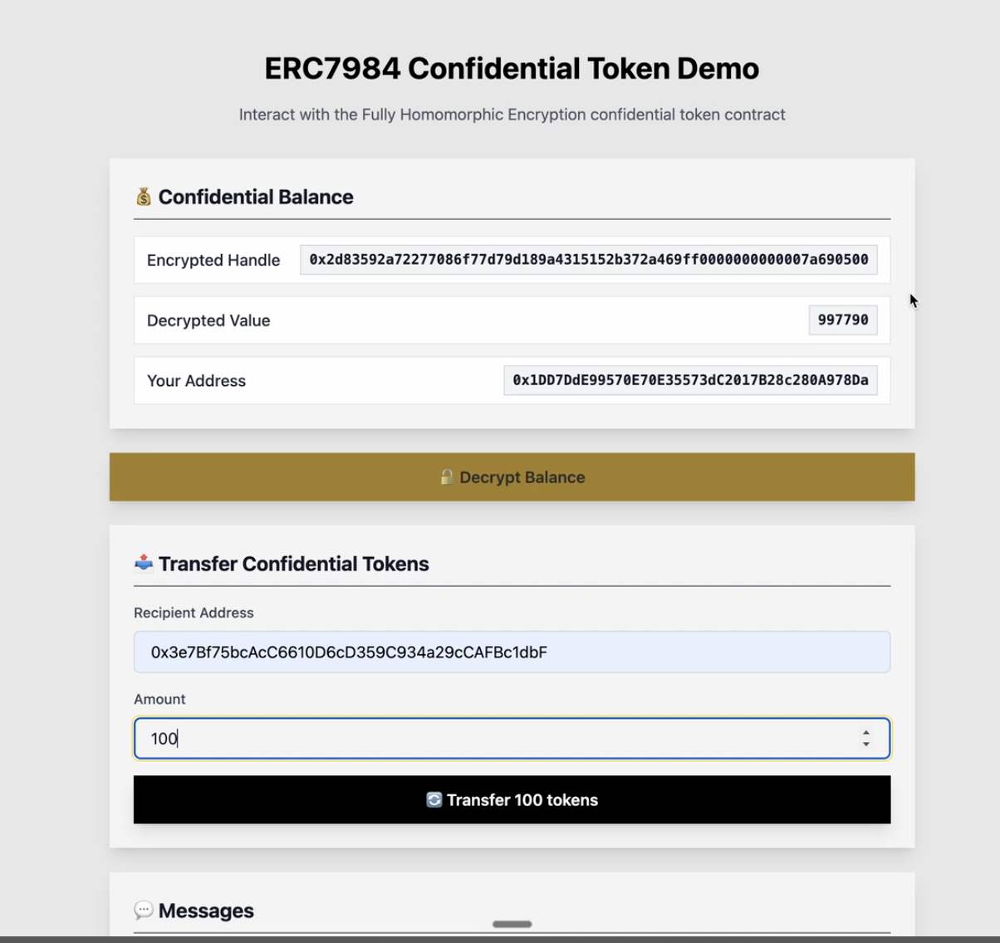

# Confidential token integration guide for Wallets and Exchanges

This guide is for wallet developers, dApp developers, and exchanges who want to support confidential tokens on Zama Protocol. It covers ERC-7984 wallet flows (showing balances via user decryption, sending transfers with encrypted inputs), as well as how to work with the Confidential Token Wrappers Registry and wrapping/unwrapping flows.

For deeper SDK details, follow the [Relayer SDK guide](https://docs.zama.org/protocol/relayer-sdk-guides/).

By the end of this guide, you will be able to:

- Understand [Zama Protocol](../protocol/architecture/overview.md) at a high-level.
- Build ERC-7984 confidential token transfers using encrypted inputs.
- Display ERC-7984 confidential token balances.
- Query the Confidential Token Wrappers Registry to discover wrapped token pairs.
- Understand the wrapping and unwrapping flow between ERC-20 and ERC-7984 tokens.

## **Core concepts in this guide**

While building support for [ERC-7984 confidential tokens](https://eips.ethereum.org/EIPS/eip-7984) in your wallet/app, you might come across the following terminology related to [various parts of the Zama Protocol](../protocol/architecture/overview.md). A brief explanation of common terms you might encounter are:

- **FHEVM**: Zama's [FHEVM library](../protocol/architecture/library.md) that supports computations on encrypted values. Encrypted values are represented on‑chain as **ciphertext handles** (bytes32).
- **Host chain**: The EVM network your users connect to in a wallet with confidential smart contracts. Example: Ethereum / Ethereum Sepolia.
- **Gateway chain**: Zama's Arbitrum L3 [Gateway chain](../protocol/architecture/gateway.md) that coordinates FHE encryptions/decryptions.
- **Relayer**: Off‑chain [Relayer](../protocol/architecture/relayer_oracle.md) that registers encrypted inputs, coordinate decryptions, and return results to users or contracts. Wallets and dApps talk to the Relayer via the JavaScript SDK.
- **ACL:** Access control for ciphertext handles. Contracts grant per‑address permissions so a user can read data they should have access to.
- **Native confidential token**: An ERC-7984 token where balances and transfer amounts are encrypted by default. The token is natively confidential and is not derived from an underlying ERC-20.
- **Wrapped confidential token**: A standard ERC-20 token that has been wrapped into an ERC-7984 confidential form via a wrapper contract. The underlying ERC-20 remains unchanged.
- **Confidential Token Wrappers Registry**: An on-chain registry that maps ERC-20 tokens to their corresponding ERC-7984 confidential token wrappers.

## Wallet and exchange integration at a glance

At a high-level, to integrate Zama Protocol into a wallet or exchange, you do **not** need to run FHE infrastructure. You can interact with the Zama Protocol using [Relayer SDK](https://docs.zama.org/protocol/relayer-sdk-guides) in your wallet or app. These are the steps at a high-level:

1. **Relayer SDK initialization** in web app, browser extension, or mobile app. Follow the [setup guide for Relayer SDK](https://docs.zama.org/protocol/relayer-sdk-guides/development-guide/webapp). In browser contexts, importing the library via the CDN links is easiest. Alternatively, do this by importing the `@zama-fhe/relayer-sdk` NPM package.
2. [Configure and initialize settings](https://docs.zama.org/protocol/relayer-sdk-guides/fhevm-relayer/initialization) for the library.
3. **Confidential token (ERC-7984) basics**:
    - Show encrypted balances using **user decryption**.
    - Build **transfers** using encrypted inputs. Refer to [OpenZeppelin's ERC-7984 token guide](https://docs.openzeppelin.com/confidential-contracts/token).
    - Manage **operators** for delegated transfers with an expiry, including clear revoke UX.

### **What wallets and exchanges should support**

- **Transfers**: Support the ERC-7984 transfer variants documented by OpenZeppelin, including forms that use an input proof and optional receiver callbacks.
- **Operators**: Operators can move any amount during an active window. Your UX must capture an expiry, show risk clearly, and make revoke easy.
- **Events and metadata**: Names and symbols behave like conventional tokens, but on-chain amounts remain encrypted. Render user-specific amounts after user decryption.

## Wrapping and unwrapping

Wrapped confidential tokens allow users to convert standard ERC-20 tokens into an ERC-7984 confidential form. Once wrapped, the token behaves as a confidential token: balances and transfer amounts are encrypted on-chain. The underlying ERC-20 remains unchanged and can be recovered by unwrapping.

For the full confidential wrapper contract reference, see the [Zama Protocol documentation](https://docs.zama.org/protocol/protocol-apps/confidential-wrapper).

### Fungibility between ERC-20 and confidential tokens

For exchanges, a wrapped confidential token should be treated as **fungible with its underlying ERC-20** from the user's perspective. A user who deposits USDT and a user who deposits cUSDT are depositing the same underlying asset. The exchange handles wrapping and unwrapping internally as an implementation detail.

This means exchanges should consider supporting the following flows:

- **User deposits ERC-20** (e.g., USDT): the exchange wraps it into the confidential form (cUSDT) if needed for on-chain operations.
- **User deposits confidential token** (e.g., cUSDT): no wrapping needed; the exchange credits the same underlying balance.
- **User withdraws as ERC-20** (e.g., USDT): the exchange unwraps the confidential token and sends standard ERC-20.
- **User withdraws as confidential token** (e.g., cUSDT): no unwrapping needed; the exchange sends the confidential token directly.

In all cases, the user sees a single unified balance for the underlying asset.

### How wrapping works

When a user holds a standard ERC-20 token (e.g., USDT), **wrapping** converts standard ERC-20 tokens into their confidential ERC-7984 form. Wrapping deposits them into the wrapper contract for the token, with the user receiving an equivalent amount of the confidential token (e.g., cUSDT) with an encrypted balance. (In a custodial scenario, these actions can be carried out on behalf of the user.)

Prior to wrapping, the wrapper contract must be approved by the caller on the underlying ERC-20 token (a standard ERC-20 `approve` call).

```solidity
wrapper.wrap(to, amount);
```

- `amount` uses the same decimal precision as the underlying ERC-20 token.
- The wrapper mints the corresponding confidential tokens to the `to` address.
- Due to decimal conversion (see below), any excess tokens below the conversion rate are refunded to the caller.

Once the wrapping is complete, the confidential token can be transferred, held, or used in as assets within an exchange. Any recipient would then need to decrypt the balances or transaction amounts to utilize the tokens in a transaction.

### How unwrapping works

When a user holds a wrapped confidential token (e.g., cUSDT), to get the ERC-20 equivalent back they (or someone on their behalf) needs to **unwrap** the confidential token.

Unwrapping is a **two-step asynchronous process**: first an unwrap request is made, then it is finalised once the encrypted amount has been publicly decrypted. During this process once the unwrapping is complete, the confidential tokens are and the user or their proxy receives the equivalent amount of the underlying ERC-20 token back.

**Step 1: Unwrap request**

```solidity
wrapper.unwrap(from, to, encryptedAmount, inputProof);
```

- The caller must be `from` or an approved operator for `from`.
- The `encryptedAmount` of confidential tokens is burned.
- No transfer of underlying ERC-20 tokens happens in this step.

**Step 2: Finalise unwrap**

The encrypted burned amount from the `UnwrapRequested` event must be [publicly decrypted](https://docs.zama.org/protocol/relayer-sdk-guides/fhevm-relayer/decryption/public-decryption) to obtain the cleartext amount and a decryption proof.

```solidity
wrapper.finalizeUnwrap(burntAmount, cleartextAmount, decryptionProof);
```

This sends the corresponding amount of underlying ERC-20 tokens to the `to` address specified in the unwrap request.

### Decimal conversion

The wrapper enforces a maximum of **6 decimals** for the confidential token. When wrapping tokens with higher precision (e.g., 18-decimal tokens), amounts are rounded down and excess tokens are refunded.

| Underlying decimals | Wrapper decimals | Conversion rate | Effect |
| --- | --- | --- | --- |
| 18 | 6 | 10^12 | 1 wrapped unit = 10^12 underlying units |
| 6 | 6 | 1 | 1:1 mapping |
| 2 | 2 | 1 | 1:1 mapping |

The conversion rate and wrapper decimals can be checked on-chain:

```solidity
uint256 conversionRate = wrapper.rate();
uint8 wrapperDecimals = wrapper.decimals();
```

### Finding the underlying token

The underlying ERC-20 address for any wrapped confidential token can be looked up via the [Confidential Token Wrappers Registry](#confidential-token-wrappers-registry):

```solidity
(bool isValid, address token) = registry.getTokenAddress(confidentialWrapperAddress);
```

Wallets and exchanges should provide clear UX for both wrapping and unwrapping flows, making it obvious to the user which token they are converting between.

## Confidential Token Wrappers Registry

The [Confidential Token Wrappers Registry](https://docs.zama.org/protocol/protocol-apps/registry-contract) is an on-chain contract that maps ERC-20 tokens to their corresponding ERC-7984 confidential token wrappers. It provides a canonical directory for discovering which ERC-20 tokens have official confidential wrappers.

The registry is currently deployed at:

- **Ethereum mainnet**: [`0xeb5015fF021DB115aCe010f23F55C2591059bBA0`](https://etherscan.io/address/0xeb5015fF021DB115aCe010f23F55C2591059bBA0)
- **Sepolia testnet**: [`0x2f0750Bbb0A246059d80e94c454586a7F27a128e`](https://sepolia.etherscan.io/address/0x2f0750Bbb0A246059d80e94c454586a7F27a128e)

Each entry in the registry is a `TokenWrapperPair` struct:

```solidity
struct TokenWrapperPair {
    address tokenAddress;              // The ERC-20 token
    address confidentialTokenAddress;  // The ERC-7984 wrapper
    bool isValid;                      // false if revoked
}
```

A token can only be associated with one confidential wrapper, and a confidential wrapper can only be associated with one token.

> **Always check validity:** A non-zero wrapper address may have been revoked. Always verify the `isValid` flag before use.

### Querying the registry

**Find the confidential wrapper for an ERC-20 token:**

```solidity
(bool isValid, address confidentialToken) = registry.getConfidentialTokenAddress(erc20TokenAddress);
```

Returns `(true, wrapperAddress)` if registered and valid, `(false, address(0))` if never registered, or `(false, wrapperAddress)` if the wrapper has been revoked.

**Find the underlying ERC-20 for a confidential wrapper:**

```solidity
(bool isValid, address token) = registry.getTokenAddress(confidentialWrapperAddress);
```

Returns `(true, tokenAddress)` if registered and valid, `(false, address(0))` if never registered, or `(false, tokenAddress)` if the wrapper has been revoked.

**Get all registered token pairs:**

```solidity
TokenWrapperPair[] memory pairs = registry.getTokenConfidentialTokenPairs();
```

Returns all registered pairs, including revoked ones. For large registries, use paginated access:

```solidity
uint256 totalPairs = registry.getTokenConfidentialTokenPairsLength();
TokenWrapperPair[] memory slice = registry.getTokenConfidentialTokenPairsSlice(fromIndex, toIndex);
TokenWrapperPair memory single = registry.getTokenConfidentialTokenPair(index);
```

For the full registry contract reference, see the [Zama Protocol documentation](https://docs.zama.org/protocol/protocol-apps/registry-contract).

### Currently registered confidential tokens

The following wrapped confidential tokens are currently registered on Ethereum mainnet:

| Confidential token | Address |
| --- | --- |
| cUSDC | [`0xe978F22157048E5DB8E5d07971376e86671672B2`](https://etherscan.io/address/0xe978F22157048E5DB8E5d07971376e86671672B2) |
| cUSDT | [`0xAe0207C757Aa2B4019Ad96edD0092ddc63EF0c50`](https://etherscan.io/address/0xAe0207C757Aa2B4019Ad96edD0092ddc63EF0c50) |
| cWETH | [`0xda9396b82634Ea99243cE51258B6A5Ae512D4893`](https://etherscan.io/address/0xda9396b82634Ea99243cE51258B6A5Ae512D4893) |
| cBRON | [`0x85dE671c3bec1aDeD752c3Cea943521181C826bc`](https://etherscan.io/address/0x85dE671c3bec1aDeD752c3Cea943521181C826bc) |
| cZAMA | [`0x80CB147Fd86dC6dEe3Eee7e4Cee33d1397d98071`](https://etherscan.io/address/0x80CB147Fd86dC6dEe3Eee7e4Cee33d1397d98071) |
| cTGBP | [`0xa873750ccbafd5ec7dd13bfd5237d7129832edd9`](https://etherscan.io/address/0xa873750ccbafd5ec7dd13bfd5237d7129832edd9) |

The underlying ERC-20 address for each can be looked up using `getTokenAddress()` on the registry contract.

## Quick start: ERC-7984 example app

To see these concepts in action, check out the [ERC-7984 demo](https://github.com/zama-ai/dapps/tree/main/packages/erc7984example) from the [zama-ai/dapps](https://github.com/zama-ai/dapps) Github repository.

The demo shows how a frontend or wallet app:

1. [**Register encrypted inputs**](https://docs.zama.org/protocol/relayer-sdk-guides/fhevm-relayer/input) for contract calls such as confidential token transfers.
2. Request [**User decryption**](https://docs.zama.org/protocol/relayer-sdk-guides/fhevm-relayer/decryption/user-decryption) so users can view private data like balances.

### Run locally

1. Clone the [zama-ai/dapps](https://github.com/zama-ai/dapps) Github repository
2. Install dependencies and deploy a local Hardhat chain

```bash
pnpm install
pnpm chain
pnpm deploy:localhost
```

1. Navigate to the [ERC-7984 demo](https://github.com/zama-ai/dapps/tree/main/packages/erc7984example) folder in the cloned repo

```bash
cd packages/erc7984example
```

1. Run the demo application on local Hardhat chain

```bash
pnpm run start
```

### Steps demonstrated by the ERC-7984 demo app

**Step 1**: On initially logging in and connect a wallet, a user's confidential token balances are not yet visible/decrypted.



**Step 2**: User can now sign and fetch their decrypted ERC-7984 confidential token balance. Balances are stored as ciphertext handles. To display a user's balance, read the balance handle from your token and [perform **user decryption**](https://docs.zama.ai/protocol/relayer-sdk-guides/v0.1/fhevm-relayer/decryption/user-decryption) with an EIP-712-authorized session in the wallet. Ensure the token grants ACL permission to the user before decrypting.





**Step 3**: User chooses ERC-7984 confidential token amount to send, which is encrypted, signed and sent to destination address. Follow [**OpenZeppelin's ERC-7984 transfer documentation**](https://docs.openzeppelin.com/confidential-contracts/token#transfer) for function variants and receiver callbacks. Amounts are passed as encrypted inputs that your wallet prepares with the Relayer SDK.



## **UI and UX recommendations**

- **Caching**: Cache decrypted values client‑side for the session lifetime. Offer a refresh action that repeats the flow.
- **Permissions:** treat user decryption as a permission grant with scope and duration. Show which contracts are included and when access expires.
- **Indicators:** use distinct icons or badges for encrypted amounts. Avoid showing zero when a value is simply undisclosed.
- **Operator visibility**: always show current operator approvals with expiry and a one-tap revoke
- **Wrapping/unwrapping**: clearly indicate which token a user is converting between. Show the underlying ERC-20 token name and symbol alongside the confidential token when displaying wrapped tokens.
- **Failure modes:** differentiate between decryption denied, missing ACL grant, and expired decryption session. Offer guided recovery actions.

## **Testing and environments**

- **Testnet configuration:** Start with the SDK's built‑in Sepolia configuration or a local Hardhat network. Swap to other supported networks by replacing the config object. Keep chain selection in a single source of truth in your app.
- **Mocks:** for unit tests, prefer SDK mocked mode or local fixtures that bypass the Gateway but maintain identical call shapes for your UI logic.

## Further reading

- Detailed [**confidential contracts guide from OpenZeppelin**](https://docs.openzeppelin.com/confidential-contracts) (besides ERC-7984)
- [**ERC-7984 tutorial and examples**](./openzeppelin/README.md)
- [**Confidential wrapper documentation**](https://docs.zama.org/protocol/protocol-apps/confidential-wrapper)
- [**Confidential Token Wrappers Registry documentation**](https://docs.zama.org/protocol/protocol-apps/registry-contract)
