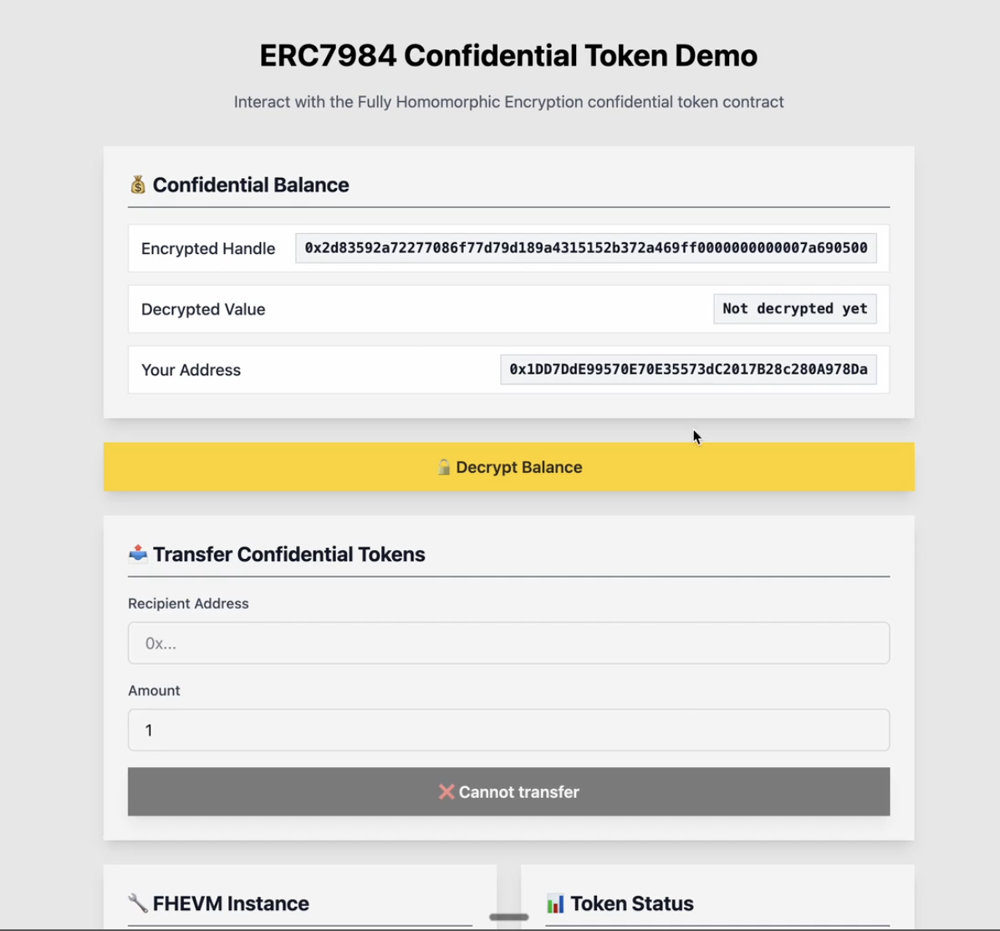
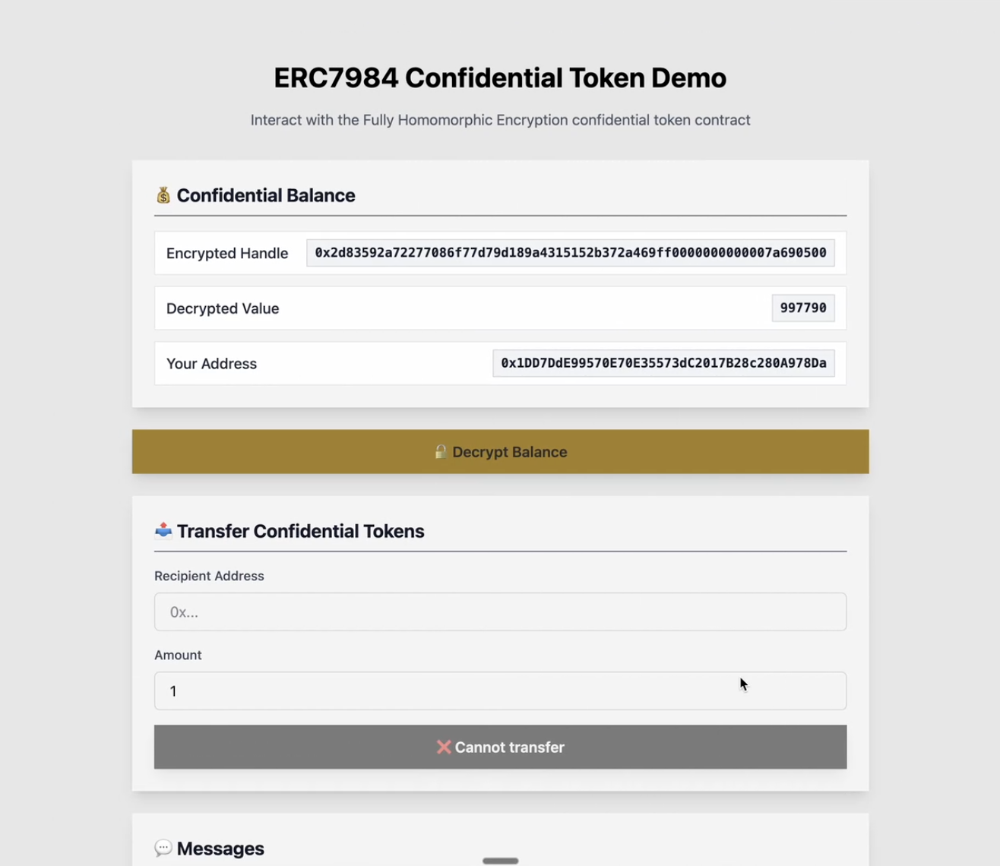
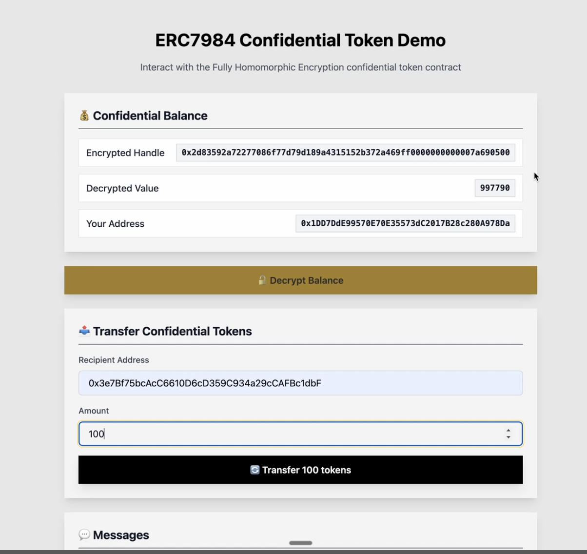

# Confidential token integration guide for Wallets

This guide is for wallet and dApp developers who want to support confidential tokens on Zama Protocol. It focuses on ERC-7984 wallet flows: showing balances (user decryption) and sending transfers (encrypted inputs). For deeper SDK details, follow the [Relayer SDK guide](https://docs.zama.org/protocol/relayer-sdk-guides/).

By the end of this guide, you will be able to:

- Understand [Zama Protocol](../protocol/architecture/overview.md) at a high-level.
- Build ERC-7984 confidential token transfers using encrypted inputs.
- Display ERC-7984 confidential token balances.

## **Core concepts in this guide**

While building support for ERC-7984 confidential tokens in your wallet/app, you might come across the following terminology related to [various parts of the Zama Protocol](../protocol/architecture/overview.md). A brief explanation of common terms you might encounter are:

- **FHEVM**: Zama’s [FHEVM library](../protocol/architecture/library.md) that supports computations on encrypted values. Encrypted values are represented on‑chain as **ciphertext handles** (bytes32).
- **Host chain**: The EVM network your users connect to in a wallet with confidential smart contracts. Example: Ethereum / Ethereum Sepolia.
- **Gateway chain**: Zama’s Arbitrum L3 [Gateway chain](../protocol/architecture/gateway.md) that coordinates FHE encryptions/decryptions.
- **Relayer**: Off‑chain [Relayer](../protocol/architecture/relayer_oracle.md) that registers encrypted inputs, coordinate decryptions, and return results to users or contracts. Wallets and dApps talk to the Relayer via the JavaScript SDK.
- **ACL:** Access control for ciphertext handles. Contracts grant per‑address permissions so a user can read data they should have access to.

## Wallet integration at a glance

At a high-level, to integrate Zama Protocol into a wallet, you do **not** need to run FHE infrastructure. You can interact with the Zama Protocol using [Relayer SDK](https://docs.zama.org/protocol/relayer-sdk-guides) in your wallet or app. These are the steps at a high-level:

1. **Relayer SDK initialization** in web app, browser extension, or mobile app. Follow the [setup guide for Relayer SDK](https://docs.zama.org/protocol/relayer-sdk-guides/development-guide/webapp). In browser contexts, importing the library via the CDN links is easiest. Alternatively, do this by importing the `@zama-fhe/relayer-sdk` NPM package.
2. [Configure and initialize settings](https://docs.zama.org/protocol/relayer-sdk-guides/fhevm-relayer/initialization) for the library.
3. **Confidential token (ERC-7984) basics**:
    - Show encrypted balances using **user decryption**.
    - Build **transfers** using encrypted inputs. Refer to [OpenZeppelin’s ERC-7984 token guide](https://docs.openzeppelin.com/confidential-contracts/token).
    - Manage **operators** for delegated transfers with an expiry, including clear revoke UX.

### **What wallets should support**

- **Transfers**: Support the ERC-7984 transfer variants documented by OpenZeppelin, including forms that use an input proof and optional receiver callbacks.
- **Operators**: Operators can move any amount during an active window. Your UX must capture an expiry, show risk clearly, and make revoke easy.
- **Events and metadata**: Names and symbols behave like conventional tokens, but on-chain amounts remain encrypted. Render user-specific amounts after user decryption.

## Quick start: ERC-7984 example app

To see these concepts in action, check out the [ERC-7984 demo](https://github.com/zama-ai/dapps/tree/main/packages/erc7984example) from the [zama-ai/dapps](https://github.com/zama-ai/dapps) Github repository.

The demo shows how a frontend or wallet app:

1. [**Register encrypted inputs**](https://docs.zama.org/protocol/relayer-sdk-guides/fhevm-relayer/input) for contract calls such as confidential token transfers.
2. Request [**User decryption**](https://docs.zama.org/protocol/relayer-sdk-guides/fhevm-relayer/decryption/user-decryption) so users can view private data like balances.

### Run locally

1. Clone the [zama-ai/dapps](https://github.com/zama-ai/dapps) Github repository
2. Install dependencies and deploy a local Hardhat chain

```bash
pnpm install
pnpm chain
pnpm deploy:localhost
```

1. Navigate to the [ERC-7984 demo](https://github.com/zama-ai/dapps/tree/main/packages/erc7984example) folder in the cloned repo

```bash
cd packages/erc7984example
```

1. Run the demo application on local Hardhat chain

```bash
pnpm run start
```

### Steps demonstrated by the ERC-7984 demo app

**Step 1**: On initially logging in and connect a wallet, a user’s confidential token balances are not yet visible/decrypted.



**Step 2**: User can now sign and fetch their decrypted ERC-7984 confidential token balance. Balances are stored as ciphertext handles. To display a user’s balance, read the balance handle from your token and [perform **user decryption**](https://docs.zama.ai/protocol/relayer-sdk-guides/v0.1/fhevm-relayer/decryption/user-decryption) with an EIP-712-authorized session in the wallet. Ensure the token grants ACL permission to the user before decrypting.




**Step 3**: User chooses ERC-7984 confidential token amount to send, which is encrypted, signed and sent to destination address. Follow [**OpenZeppelin’s ERC-7984 transfer documentation**](https://docs.openzeppelin.com/confidential-contracts/token#transfer) for function variants and receiver callbacks. Amounts are passed as encrypted inputs that your wallet prepares with the Relayer SDK.



## **UI and UX recommendations**

- **Caching**: Cache decrypted values client‑side for the session lifetime. Offer a refresh action that repeats the flow.
- **Permissions:** treat user decryption as a permission grant with scope and duration. Show which contracts are included and when access expires.
- **Indicators:** use distinct icons or badges for encrypted amounts. Avoid showing zero when a value is simply undisclosed.
- **Operator visibility**: always show current operator approvals with expiry and a one-tap revoke
- **Failure modes:** differentiate between decryption denied, missing ACL grant, and expired decryption session. Offer guided recovery actions.

## **Testing and environments**

- **Testnet configuration:** Start with the SDK’s built‑in Sepolia configuration or a local Hardhat network. Swap to other supported networks by replacing the config object. Keep chain selection in a single source of truth in your app.
- **Mocks:** for unit tests, prefer SDK mocked mode or local fixtures that bypass the Gateway but maintain identical call shapes for your UI logic.

## Further reading

- Detailed [**confidential contracts guide from OpenZeppelin**](https://docs.openzeppelin.com/confidential-contracts) (besides ERC-7984)
- [**ERC-7984 tutorial and examples**](./openzeppelin/README.md)