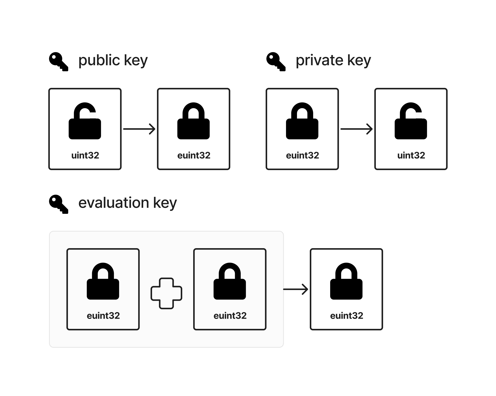
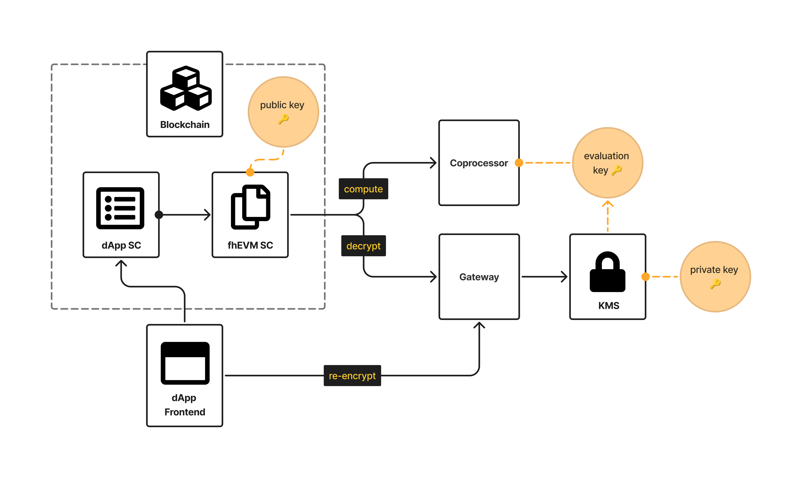

# Architecture Overview

This document provides developers with the essential architectural concepts needed to start building with fhEVM. Rather than diving deep into implementation details, it focuses on the key components and principles that enable confidential smart contract development.

The goal is to give you just enough understanding of the architecture to begin coding effectively. For more detailed technical information, please refer to the other documentation sections.

## **1. What is Fully Homomorphic Encryption (FHE)?**

Fully Homomorphic Encryption (FHE) is an advanced cryptographic technique that allows computations to be performed directly on encrypted data, without the need for decryption. This ensures that data remains confidential throughout its entire lifecycle, even during processing.

With FHE:

- Sensitive data can be securely encrypted while still being useful for computations.
- The results of computations are encrypted, maintaining end-to-end privacy.

FHE operates using three types of keys, each playing a crucial role in its functionality:

### **1.1 Private key**

- **Purpose**: - for securely decrypting results - Decrypts ciphertexts to recover the original plaintext.
- **Usage in fhEVM**: Managed securely by the Key Management System (KMS) using a threshold MPC protocol. This ensures no single entity ever possesses the full private key.

### **1.2 Public key**

- **Purpose**: - for encrypting data. - Encrypts plaintexts into ciphertexts.
- **Usage in fhEVM**: Shared globally to allow users and smart contracts to encrypt inputs or states. It ensures that encrypted data can be processed without revealing the underlying information.

### **1.3 Evaluation key**

- **Purpose**: - for performing encrypted computations - Enables efficient homomorphic operations (e.g., addition, multiplication) on ciphertexts.
- **Usage in fhEVM**: Provided to FHE nodes (on-chain validators or off-chain coprocessors) to perform computations on encrypted data while preserving confidentiality.

These three keys work together to facilitate private and secure computations, forming the foundation of FHE-based systems like fhEVM.

<figure><figcaption>Overview of FHE Keys and their roles</figcaption></figure>

## **2. Bringing FHE to Blockchain: From Library to fhEVM**

### **2.1 Building on Zama's FHE library**

At its core, the fhEVM is built on Zama's high-performance FHE library, **TFHE-rs**, written in Rust. This library implements the TFHE (Torus Fully Homomorphic Encryption) scheme and is designed to perform secure computations on encrypted data efficiently.

> **Info**:
> For detailed documentation and implementation examples on the `tfhe-rs` library, visit the [TFHE-rs documentation](https://docs.zama.ai/tfhe-rs).

However, integrating a standalone FHE library like TFHE-rs into a blockchain environment involves unique challenges. Blockchain systems demand efficient processing, public verifiability, and seamless interoperability, all while preserving their decentralized nature. To address these requirements, Zama designed the fhEVM, a system that bridges the computational power of TFHE-rs with the transparency and scalability of blockchain technology.

### **2.2 Challenges in blockchain integration**

Integrating FHE into blockchain systems posed several challenges that needed to be addressed to achieve the goals of confidentiality, composability, and scalability:

1. **Transparency and privacy**: Blockchains are inherently transparent, where all on-chain data is publicly visible. FHE solves this by keeping all sensitive data encrypted, ensuring privacy without sacrificing usability.
2. **Public verifiability**: On-chain computations need to be verifiable by all participants. This required a mechanism to confirm the correctness of encrypted computations without revealing their inputs or outputs.
3. **Composability**: Smart contracts needed to interact seamlessly with each other, even when operating on encrypted data.
4. **Performance and scalability**: FHE computations are resource-intensive, and blockchain systems require high throughput to remain practical.

To overcome these challenges, Zama introduced a hybrid architecture for fhEVM that combines:

- **On-chain** functionality for managing state and enforcing access controls.
- **Off-chain** processing via a coprocessor to execute resource-intensive FHE computations.

## **3 fhEVM components overview**

The fhEVM architecture is built around four primary components, each contributing to the system's functionality and performance. These components work together to enable the development and execution of private, composable smart contracts on EVM-compatible blockchains. Below is an overview of these components and their responsibilities:

| **Component**                   | **Description**                                                                                           | **Key Functions**                                                                                                                  |
| ------------------------------- | --------------------------------------------------------------------------------------------------------- | ---------------------------------------------------------------------------------------------------------------------------------- |
| **fhEVM Smart Contracts**       | Smart contracts deployed on the blockchain to manage encrypted data and interactions.                     | Includes the Access Control List (ACL) contract, `TFHE.sol` Solidity library, `Gateway.sol` and other FHE-enabled smart contracts. |
| **Gateway**                     | An off-chain service that bridges the blockchain with the cryptographic systems like KMS and coprocessor. | Acts as an intermediary to forward the necessary requests and results between the blockchain, the KMS, and users.                  |
| **Coprocessor**                 | An off-chain computational engine designed to execute resource-intensive FHE operations.                  | Executes symbolic FHE operations, manages ciphertext storage, and ensures efficient computation handling.                          |
| **Key Management System (KMS)** | A decentralized cryptographic service that securely manages FHE keys and validates operations.            | Manages the global FHE key (public, private, evaluation), performs threshold decryption, and validates ZKPoKs.                     |

<figure><figcaption>High level overview of the fhEVM Architecture</figcaption></figure>

---

### **Developer guide to creating confidential smart contracts**

As a developer working with fhEVM, your workflow typically involves two key elements:

1. **Frontend development**:  
   You create a frontend interface for users to interact with your confidential application. This includes encrypting inputs using the public FHE key and submitting them to the blockchain.

2. **Smart contract development**:  
   You write Solidity contracts deployed on the same blockchain as the fhEVM smart contracts. These contracts leverage the `TFHE.sol` library to perform operations on encrypted data. Below, we explore the major components involved.

---

### **fhEVM smart contracts**

fhEVM smart contracts include the Access Control List (ACL) contract, `TFHE.sol` library, and related FHE-enabled contracts.

#### **Symbolic execution in Solidity**

fhEVM implements **symbolic execution** to optimize FHE computations:

- **Handles**: Operations on encrypted data return "handles" (references to ciphertexts) instead of immediate results.
- **Lazy Execution**: Actual computations are performed asynchronously, offloading resource-intensive tasks to the coprocessor.

This approach ensures high throughput and flexibility in managing encrypted data.

#### **Zero-Knowledge proofs of knowledge (ZKPoKs)**

fhEVM incorporates ZKPoKs to verify the correctness of encrypted inputs and outputs:

- **Validation**: ZKPoKs ensure that inputs are correctly formed and correspond to known plaintexts without revealing sensitive data.
- **Integrity**: They prevent misuse of ciphertexts and ensure the correctness of computations.

By combining symbolic execution and ZKPoKs, fhEVM smart contracts maintain both privacy and verifiability.

---

### **Coprocessor**

The coprocessor is the backbone for handling computationally intensive FHE tasks.

#### **Key functions**:

1. **Execution**: Performs operations such as addition, multiplication, and comparison on encrypted data.
2. **Ciphertext management**: Stores encrypted inputs, states, and outputs securely, either off-chain or in a dedicated on-chain database.

---

### **Gateway**

The Gateway acts as the bridge between the blockchain, coprocessor, and KMS.

#### **Key functions**:

- **API for developers**: Exposes endpoints for submitting encrypted inputs, retrieving outputs, and managing ciphertexts.
- **Proof validation**: Forwards ZKPoKs to the KMS for verification.
- **Off-chain coordination**: Relays encrypted data and computation results between on-chain and off-chain systems.

The Gateway simplifies the development process by abstracting the complexity of cryptographic operations.

---

### **Key management system (KMS)**

The KMS securely manages the cryptographic backbone of fhEVM by maintaining and distributing the global FHE keys.

#### **Key functions**:

- **Threshold decryption**: Uses Multi-Party Computation (MPC) to securely decrypt ciphertexts without exposing the private key to any single entity.
- **ZKPoK validation**: Verifies proofs of plaintext knowledge to ensure that encrypted inputs are valid.
- **Key distribution**: Maintains the global FHE keys, which include:
  - **Public key**: Used for encrypting data (accessible to the frontend and smart contracts).
  - **Private key**: Stored securely in the KMS and used for decryption.
  - **Evaluation key**: Used by the coprocessor to perform FHE computations.

The KMS ensures robust cryptographic security, preventing single points of failure and maintaining public verifiability.

---

In the next section, we will dive deeper into encryption, re-encryption, and decryption processes, including how they interact with the KMS and Gateway services. For more details, see [Decrypt and re-encrypt](./d_re_ecrypt_compute.md).
