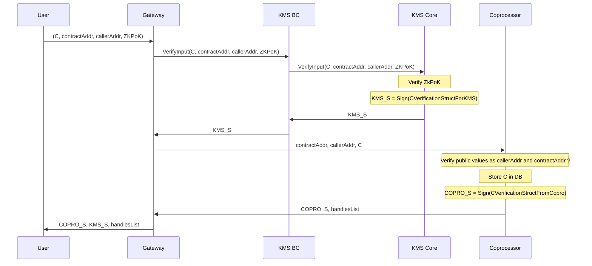
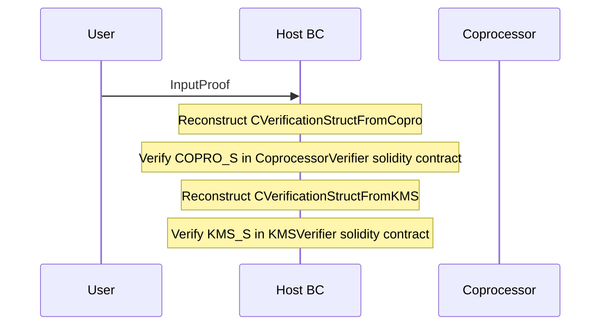

# Inputs

Inputs are handled particularly because the corresponding ciphertext is stored off-chain. This implies a secure mechanism which starts on user side, 
cross the KMS and finaly is managed by the coprocessor. 

This document will explain how inputs works on Solidity level, the second part will give an overview of the full flow of an input. 

## Compact Input Lists

TODO.

## Overview of input mechanism

Handling inputs requires a few steps. The first one is to retrieve public key material from the Gateway. The second point is to encrypt them and computing the associated proof. Last step is to use them as "usual" inputs in the smart contract. 

### Public key material and CRS retrieval

The very first step to prepare input is to have the blockchain related public key material. The Gateway is the component reached by the user to get those material. 

The Gateway is exposing a `/keys` endpoint that returns the public key and CRS alongside the signature. Users are able to verify them using KMSVerifier smart contract. 

### Initialiazation phase

In this first part we need to encrypt the input with the blockchain public key to get the `ciphertext` `C`, and compute the `ZkPok`. `C` 
is bounded to be used with a `contractAddress` and by a `callerAddress`. The goal is to make it signed by the KMS to enable the usage of the input
within smart contract further. 

C == ciphertext - Encrypted with the blockchain public key

h == handle - keccak of C with some info appended

ZkPok == Zero-knowledge proof - Computed on client side as proof of knowledge of input

S ==  Signature

    struct CVerificationStructForKMS {
        address contractAddress;
        bytes32 hashOfCiphertext;
        address callerAddress;
    }

        struct CVerificationStructFromCopro {
        uint256[] handlesList;
        address contractAddress;
        bytes32 hashOfCiphertext;
        address callerAddress;
    }

    struct InputProof {
        bytes COPRO_S;
        bytes KMS_S;
        bytes32 hashOfCiphertext;
        uint256[] handlesList;

    }

Note: we can add handleList in **CVerificationStructForKMS**

### Usage

