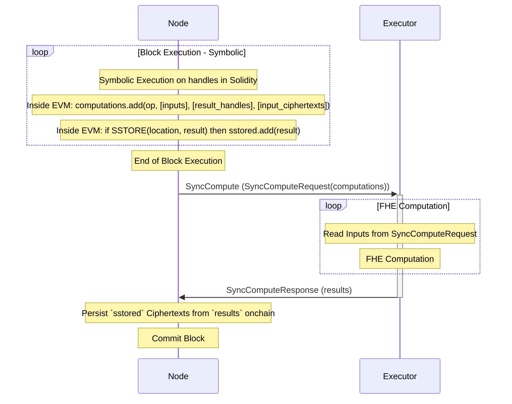

# Execution

Block execution in fhEVM-native is split into two parts:
 * symbolic execution
 * FHE computation

Symbolic execution happens onchain, inside the TFHEExecutor contract (inside the EVM). Essentially, the EVM accumulates all requested FHE operations in a block with their input handles and the corresponding result handles. It also remembers which result handles are stored via the SSTORE opcode. No FHE computations are done inside the EVM itself.

At the end of the block, the EVM sends a networking call to the Executor with the accumulated FHE computations. The Executor is free to do the FHE computations via any method, e.g. in parallel, on a cluster of compute nodes, via CPUs, GPUs, FPGAs or ASICs. The EVM waits until FHE computation for the block is done.

Finally, when results are returned to the EVM, it persists onchain the ciphertexts whose handles have been SSTOREd during symbolic execution. That way the EVM can avoid persisting ciphertexts that are intermediate results and are never actually stored by the smart contract developer.

## Symbolic Execution

As mentioned, symbolic execution doesn't do any FHE computations. Instead, it only operates on input handles, checking constraints on them and deterministically producing result handles based on the input ones.

For more information on what symbolic execution does, please look at the [TFHEExecutor](../../../contracts/contracts/TFHEExecutor.sol) contract.

## Interaction with the TFHEExecutor Contract

The TFHEExecutor contract is deployed when the chain is created and is at a well-known address that is also known by blockchain nodes. When a node (validator or full node) detects a call to this address (a CALL or STATITCCALL opcode), the EVM running in the node looks at the function signature and determines which FHE computation is being requested. The result handle is the result of this particular call to the TFHEExecutor contract and the EVM can accumulate it in the computations list for the block.

## FHE Computation Data Dependencies

Note that the EVM sends both input handles and result handles to the Executor. It is able to do that, because result handles are computed symbolically in the TFHEExecutor contract. That allows the Executor to do parallel FHE computation by analysing which computations are independent.

The Executor can detect a conflict if an output of computation A (or the output of another computation depending on the output of A) is also used as an input in a subsequent computation B. We call these computations `dependent` and we need to execute them in order.

On the other hand, if two computations have inputs that are not related to their outputs, we call them `independent` and the Executor can schedule them to run in parallel.
