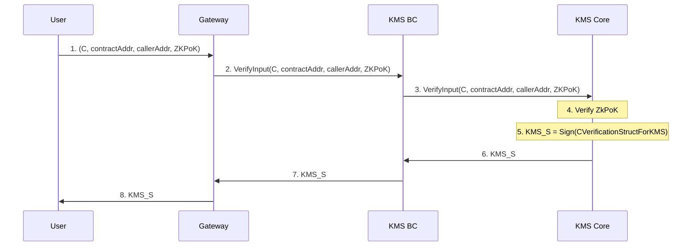
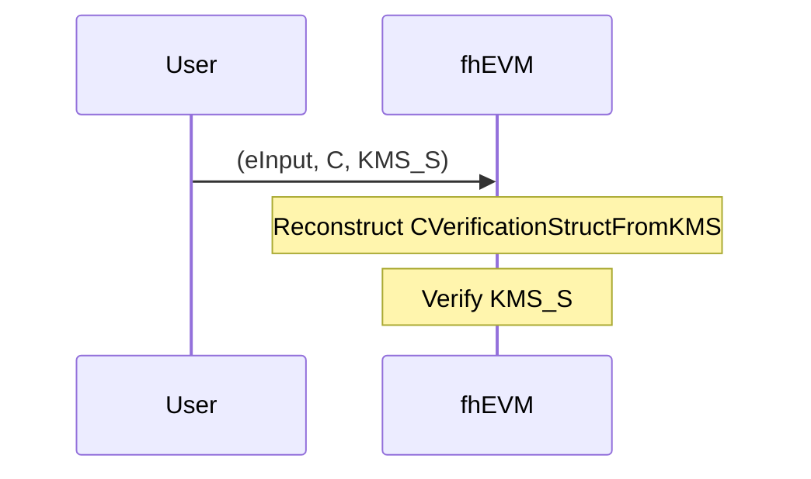

# Inputs

When we talk about inputs, we refer to encrypted data the users send to the fhEVM-native blockchain. Data is in the form of FHE ciphertexts. An example would be the amount to be transferred when calling an ERC20 transfer function.

## ZKPoK
It is important that confidential data sent by users cannot be seen by anyone. Without measures, there are multiple ways that could happen, for example:
 * anyone decrypting the ciphertext
 * anyone doing arbitrary computations via the ciphertext (e.g. adding 0 to it), producing a new ciphertext that itself is decrypted (including malicious actors using ciphertexts of other users)
 * using the ciphertext in a malicious contract that leads to decryption

Furthermore, if users are allowed to send arbitrary ciphertexts (including malformed ones or maliciously-crafted ones), that could lead to revealing data about the FHE secret key.

Therefore, we employ zero-knowledge proofs of knowledge (ZKPoK) of input FHE ciphertexts that guarantee:

* ciphertext is well-formed (i.e. encryption has been done correctly)
* the user knows the plaintext value
* the input ciphertext can only be used in a particular smart contract

The ZKPoK is verified by the KMS which delivers a signature (KMS_S) to the user. When the input byte array is passed to an `TFHE.asEuintXX()` function to convert from a ciphertext to a handle that can be used in smart contracts for FHE operations, the KMS_S is verified. 

## Compact Input Lists

To greatly reduce the size of FHE ciphertexts inputs, we utilize a feature called compact lists. It allows us to pack multiple values efficiently. It is useful when there is only one input and even more so when the are multiple inputs in a call to a smart contract.

We define the `einput` type that refers to a particular ciphertext in the list. The list itself is serialized and passed as a byte array. For example, `inputA` and `inputB` refer to ciphertexts in the list and the serialized list is `inputProof`:

```solidity
// SPDX-License-Identifier: BSD-3-Clause-Clear

pragma solidity ^0.8.24;

import "fhevm/lib/TFHE.sol";

contract Adder {
  euint32 result;

  function add(einput inputA, einput inputB, bytes calldata inputProof) public {
    euint32 a = TFHE.asEuint32(inputA, inputProof);
    euint32 b = TFHE.asEuint32(inputB, inputProof);
    result = TFHE.add(a, b);
    TFHE.allow(result, address(this));
  }
}
```

Note that `inputProof` also contains the ZKPoK.


## Overview of input mechanism

Handling inputs requires a few steps. The first one is to retrieve public key material from the Gateway. The second point is to encrypt them and computing the associated proof. Last step is to use them as "usual" inputs in the smart contract. 

### Public key material and CRS retrieval

The very first step to prepare input is to have the blockchain related public key material. The Gateway is the component reached by the user to get those material. 

The Gateway is exposing a `/keys` endpoint that returns the public key and CRS alongside the signature. Users are able to verify them using KMSVerifier smart contract. 


### Initialization phase

In this first part we need to encrypt the input with the blockchain public key to get the `ciphertext` `C`, and compute the `ZkPok`. `C` 
is bounded to be used with a `contractAddress` and by a `callerAddress`. The goal is to make it signed by the KMS to enable the usage of the input
within smart contract further. 

C == ciphertext - Encrypted with the blockchain public key

ZkPok == Zero-knowledge proof - Computed on client side as proof of knowledge of input

eInput == types + index

S ==  Signature 

    struct CVerificationStructForKMS {
        address contractAddress;
        bytes32 hashOfCiphertext;
        address callerAddress;
    }




### Usage

The user has received the KMS signature, this means that the proof has been verified and the input could be legitimately used within fhEVM. 
This is quite useful because in fhEVM, only the KMS signature will be verified which is faster than verifying a ZkPoK proof. 

