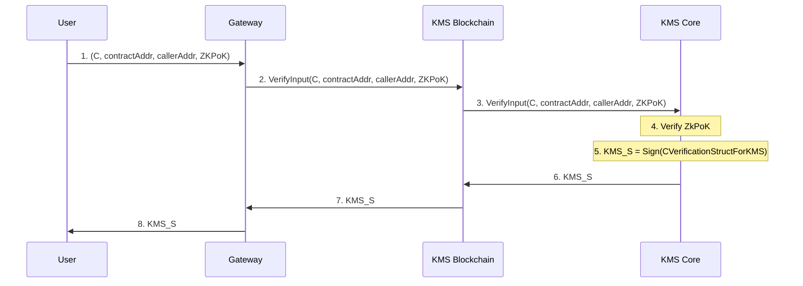

# Inputs

When we talk about inputs, we refer to encrypted data users send to an fhEVM-native blockchain or an fhEVM-coprocessor. Data is in the form of FHE ciphertexts. An example would be the amount to be transferred when calling an ERC20 transfer function.

## ZKPoK

It is important that confidential data sent by users cannot be seen by anyone. Without measures, there are multiple ways that could happen, for example:

- anyone decrypting the ciphertext
- anyone doing arbitrary computations via the ciphertext (e.g. adding 0 to it), producing a new ciphertext that itself is decrypted (including malicious actors using ciphertexts of other users)
- using the ciphertext in a malicious contract that leads to decryption

Furthermore, if users are allowed to send arbitrary ciphertexts (including malformed ones or maliciously-crafted ones), that could lead to revealing data about the FHE secret key.

Therefore, we employ zero-knowledge proofs of knowledge (ZKPoK) of input FHE ciphertexts that guarantee:

- ciphertext is well-formed (i.e. encryption has been done correctly)
- the user knows the plaintext value
- the input ciphertext can only be used in a particular smart contract

The ZKPoK is verified by the KMS which delivers a signature (KMS_S) to the user. When the input byte array is passed to an `FHE.fromExternal()` function to convert from a ciphertext to a handle that can be used in smart contracts for FHE operations, the KMS_S is verified.

## Compact Input Lists

To greatly reduce the size of FHE ciphertexts inputs, we utilize a feature called compact lists. It allows us to pack multiple values efficiently. It is useful when there is only one input and even more so when the are multiple inputs in a call to a smart contract.

We define the `einput` type that refers to a particular ciphertext in the list. The list itself is serialized and passed as a byte array. For example, `inputA` and `inputB` refer to ciphertexts in the list and the serialized list is `inputProof`:

```solidity
// SPDX-License-Identifier: BSD-3-Clause-Clear

pragma solidity ^0.8.24;

import "fhevm/lib/FHE.sol";

contract Adder {
  euint32 result;

  function add(externalEuint32 inputA, externalEuint32 inputB, bytes calldata inputProof) public {
    euint32 a = FHE.fromExternal(inputA, inputProof);
    euint32 b = FHE.fromExternal(inputB, inputProof);
    result = FHE.add(a, b);
    FHE.allow(result, address(this));
  }
}
```

Note that `inputProof` also contains the ZKPoK.

## Overview of the input mechanism

Handling inputs requires a few steps. The first one is for the user to retrieve public key material from the Gateway. The second is to encrypt plaintext inputs and compute the associated ZKPoK. Last step is to use inputs as "usual" inputs in a smart contract.

### Public key material and CRS retrieval

The first step to generate an encrypted input is to retrieve the blockchain related FHE public key material. The Gateway is the component the user queries to get that material.

The Gateway is exposing a `/keys` endpoint that returns the FHE public key and CRS alongside a signature. Users are able to verify them using KMSVerifier smart contract.

### Encryption phase

In this phase, the user encrypts the plaintext input with the FHE public key to get ciphertext `C` and compute the proof `ZkPoK`. `C`
is bounded to be used with a `contractAddress` and by a `callerAddress`. The goal is for `C` to be signed the KMS to enable the usage of the input
within smart contracts later.

C == ciphertext - Encrypted with the blockchain FHE public key

ZKPoK == Zero-Knowledge Proof of Knowledvge - Computed on the user side

eInput == type + index

S == Signature

    struct CVerificationStructForKMS {
        address contractAddress;
        bytes32 hashOfCiphertext;
        address callerAddress;
    }



### Usage

When the user receives the KMS signature, it means that the ZKPoK has been verified by the KMS and the input could be used within fhEVM.
This is quite useful because on the fhEVM only the KMS signature will be verified and that is faster than verifying a ZkPoK.


