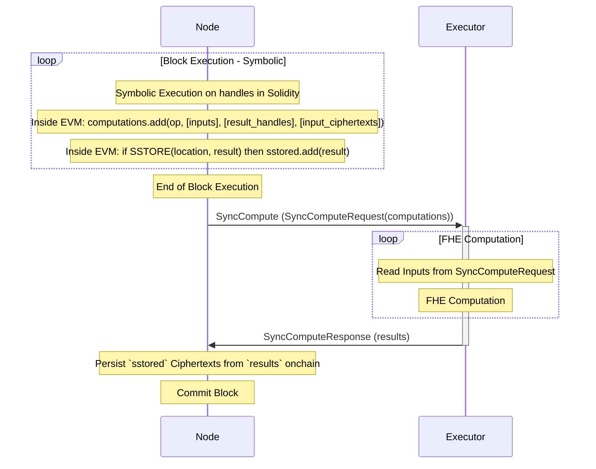

# FHE Computation

Block execution in fhEVM-native is split into two parts:
 * Symbolic Execution
 * FHE Computation

Symbolic execution happens onchain, inside the [TFHEExecutor](../../../../contracts/contracts/TFHEExecutor.sol) contract (inside the EVM). Essentially, the EVM accumulates all requested FHE operations in a block with their input handles and the corresponding result handles. It also remembers which result handles are stored via the SSTORE opcode. No FHE computations are done inside the EVM itself.

For more on symbolic execution, please see [Symbolic Execution](../symbolic_execution.md).

At the end of the block, the EVM sends a networking call to the Executor with the accumulated FHE computations. The Executor is free to do the FHE computations via any method, e.g. in parallel, on a cluster of compute nodes, via CPUs, GPUs, FPGAs or ASICs. The EVM waits until FHE computation for the block is done.

Finally, when results are returned to the EVM, it persists onchain the ciphertexts whose handles have been SSTOREd during symbolic execution. That way the EVM can avoid persisting ciphertexts that are intermediate results and are never actually stored by the smart contract developer.

## Interaction with the TFHEExecutor Contract

The [TFHEExecutor](../../../../contracts/contracts/TFHEExecutor.sol) contract is deployed when the chain is created and is at a well-known address that is also known by blockchain nodes. When a node (validator or full node) detects a call to this address (a CALL or STATICCALL opcode), the EVM running in the node looks at the function signature and determines which FHE computation is being requested. The result handle is the result of this particular call to the TFHEExecutor contract and the EVM can accumulate it in the computations list for the block.

## Scheduling Policies

Since the Executor can extract data dependencies from the `SyncCompute` request, it can use them to execute FHE computations in parallel.

Different scheduling policies can be set for FHE computation via the `FHEVM_DF_SCHEDULE` environment variable with possible choices: **LOOP**, **FINE_GRAIN**, **MAX_PARALLELISM**, **MAX_LOCALITY**.
