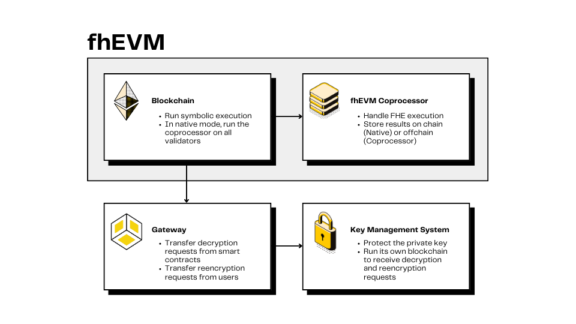

# Overview

At the highest level, the system consists of two subsystems: an _fhEVM-native_ blockchain or an _fhEVM-coprocessor_ and a _TKMS_.

An fhEVM-native blockchain itself consists of a set of validator nodes with each one running an _Executor_. An executor is tasked with actual FHE computation, whereas the validator runs symbolic execution (see below). Persisted FHE ciphertexts in smart contracts are stored on-chain in fhEVM-native. Furthermore, note that all fhEVM-native validators must have an associated Executor, meaning that if an existing blockchain is used, validators must all be modified.

An fhEVM-coprocessor configuration consists unmodified host blockchain validators and an off-chain _Coprocessor_ component that is responsible for FHE computation. FHE ciphertexts are stored in a local off-chain database and in a public off-chain Data Availability (DA) layer. Note that the Coprocessor itself requires a modified host blockchain full-node.

In some contexts it doesn't matter whether fhEVM-native or fhEVM-blockchain is used. In such cases, we could use the collective term _fhEVM_.

A Threshold Key Management System (TKMS) is a component that runs a blockchain as a communication layer for a threshold protocol to manage the secret FHE key and handle decryption and reencryption.

These two subsystems are not directly connected; instead, a component called a **Gateway** handles communication between them.

## fhEVM

An fhEVM processes all transactions, including those involving operations on encrypted data types. Operations on encrypted data are executed symbolically, meaning that the actual FHE computation is not done - instead, only constraints on symbolic inputs (handles) are checked and the returned result is just a new handle. A handle can be seen as a pointer to a ciphertext, similar to an identifier. After the operations are executed symbolically, the Executor in fhEVM-native or the Coprocessor in fhEVM-coprocessor perform the actual FHE computation on the ciphertexts. If a result handle is stored in a smart contract, the corresponding result ciphertext is stored on-chain for fhEVM-native. For fhEVM-coprocessor, all ciphertexts are stored in a Coprocessor-local off-chain database and in a public off-chain Data Availability (DA) layer.

No fhEVM node (neither Executor nor Coprocessor) has access to the secret FHE key; instead, an fhEVM node has a public _bootstrap key_ that allows it to perform computations on ciphertexts. The bootstrap key itself does not allow any fhEVM node to decrypt any ciphertexts (as the secret FHE key is managed by the TKMS).

## Gateway

The Gateway takes part in decryption and the reencryption, interacting with both the fhEVM and the TKMS.

- A decryption can be requested from any smart contract. In this case, the Gateway acts as an oracle: the dApp calls the Gateway contract with the necessary materials for decryption. The Gateway contract will then emit an event that is monitored for by the Gateway service.

- A user can directly request a reencryption through an HTTP call. In this case, the Gateway acts as a Web2 service: the user provides a public key for the reencryption, a signature, and the handle of the ciphertext to be reencrypted.

The Gateway sends transactions to the TKMS blockchain, which serves as the communication layer, to request the decryption or reencryption. When the TKMS responds with a TKMS blockchain event, the Gateway will transmit the decryption either through a Solidity callback function on-chain (on the fhEVM) or the reencryption by responding synchronously to the HTTP call from the user.

The Gateway is not a trusted party, meaning that a malicious Gateway will not be able to compromise correctness or privacy of the system. At most, it would be able to ignore requests between the fhEVM and the TKMS, impacting the liveness of decryption and reencryption. However, that can be prevented by deploying multiple Gateways and assuming at least one is honest.

## TKMS

The TKMS is a full key management solution for TFHE, more specifically [TFHE-rs](https://github.com/zama-ai/tfhe-rs), based on a maliciously secure and robust [MPC Protocol](https://eprint.iacr.org/2023/815).
It leverages a blockchain as its communication layer and utilizes a threshold protocol to manage decryption and reencryption requests securely. When a decryption or reencryption is requested, the TKMS processes the request using its cryptographic mechanisms, ensuring that no single entity has access to the full decryption (FHE secret) key. Instead, the decryption or reencryption is carried out in a distributed manner, which enhances security by minimizing the risk of key exposure.
