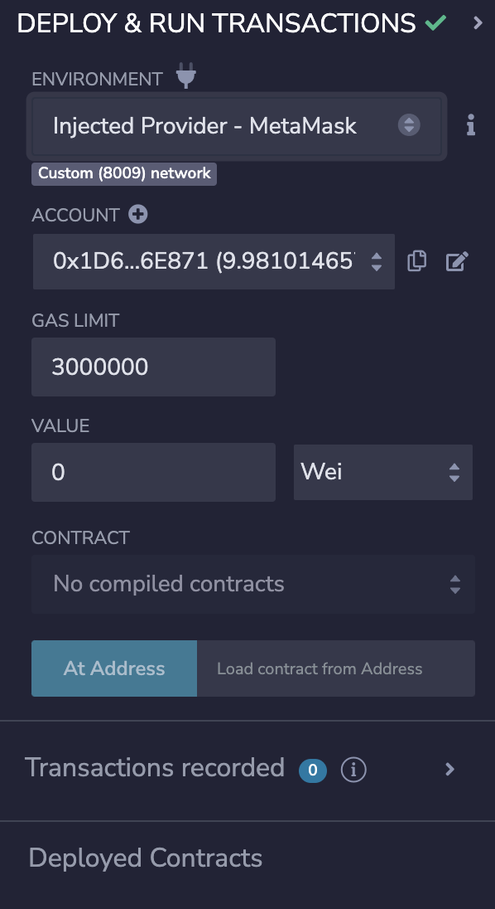

# Using Remix

You can use Remix to interact with a blockchain using fhEVM. If you want to send an encrypted input, you need to encrypt it with [fhevmjs CLI tool](https://docs.zama.ai/fhevm/client/getting_started/cli) for example. It becomes more complex if you want to reencrypt a value directly in Remix.

To avoid this problem, we developed a [version of Remix IDE](https://github.com/zama-ai/remix-project) with these two missing features:

- Encryption of input
- Generation of public key and signature for reencryption and decryption.

You can use it on [https://remix.zama.ai](https://remix.zama.ai).

## Usage

To import TFHE library, simply import it at the top of your contract.

`import "fhevm/lib/TFHE.sol";`

Be sure to be on the correct network before deploying your contract

<figure><figcaption>
Choose the Zama Devnet</figcaption></figure>

<figure><figcaption>
Choose "Injected Provider - Metamask"</figcaption></figure>
````
