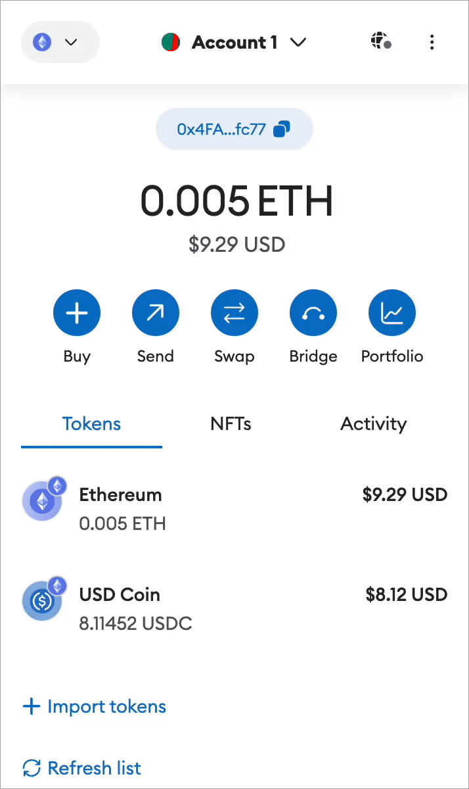
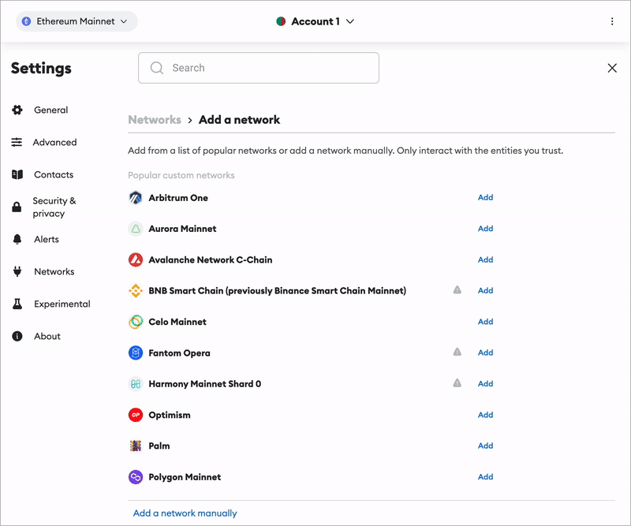
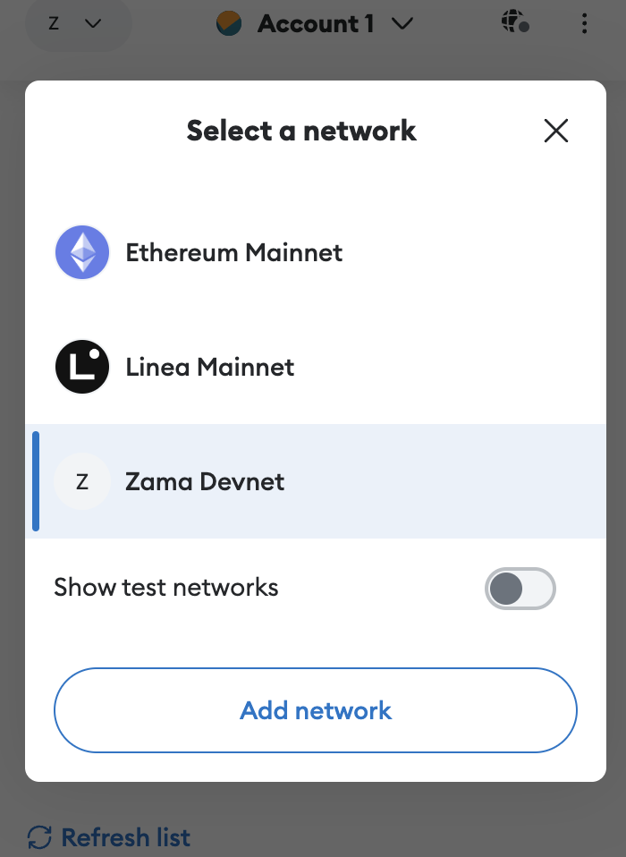

# Zama Devnet

This document explains how to configure the Zama Devnet for deploying smart contracts on fhEVM native.

## Devnet information

Our devnet is up and running.

<!-- markdown-link-check-disable -->

| Fields             | Value                                         |
| ------------------ | --------------------------------------------- |
| New RPC URL        | https://devnet.zama.ai                        |
| Chain ID           | 9000                                          |
| Currency symbol    | ZAMA                                          |
| Gateway URL        | https://gateway.devnet.zama.ai                |
| Faucet URL         | https://faucet.zama.ai                        |
| Block explorer URL | https://explorer.devnet.zama.ai (coming soon) |

<!-- markdown-link-check-enable -->

## Configuring MetaMask

<!-- markdown-link-check-disable -->

To configure the [MetaMask](<(https://support.metamask.io/hc/en-us/articles/360043227612-How-to-add-a-custom-network-RPC)>) for Zama Devnet, follow the steps:

<!-- markdown-link-check-enable -->

1. From the homepage of your wallet, click on the network selector in the top left, and then on 'Add network'

<figure><figcaption>
</figcaption></figure>

2. MetaMask will open in a new tab in fullscreen mode. From here, find and the 'Add network manually' button at the bottom of the network list.
<figure><figcaption>
</figcaption></figure>
<!-- markdown-link-check-disable -->

3. Add these information to access to blockchain

   
   

| Fields                        | Value                           |
| ----------------------------- | ------------------------------- |
| Network Name                  | Zama Network                    |
| New RPC URL                   | https://devnet.zama.ai          |
| Chain ID                      | 9000                            |
| Currency symbol               | ZAMA                            |
| Block explorer URL (Optional) | https://explorer.devnet.zama.ai |




| Fields                        | Value                  |
| ----------------------------- | ---------------------- |
| Network Name                  | Zama Local             |
| New RPC URL                   | http://localhost:8545/ |
| Chain ID                      | 9000                   |
| Currency symbol               | ZAMA                   |
| Block explorer URL (Optional) |                        |




<!-- markdown-link-check-enable -->

4. Choose the Zama Devnet
<figure><figcaption>
</figcaption></figure>

## Using Zama Faucet


**Devnet down** Our devnet is currently offline but will be up soon! In the meantime, develop your contracts using a local instance.


You can get 10 Zama token on [https://faucet.zama.ai/](https://faucet.zama.ai/).
