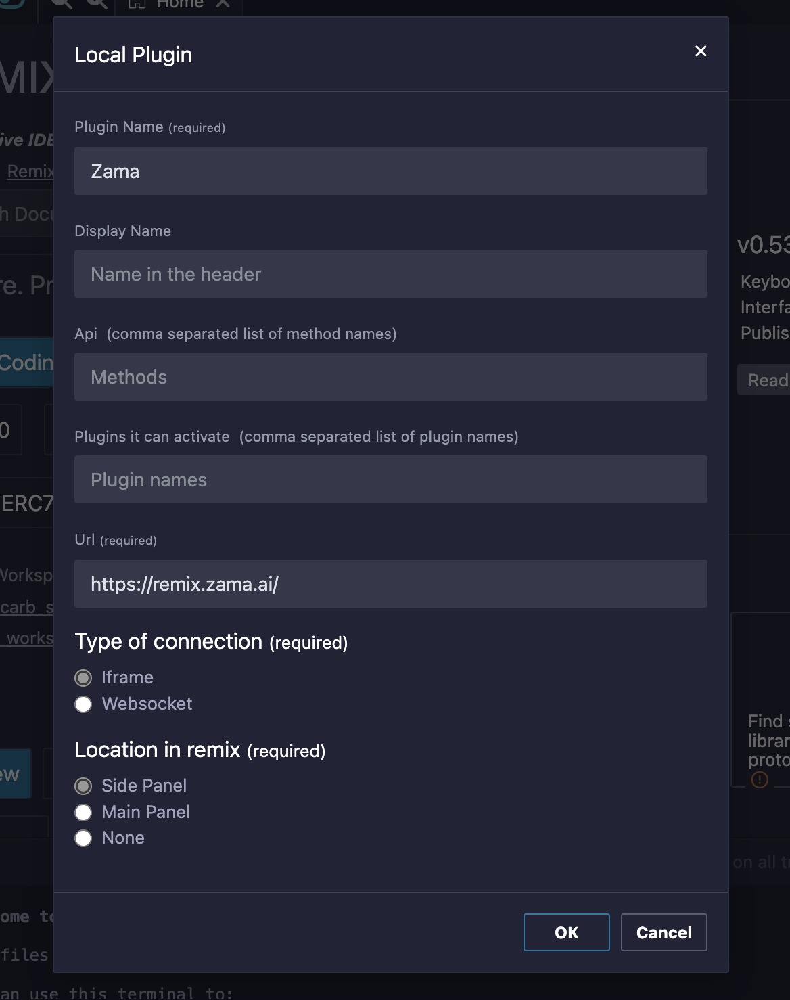
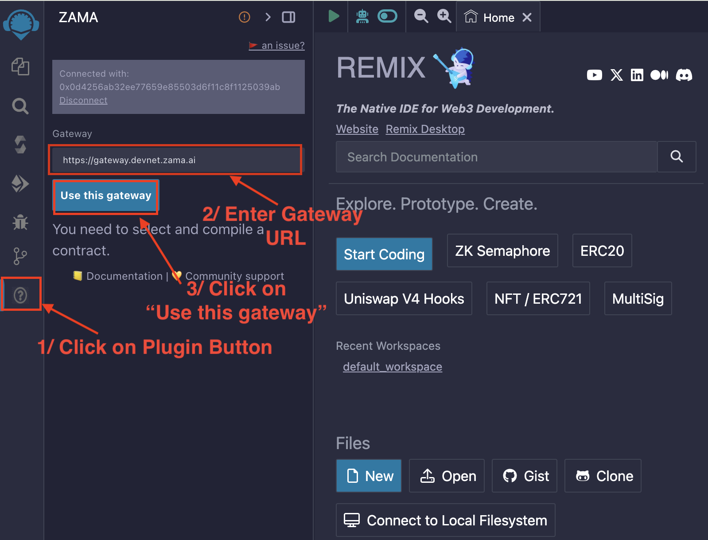

# Using Remix

We have decided to deprecate our Remix fork in favor of a new plugin we are currently developing. This plugin will enable you to develop your contracts directly on [the official Remix IDE](https://remix.ethereum.org) by simply loading the fhEVM plugin.

To use it:

1. Go to the "Plugin Manager" page
2. Click on "Connect to a Local Plugin"
3. Fill the name with "Zama" and the "Url" with "https://remix.zama.ai/"
4. Keep "Iframe" and "Side panel" and validate

<figure><figcaption>
</figcaption></figure>

After connecting to the Zama Plugin, you should click on the plugin button located on the left of the screen, and then add a Gateway URL to be able to request reencryption of ciphertexts, as shown in the picture below. The default recommended Gateway URL is: `https://gateway.devnet.zama.ai`.

<figure><figcaption>
</figcaption></figure>

Afterwards, you will be able to deploy and use any contract that you chose to compile via this plugin interface.
