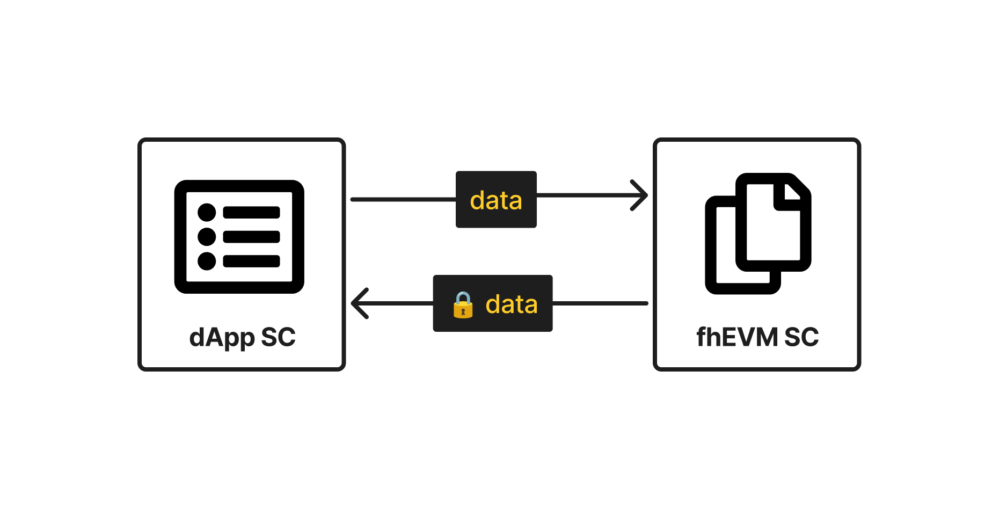
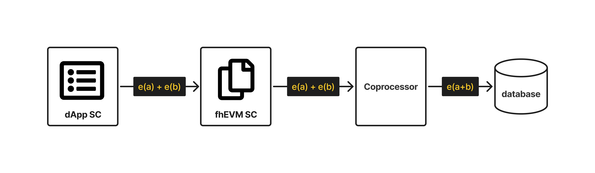
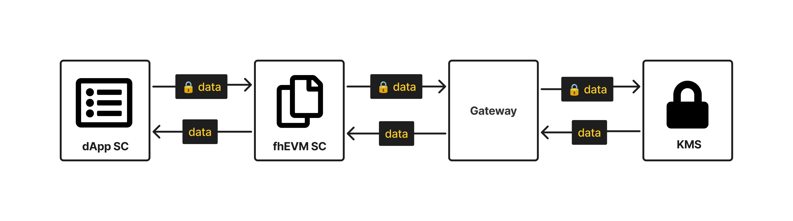
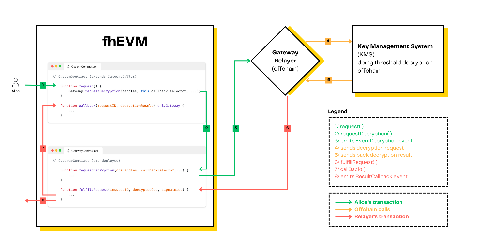
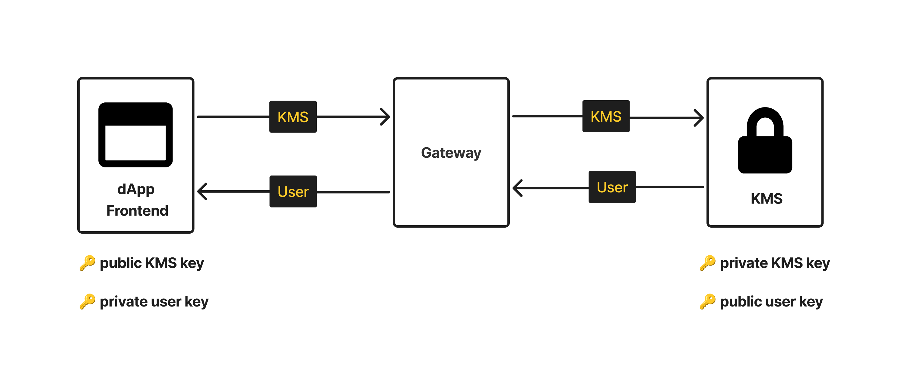

# Encryption, decryption, and computation

This section introduces the core cryptographic operations in the FHEVM system, covering how data is encrypted,
processed, and decrypted — while ensuring complete confidentiality through Fully Homomorphic Encryption (FHE).

The architecture enforces end-to-end encryption, coordinating key flows across the frontend, smart contracts,
coprocessors, and a secure Key Management System (KMS) operated via threshold MPC.

## **FHE keys and their locations**

1. **Public Key**:
   - **Location**: Exposed via frontend SDK.
   - **Role**: Encrypts user inputs before any interaction with the blockchain.
2. **Private Key**:
   - **Location**: Secured in the Key Management System (KMS) using threshold MPC.
   - **Role**: Used to decrypt data when necessary — such as to reveal plaintext to users or smart contracts.
3. **Evaluation Key**:
   - **Location**: Hosted on coprocessors.
   - **Role**: Usage: Enables encrypted computation without decrypting any data.

<figure><figcaption>
High level overview of the FHEVM Architecture
</figcaption></figure>

## **Workflow: encryption, decryption, and processing**

### **Encryption**

Encryption is the starting point for any interaction with the FHEVM system, ensuring that data is protected before it is
transmitted or processed.

- **How It Works**:
  1. The frontend or client application uses the public key to encrypt user-provided plaintext inputs and generates a
     proof of knowledge of the underlying plaintexts.
  2. The resulting ciphertext and proof are submitted to the Gateway for verification.
  3. Coprocessors validate the proof and store the ciphertext off-chain, returning handles and signature that can be
     used as on-chain parameters.
- **Data Flow**:
  - **Source**: Frontend.
  - **Destination**: Coprocessor (for processing).

<figure><figcaption></figcaption></figure>

You can read about the implementation details in [our encryption guide](solidity-guides/inputs.md).

### **Computation**

Encrypted computations are performed using the **evaluation key** on the coprocessor.

- **How it works**:
  1. The smart contract emits FHE operation events as symbolic instructions.
  2. These events are picked up by the coprocessor, which evaluates each operation individually using the evaluation
     key, without ever decrypting the data.
  3. The resulting ciphertext is persisted in the coprocessor database, while only a handle is returned on-chain.
- **Data flow**:
  - **Source**: Blockchain smart contracts (via symbolic execution).
  - **Processing**: Coprocessor (using the evaluation key).
  - **Destination**: Blockchain (updated ciphertexts).

<figure><figcaption></figcaption></figure>

### **Decryption**

There are two kinds of decryption supported in the FHEVM system:

1. Public Decryption used when plaintext is needed on-chain.
   1. The contract emits a decryption request.
   2. The Gateway validates it and forwards it to the KMS.
   3. The plaintext is returned via a callback to the smart contract.
2. User Decryption used when a user needs to privately access a decrypted value.
   1. User generates a key pair locally.
   2. Signs their public key and submits a request to the Gateway.
   3. The Gateway verifies the request and forwards it to the KMS.
   4. The KMS decrypts the ciphertext and encrypts it with the user’s public key.
   5. The user receives the ciphertext and decrypts it locally.

<figure><figcaption></figcaption></figure>

<figure><figcaption>
re-encryption
</figcaption></figure>
You can read about the implementation details in [our decryption guide](solidity-guides/decryption/decrypt.md).

#### What is “User Decryption”?

User Decryption is the mechanism that allows users or applications to request private access to decrypted data — without
exposing the plaintext on-chain. Instead of simply decrypting, the KMS securely decrypts and re-encrypts the result with
the user’s public key, allowing the user to decrypt it client-side only.

This guarantees:

- Only the requesting user can see the plaintext
- The KMS never reveals the decrypted value
- The decrypted result is not written to the blockchain

<figure><figcaption>
re-encryption process
</figcaption></figure>

#### Client-side implementation

User decryption is initiated on the client side using the
[`@zama-ai/relayer-sdk`](https://github.com/zama-ai/relayer-sdk/) library. Here’s the general workflow:

1. **Retrieve the ciphertext**:
   - The dApp calls a view function (e.g., `balanceOf`) on the smart contract to get the handle of the ciphertext to be
     re-encrypted.
2. **Generate and sign a keypair**:
   - The dApp generates a keypair for the user.
   - The user signs the public key to ensure authenticity.
3. **Submit user encryption request**:
   - The dApp emits a transaction to the Gateway, providing the following information:
     - The ciphertext handle.
     - The user’s public key.
     - The user’s address.
     - The smart contract address.
     - The user’s signature.
   - The transaction can be sent directly to the Gateway chain from the client application, or routed through a Relayer,
     which exposes an HTTP endpoint to abstract the transaction handling.
4. **Decrypt the encrypted ciphertext**:
   - The dApp receives the encrypted ciphertext under the user's public key from the Gateway/Relayer.
   - The dApp decrypts the ciphertext locally using the user's private key.

You can read [our user decryption guide explaining how to use it](solidity-guides/decryption/user-decryption.md).

## **Tying It All Together**

The flow of information across the FHEVM components during these operations highlights how the system ensures privacy
while maintaining usability:

| Operation           |                         |                                                                                                     |
| ------------------- | ----------------------- | --------------------------------------------------------------------------------------------------- |
| **Encryption**      | Public Key              | Frontend encrypts data → ciphertext sent to blockchain or coprocessor                               |
| **Computation**     | Evaluation Key          | Coprocessor executes operations from smart contract events → updated ciphertexts                    |
| **Decryption**      | Private Key             | Smart contract requests plaintext → Gateway forwards to KMS → result returned on-chain              |
| **User decryption** | Private and Target Keys | User requests result → KMS decrypts and encrypts with user’s public key → frontend decrypts locally |

This architecture ensures that sensitive data remains encrypted throughout its lifecycle, with decryption only occurring
in controlled, secure environments. By separating key roles and processing responsibilities, FHEVM provides a scalable
and robust framework for private smart contracts.
