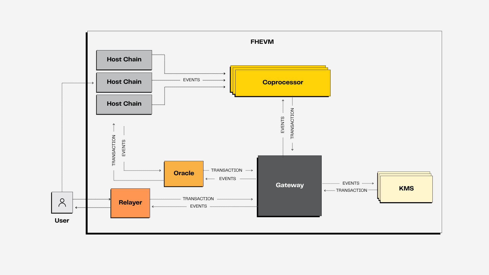

# FHE on Blockchain

This section explains in depth the Zama Confidential Blockchain Protocol (Zama Protocol) and demonstrates how it can bring encrypted computation to smart contracts using Fully Homomorphic Encryption (FHE).&#x20;

FHEVM is the core technology that powers the Zama Protocol. It is composed of the following key components.

<figure><figcaption></figcaption></figure>

* [**FHEVM Solidity library**](library.md): Enables developers to write confidential smart contracts in plain Solidity using encrypted data types and operations.
* [**Host contracts**](hostchain.md) : Trusted on-chain contracts deployed on EVM-compatible blockchains. They manage access control and trigger off-chain encrypted computation.
* [**Coprocessors**](coprocessor.md) – Decentralized services that verify encrypted inputs, run FHE computations, and commit results.
* [**Gateway**](gateway.md) **–** The central orchestrator of the protocol. It validates encrypted inputs, manages access control lists (ACLs), bridges ciphertexts across chains, and coordinates coprocessors and the KMS.
* [**Key Management Service (KMS)**](kms.md) – A threshold MPC network that generates and rotates FHE keys, and handles secure, verifiable decryption.&#x20;
* [**Relayer & oracle**](relayer_oracle.md) – A lightweight off-chain service that helps users interact with the Gateway by\
  forwarding encryption or decryption requests.
