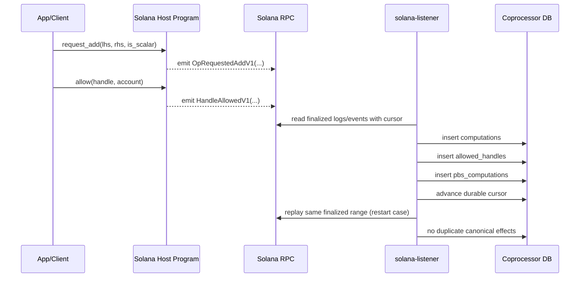

# Solana Host Interface v0 (Freeze)

Date: 2026-02-09
Status: Frozen for PoC baseline

## Goal

Define the minimal Solana host contract that maps 1:1 to current EVM listener semantics for:

1. symbolic add request ingestion
2. persistent allow ingestion

Baseline source strategy: finalized RPC logs/events as canonical input, with optional confirmed logs as hint-only.

## Program Instructions (v0)

| Instruction | Args | Notes |
|---|---|---|
| `request_add` | `lhs: [u8;32]`, `rhs: [u8;32]`, `is_scalar: bool` | Symbolic request only; no FHE compute on-chain. |
| `allow` | `handle: [u8;32]`, `account: Pubkey` | Persistent allow signal equivalent to EVM `Allowed`. |

## Emitted Events (v0)

| Event | Fields | EVM parity |
|---|---|---|
| `OpRequestedAddV1` | `caller: Pubkey`, `lhs: [u8;32]`, `rhs: [u8;32]`, `is_scalar: bool`, `result_handle: [u8;32]` | Equivalent to `FheAdd(caller, lhs, rhs, scalarByte, result)` with `is_scalar <-> scalarByte != 0`. |
| `HandleAllowedV1` | `caller: Pubkey`, `handle: [u8;32]`, `account: Pubkey` | Equivalent to ACL `Allowed(handle, account)`. |

## Event Transport Modes (same payload contract)

For PoC Track 1 we allow two emission modes with identical event payload semantics:

1. `emit!` (event encoded in program logs / `Program data:` lines)
2. `emit_cpi!` (event encoded in CPI instruction data)

Listener mapping and DB effects must remain strictly identical between both modes.

## Listener Enrichment Fields (off-chain)

Not emitted by program; injected from finalized RPC context:

1. `host_chain_id` (from listener config/mapping)
2. `slot`
3. `block_time_unix`
4. `tx_signature`
5. `tx_index`
6. `op_index`
7. `version` (listener canonical schema version)

## Canonical Mapping to Existing DB Contracts

### `OpRequestedAddV1` -> `computations`

1. `output_handle` = `result_handle`
2. `dependencies` = `[lhs, rhs]`
3. `fhe_operation` = `FheAdd`
4. `is_scalar` = event `is_scalar`
5. `transaction_id` = `tx_signature`
6. `schedule_order` = `slot_time + tx_index + op_index`
7. idempotency semantics must match current host-listener (`ON CONFLICT ... DO NOTHING` behavior)

### `HandleAllowedV1` -> `allowed_handles` and `pbs_computations`

1. insert `allowed_handles` with `(handle, account, AllowedAccount, tx_signature)`
2. insert `pbs_computations` for the same `handle` and `tx_signature`
3. both writes remain idempotent under replay

## Finality and Replay Contract

1. Canonical DB commits only from finalized events.
2. Confirmed websocket logs are optional wake-up hints only.
3. Durable cursor is required for replay/catchup.

## Sequence (v0)

## Non-goals (v0)

1. on-chain receipt/journal lifecycle design
2. watermark/ack transaction sender
3. production indexing infra hardening
