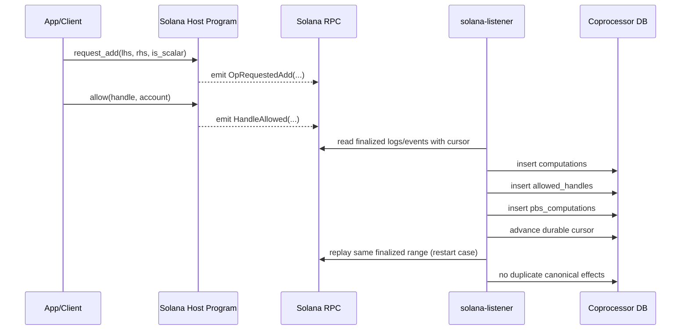

# Solana Host Interface v0/v0.1 (Freeze + Incremental Extension)

Date: 2026-02-09
Last synced: 2026-02-11
Status: Active full-op interface (v0.1)

## Goal

Define the minimal Solana host contract that maps 1:1 to current EVM listener semantics for:

1. symbolic TFHE request ingestion (full operation surface)
2. persistent allow ingestion

Baseline source strategy: finalized RPC logs/events as canonical input, with optional confirmed logs as hint-only.

## Program Instructions (v0/v0.1)

| Instruction | Args | Notes |
|---|---|---|
| `request_add` | `lhs: [u8;32]`, `rhs: [u8;32]`, `is_scalar: bool` | Symbolic request only; no FHE compute on-chain. |
| `request_sub` | `lhs: [u8;32]`, `rhs: [u8;32]`, `is_scalar: bool` | Same contract as add, mapped to `FheSub`. |
| `request_binary_op` | `lhs: [u8;32]`, `rhs: [u8;32]`, `is_scalar: bool`, `opcode: u8` | Covers binary/comparison/bitwise/shift/rotate/min/max (`FheAdd..FheMax`, opcodes `0..19`). |
| `request_unary_op` | `input: [u8;32]`, `opcode: u8` | Covers unary ops (`FheNeg`, `FheNot`, opcodes `20/21`). |
| `request_if_then_else` | `control: [u8;32]`, `if_true: [u8;32]`, `if_false: [u8;32]` | Maps to `FheIfThenElse`. |
| `request_cast` | `input: [u8;32]`, `to_type: u8` | Maps to `FheCast`. |
| `request_trivial_encrypt` | `pt: [u8;32]`, `to_type: u8` | Maps to `FheTrivialEncrypt`. |
| `request_rand` | `rand_type: u8`, `seed: [u8;32]` | Maps to `FheRand`. |
| `request_rand_bounded` | `upper_bound: [u8;32]`, `rand_type: u8`, `seed: [u8;32]` | Maps to `FheRandBounded`. |
| `allow` | `handle: [u8;32]`, `account: Pubkey` | Persistent allow signal equivalent to EVM `Allowed`. |

## Emitted Events (v0)

| Event | Fields | EVM parity |
|---|---|---|
| `OpRequestedAdd` | `caller: Pubkey`, `lhs: [u8;32]`, `rhs: [u8;32]`, `is_scalar: bool`, `result_handle: [u8;32]` | Equivalent to `FheAdd(caller, lhs, rhs, scalarByte, result)` with `is_scalar <-> scalarByte != 0`. |
| `OpRequestedSub` | `caller: Pubkey`, `lhs: [u8;32]`, `rhs: [u8;32]`, `is_scalar: bool`, `result_handle: [u8;32]` | Equivalent to `FheSub(caller, lhs, rhs, scalarByte, result)` with `is_scalar <-> scalarByte != 0`. |
| `OpRequestedBinary` | `caller`, `lhs`, `rhs`, `is_scalar`, `result_handle`, `opcode` | Generic binary-event contract for opcodes `0..19` (`FheAdd..FheMax`). |
| `OpRequestedUnary` | `caller`, `input`, `result_handle`, `opcode` | Generic unary-event contract for `FheNeg`/`FheNot` (`20/21`). |
| `OpRequestedIfThenElse` | `caller`, `control`, `if_true`, `if_false`, `result_handle` | Equivalent to `FheIfThenElse`. |
| `OpRequestedCast` | `caller`, `input`, `to_type`, `result_handle` | Equivalent to `Cast`. |
| `OpRequestedTrivialEncrypt` | `caller`, `pt`, `to_type`, `result_handle` | Equivalent to `TrivialEncrypt`. |
| `OpRequestedRand` | `caller`, `rand_type`, `seed`, `result_handle` | Equivalent to `FheRand`. |
| `OpRequestedRandBounded` | `caller`, `upper_bound`, `rand_type`, `seed`, `result_handle` | Equivalent to `FheRandBounded`. |
| `HandleAllowed` | `caller: Pubkey`, `handle: [u8;32]`, `account: Pubkey` | Equivalent to ACL `Allowed(handle, account)`. |

## Event Transport Mode (active baseline)

1. `emit!` (event encoded in program logs / `Program data:` lines)
2. `msg!` is non-typed debug logging only and not part of canonical ingest contract.

CPI-mode transport is intentionally deferred to a separate follow-up experiment.

## Listener Enrichment Fields (off-chain)

Not emitted by program; injected from finalized RPC context:

1. `host_chain_id` (from listener config/mapping)
2. `slot`
3. `block_time_unix`
4. `tx_signature`
5. `tx_index`
6. `op_index`
7. `version` (listener canonical schema version)

## Canonical Mapping to Existing DB Contracts

### `OpRequestedAdd` / `OpRequestedSub` -> `computations`

1. `output_handle` = `result_handle`
2. `dependencies` = `[lhs, rhs]`
3. `fhe_operation` = `FheAdd` or `FheSub`
4. `is_scalar` = event `is_scalar`
5. `transaction_id` = `tx_signature`
6. `schedule_order` = `slot_time + tx_index + op_index`
7. idempotency semantics must match current host-listener (`ON CONFLICT ... DO NOTHING` behavior)

### `OpRequestedBinary` -> `computations`

1. `output_handle` = `result_handle`
2. `dependencies` = `[lhs, rhs]`
3. `fhe_operation` = opcode mapping (`0..19`) to `FheAdd..FheMax`
4. `is_scalar` = event `is_scalar`
5. `transaction_id` = `tx_signature`
6. `schedule_order` = `slot_time + tx_index + op_index`
7. idempotency semantics must match current host-listener (`ON CONFLICT ... DO NOTHING` behavior)

### `OpRequestedUnary` -> `computations`

1. `output_handle` = `result_handle`
2. `dependencies` = `[input]`
3. `fhe_operation` = opcode mapping (`20/21`) to `FheNeg`/`FheNot`
4. `is_scalar` = `false`
5. `transaction_id` = `tx_signature`

### `OpRequestedIfThenElse` -> `computations`

1. `dependencies` = `[control, if_true, if_false]`
2. `fhe_operation` = `FheIfThenElse`
3. `is_scalar` = `false`

### `OpRequestedCast` -> `computations`

1. `dependencies` = `[input, [to_type]]`
2. `fhe_operation` = `FheCast`
3. `is_scalar` = `true`

### `OpRequestedTrivialEncrypt` -> `computations`

1. `dependencies` = `[pt, [to_type]]`
2. `fhe_operation` = `FheTrivialEncrypt`
3. `is_scalar` = `true`

### `OpRequestedRand` -> `computations`

1. `dependencies` = `[seed, [rand_type]]`
2. `fhe_operation` = `FheRand`
3. `is_scalar` = `true`

### `OpRequestedRandBounded` -> `computations`

1. `dependencies` = `[seed, upper_bound, [rand_type]]`
2. `fhe_operation` = `FheRandBounded`
3. `is_scalar` = `true`

### `HandleAllowed` -> `allowed_handles` and `pbs_computations`

1. insert `allowed_handles` with `(handle, account, AllowedAccount, tx_signature)`
2. insert `pbs_computations` for the same `handle` and `tx_signature`
3. both writes remain idempotent under replay

## Finality and Replay Contract

1. Canonical DB commits only from finalized events.
2. Confirmed websocket logs are optional wake-up hints only.
3. Durable cursor is required for replay/catchup.

## Sequence (v0)

## Non-goals (v0)

1. on-chain receipt/journal lifecycle design
2. watermark/ack transaction sender
3. production indexing infra hardening
