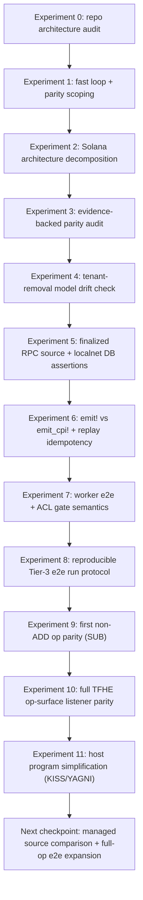

# Solana Host Listener Learning Log

Date opened: 2026-02-09
Last synced: 2026-02-10
Branch: `codex/solana-host-listener-discovery`
Status: Active

## How to use this file

- Record facts, not guesses.
- When a hypothesis is invalidated, keep the old entry and mark it as invalidated.
- Link each decision to evidence from code, logs, or a reproducible run.

## Visual Timeline

## Current Facts (confirmed)

1. Gateway stays on EVM as payment/enforcement layer.
2. Existing `host-listener` is deeply EVM-coupled.
3. Coprocessor compute path downstream is mostly DB-driven.
4. Handle metadata compatibility with Gateway checks is mandatory.
5. Fast learning requires a self-contained local e2e loop.
6. A local hybrid (`logs + PDAs`) Solana host demo exists at `/Users/work/code/zama/solana-symbolic-host-demo` and is useful as a fast-loop reference.
7. Listener ingestion SQL contracts (`computations`, `allowed_handles`, `pbs_computations`) are reusable if Solana ingestion preserves deterministic keys and idempotency semantics.
8. The highest-coupling surfaces are chain transport/indexing and EVM ABI decode, not downstream scheduler/worker ingestion contracts.
9. Upstream PR `zama-ai/fhevm#1856` removes tenant-centric DB/runtime model in favor of `keys`, `crs`, and `host_chains`; Solana discovery should target `host_chain_id` compatibility, not `tenant_id`.
10. Local Solana rent estimates (2026-02-09) show per-tx receipt PDA cost can become prohibitive with long TTL at moderate/high TPS; this is now an explicit design gate.
11. Tier-3 e2e runs now have a dedicated script entrypoint (`solana-poc-tier3-e2e.sh`) with explicit prerequisites and deterministic case selection.
12. Operation parity expansion started with `SUB` in Solana listener decode + ingest mapping (same DB contract as `ADD`).
13. Solana host/listener now supports full TFHE symbolic op surface at interface + decode + ingest mapping layers (`binary`, `unary`, `if_then_else`, `cast`, `trivial_encrypt`, `rand`, `rand_bounded`).
14. Solana host program layout has been normalized to `/Users/work/.codex/worktrees/66ae/fhevm/solana/host-programs/zama-host` (no `v0` naming in folders/types).
15. Host program logic is now single-sourced across `emit!` and `emit_cpi!` entrypoints (shared implementation helpers; no behavior split per mode).
16. RPC source now fails closed on unavailable finalized blocks (no cursor advance on missing `getBlock` data), preventing silent slot skips.

## Open Questions

1. Which emission mode is more reliable for ingestion/replay in practice: `emit!` logs or `emit_cpi!`?
2. Do PDA receipts reduce ambiguity enough to justify additional complexity?
3. What is the smallest Solana operation model that maps cleanly to current DB schema?
4. Which parts of the current listener should eventually become chain-agnostic, if any?
5. Do we need any transaction-sender behavior changes for Solana-host-only local tests?

## Hypotheses

### H1

A separate `solana-listener` will let us validate feasibility faster than refactoring `host-listener` now.

Status: Pending validation

Evidence to collect:

- Time-to-first-e2e.
- Number of EVM listener files that would otherwise require invasive abstraction.

### H2

A log-driven PoC can reach first e2e faster than a PDA-receipt PoC.

Status: Pending validation

Evidence to collect:

- Implementation time and complexity.
- Failure modes during replay/restart.

### H3

PDA receipts will offer better replay/index guarantees for long-term robustness.

Status: Pending validation

Evidence to collect:

- Idempotency behavior under restarts.
- Simplicity of detecting missed operations.

## Experiment Journal

### Experiment 0: Repo architecture audit

Date: 2026-02-09
Objective: Determine if adapter vs new service is lower risk for initial exploration.
Result: `host-listener` appears deeply EVM-shaped; separate `solana-listener` is currently favored for PoC.
Confidence: Medium-high
Notes:

- Final decision deferred until at least one Solana e2e run exists.

### Experiment 1: Fast feedback loop + parity scoping

Date: 2026-02-09
Objective: Define a spec-driven host+listener-first loop and enumerate EVM features to replicate.
Result: Added `FAST_FEEDBACK_LOOP.md` and `HOST_LISTENER_PARITY_MATRIX.md`.
Confidence: High
Notes:

- Initial PoC boundary is now explicit (handle metadata, op request ingestion, allow ingestion, finality/cursor/idempotency).

### Experiment 2: Solana architecture decomposition

Date: 2026-02-09
Objective: Make separation boundaries explicit (host programs, adapter/listener, shared core, gateway), including ownership and CPI options.
Result: Added `SOLANA_ARCHITECTURE.md` with component and sequence diagrams.
Confidence: Medium-high
Notes:

- Decided to favor monolithic host program for first loop, while keeping internal module seams compatible with later split (ACL/HCU programs).

### Experiment 3: Evidence-backed parity audit

Date: 2026-02-09
Objective: Convert discovery assumptions into file-level evidence for parity scope and v0 gates.
Result: Upgraded `HOST_LISTENER_PARITY_MATRIX.md` with concrete file:line anchors, coupling verdicts, and v0 acceptance gates.
Confidence: High
Notes:

- Reinforced that `solana-listener` as separate PoC service is the lowest-risk path for speed.
- Confirmed gateway handle compatibility is a hard invariant to preserve (chain-id/type/version bytes + host chain registration semantics).

### Experiment 4: Coprocessor model drift check (tenant removal)

Date: 2026-02-09
Objective: Validate whether discovery assumptions around `tenant_id` are still valid upstream.
Result: `tenant` notion is being removed; model is migrating to `keys` + `crs` + `host_chains`.
Confidence: High
Notes:

- Migration renames `tenants` to `keys`, drops tenant API key fields, and creates `host_chains`.
- Existing discovery docs should reference `host_chain_id` and key model, not tenant mapping.
- References:
  - [PR #1856](https://github.com/zama-ai/fhevm/pull/1856)
  - [remove_tenants migration](https://github.com/zama-ai/fhevm/blob/f991b40c0c8f0e73abf768d37506323a3175ee04/coprocessor/fhevm-engine/db-migration/migrations/20260128095635_remove_tenants.sql#L1)
  - [host_chains cache](https://github.com/zama-ai/fhevm/blob/f991b40c0c8f0e73abf768d37506323a3175ee04/coprocessor/fhevm-engine/fhevm-engine-common/src/host_chains.rs#L1)

### Experiment 5: Finalized RPC source + localnet DB assertions

Date: 2026-02-09
Objective: Replace mock source with real finalized RPC block ingestion and prove DB writes end-to-end.
Result: Completed and passing.
Confidence: High
Notes:

- Added finalized RPC source to `solana-listener` and wired command bootstrap to use it.
- Added localnet integration harness to build program, run validator + Postgres (testcontainers), submit txs, ingest, and assert DB rows.
- Observed passing assertions for `computations`, `allowed_handles`, `pbs_computations`, and cursor advancement.

### Experiment 6: `emit!` vs `emit_cpi!` parity + replay idempotency

Date: 2026-02-09
Objective: Validate event-mode equivalence and prove replay inserts no new rows.
Result: Completed and passing in Tier 2 localnet harness.
Confidence: High
Notes:

- Host program now supports both emission modes (`request_add`/`allow` and `request_add_cpi`/`allow_cpi`).
- Listener decodes both direct `Program data` logs and CPI-carried event payloads from `innerInstructions`.
- Localnet test verifies same DB contract for both modes and replay idempotency (`inserted rows = 0` on reprocessing same finalized range).
- Mollusk fast tier currently validates `request_add`; CPI self-call remains localnet-validated due current Mollusk limitation.

### Experiment 7: Worker e2e + ACL gate semantics (Solana localnet)

Date: 2026-02-09
Objective: Prove that Solana-ingested rows are not only inserted correctly but actually executable by worker, with decrypt sanity and ACL gating behavior.
Result: Completed and passing in Tier 3 localnet ignored tests.
Confidence: High
Notes:

- Added end-to-end tests for both event modes:
  - `localnet_solana_request_add_computes_and_decrypts` (`emit!`)
  - `localnet_solana_request_add_cpi_computes_and_decrypts` (`emit_cpi!`)
- Added ACL gate test:
  - `localnet_acl_gate_blocks_then_allows_compute`
- Listener semantics now keep `request_add` non-runnable until `allow` is ingested; `allow` unlocks matching queued computations.
- Added robust finalized tx wait loop in integration harness to avoid 16s poll timeout flakes.

## Presentation Summary (for team)

### What this PoC proves

1. Solana host events can feed the existing DB-driven worker pipeline end-to-end.
2. Both `emit!` and `emit_cpi!` can drive equivalent compute/decrypt outcomes.
3. Replay/idempotency guarantees hold at listener ingest layer.
4. ACL gate semantics are enforceable in listener DB contract:
   - no `allow` => no execution
   - `allow` => becomes runnable and completes

### What this PoC does not prove yet

1. Production indexer reliability under high throughput/long reorg windows.
2. Cost/perf envelope at scale (TPS/load/rent economics).
3. Full-op e2e execution coverage across all newly supported operations (today e2e runtime is still validated on representative slices, not every op).
4. Final architecture choice between long-lived adapter abstraction vs standalone listener service.

## Decision Log

### D0

Date: 2026-02-09
Decision: Keep Gateway on EVM for the exploration.
Why: Fixed project constraint and aligns with protocol/payment responsibilities.
Status: Locked for this exploration phase.

### D1

Date: 2026-02-09
Decision: Prioritize separate `solana-listener` PoC before attempting listener abstraction.
Why: Minimizes blast radius and improves feedback speed.
Status: Active (revisit after Track 1 and Track 2 results).

### D2

Date: 2026-02-09
Decision: Use listener-canonical structs with explicit `version` and `host_chain_id`; keep canonical ingest finalized-only and use confirmed logs as hint-only.
Why: Preserves explicitness at the listener boundary without forcing extra on-chain payload fields; aligns with replay safety target.
Status: Active.

### Experiment 8: Reproducible Tier-3 run protocol

Date: 2026-02-10
Objective: Make Tier-3 e2e execution reproducible and explicit (not tribal command knowledge).
Result: Completed.
Confidence: High
Notes:

- Added `/Users/work/.codex/worktrees/66ae/fhevm/test-suite/fhevm/scripts/solana-poc-tier3-e2e.sh`.
- Script supports deterministic case selection: `emit`, `emit-cpi`, `acl`, `all`.
- Updated testing docs and listener README with exact commands and `SQLX_OFFLINE=true` guidance.

### Experiment 9: First non-ADD op parity (`SUB`)

Date: 2026-02-10
Objective: Validate that Solana listener operation mapping can extend beyond `ADD` while preserving DB semantics.
Result: Completed for `SUB` decode + ingest mapping.
Confidence: Medium-high
Notes:

- Host program emits new `OpRequestedSub` / `request_sub(_cpi)` events.
- Listener decodes `OpRequestedSub` and maps to `SupportedFheOperations::FheSub`.
- Unit coverage added for decoder + ingest mapping.
- ACL gate integration test now checks both `emit!` and `emit_cpi!` modes.

### Experiment 10: Full TFHE op-surface listener parity

Date: 2026-02-10
Objective: Expand PoC operation surface from `ADD/SUB` to full symbolic TFHE op ingestion parity.
Result: Completed at interface + decode + ingest mapping layers.
Confidence: Medium-high
Notes:

- Host program extended with generic symbolic instructions/events for:
  - binary ops (`opcode 0..19`)
  - unary ops (`20/21`)
  - `if_then_else`, `cast`, `trivial_encrypt`, `rand`, `rand_bounded`
- Listener decoder now parses all corresponding event types from both `emit!` logs and `emit_cpi!` inner instructions.
- Ingest mapping now converts all supported op events into canonical `computations` rows with operation-specific dependency encoding aligned with EVM ingestion semantics.
- Unit test coverage added for new decoder and ingest mappings; existing Tier-3 `request_add` e2e sanity remains green after extension.

### Experiment 11: Host program simplification (KISS/YAGNI)

Date: 2026-02-10
Objective: Remove avoidable duplication and naming noise while preserving PoC behavior.
Result: Completed.
Confidence: High
Notes:

- Renamed program workspace/layout and removed version suffixes in Solana naming (`host-programs/zama-host`, event/type names without `V0`/`V1`).
- Refactored host program to keep one shared implementation per operation and thin emission wrappers for `emit!` vs `emit_cpi!`.
- No DB contract change and no listener semantic drift; this was maintainability-only cleanup.

### D3

Date: 2026-02-09
Decision: For PoC v0 ordering, derive `schedule_order` from `slot_time + tx_index + op_index`.
Why: Deterministic replay ordering for Solana while staying compatible with timestamp-based worker ordering semantics.
Status: Active (revisit after first full replay test).

### D4

Date: 2026-02-09
Decision: PoC baseline ingestion source is finalized RPC logs/events with durable cursor replay; confirmed logs are hint-only.
Why: Lowest state/rent overhead with fastest path to validate replay/idempotency.
Status: Active.

### D5

Date: 2026-02-09
Decision: Defer per-tx PDA/journal designs until a scorecard comparison is completed (RPC baseline vs managed stream source).
Why: Early rent-growth estimates indicate high locked-capital risk for long TTL receipt accounts.
Status: Active.

### D6

Date: 2026-02-09
Decision: Freeze minimal v0 Solana host interface with two instructions (`request_add`, `allow`) and two emitted events (`OpRequestedAdd`, `HandleAllowed`) mapped 1:1 to current DB ingestion semantics.
Why: establish an unambiguous contract before implementing listener internals; reduce churn and improve test explainability.
Status: Superseded by D10 after baseline validation.

### D10

Date: 2026-02-10
Decision: Extend Solana host/listener interface to full symbolic TFHE op surface using typed generic op events while preserving canonical DB contract and existing `add/sub/allow` compatibility.
Why: execute the parity expansion track without refactoring shared downstream worker/scheduler path, and keep the event-to-DB boundary explicit.
Status: Active.

### D11

Date: 2026-02-10
Decision: Keep both emission modes in PoC surface, but remove duplicated operation logic behind those entrypoints.
Why: preserves the comparison axis (`emit!` vs `emit_cpi!`) without paying a maintenance penalty in host-program code.
Status: Active.

### D7

Date: 2026-02-09
Decision: Treat event emission mode (`emit!` vs `emit_cpi!`) as an explicit Track 1 comparison axis while keeping one shared listener mapping contract.
Why: this can materially impact event retrieval reliability without forcing DB contract or architecture changes.
Status: Active.

### D8

Date: 2026-02-09
Decision: Prefer Rust in-process integration harness (`testcontainers`) over bash orchestration as the primary Tier 2 runner.
Why: keeps setup/teardown deterministic in tests and aligns with existing coprocessor testing patterns.
Status: Active.

### D9

Date: 2026-02-09
Decision: Keep `emit_cpi!` in active comparison scope, but treat Tier 2 localnet integration as canonical validation path for CPI semantics.
Why: current Mollusk harness path does not reliably support this self-CPI setup (`UnsupportedProgramId`) while localnet validation is stable.
Status: Active.

## Next Update Triggers

Update this file after any of the following:

1. First successful local Solana -> DB -> worker e2e run.
2. Any invalidated hypothesis.
3. Any architecture decision affecting adapter vs separate service.
