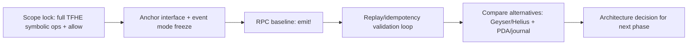
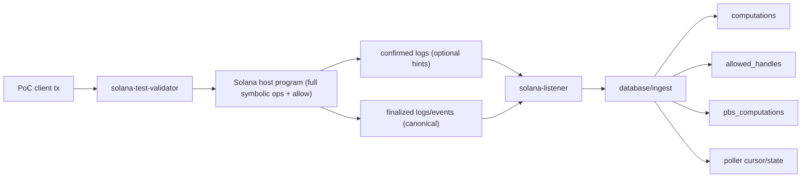

# Solana Host Listener PoC Plan

Date: 2026-02-09
Last synced: 2026-02-11
Branch: `codex/solana-host-listener-discovery`

## Goal

Validate whether we can run a minimal end-to-end FHEVM flow with a Solana host chain while keeping Gateway on EVM.

This is an exploratory PoC. Code can be discarded after each experiment if the learning is captured.

## Visual Overview

## Scope

- Investigate integration shape for Solana host events -> coprocessor jobs.
- Prioritize fast feedback loops and clear validation over production readiness.
- Capture decisions and corrections in `LEARNING.md`.

## Implementation Directives

1. Prefer Solana SDK crates over custom RPC plumbing whenever possible:
- `solana-client`
- `solana-commitment-config`
- `solana-sdk`
2. Keep canonical event decoding IDL-driven (Anchor event types), not manual byte-layout parsing.
3. Only drop to custom parsing if SDK/IDL paths are insufficient for a specific requirement, and document why.

## Non-goals

- No big refactor of current EVM `host-listener`.
- No protocol redesign.
- No production hardening.

## Current Baseline (from repo audit)

- Gateway remains EVM and is a payment/enforcement layer.
- Existing `host-listener` is strongly EVM-specific in transport, decoding, and ingestion.
- Scheduler/worker path is mostly DB-driven and can be reused if DB rows are compatible.
- Handle metadata format must remain compatible with Gateway checks.

## Main Decision to De-risk

Choose one path based on evidence:

- Path A: Adapter/sub-service inside current `host-listener`.
- Path B: New `solana-listener` service writing equivalent DB records.

Current expectation: Path B is lower risk for fast learning.

## Program-First Execution Model

We implement in this order:

1. Solana host program interface for full symbolic op surface + `allow` (emit! baseline).
2. Freeze IDL/event contract consumed by listener.
3. Build `solana-listener` against that contract.
4. Validate replay/idempotency with restart tests.

Reason: the program/IDL is the equivalent of EVM event ABI and defines what listener can ingest.

## PoC Topology (v0)

## Components: Create vs Modify vs Reuse

### Create

1. `coprocessor/fhevm-engine/solana-listener/` (new service)
- `cmd/` args + bootstrap
- `poller/` finalized canonical log ingestion + durable cursor
- optional `ws_listener/` confirmed logs as wake-up hints
- `database/ingest.rs` and `database/solana_event_propagate.rs` (same conceptual split as current host-listener)
- tests for mapping/replay/idempotency

2. Solana PoC program workspace (Anchor, minimal)
- instructions: full symbolic op surface + `allow`
- events/log contract for listener reads
- IDL committed and versioned for listener contract

3. PoC local run scripts
- one script to start validator + listener + required DB services
- one script to submit `request_add` / `request_sub` and `allow`
- one script to assert DB rows + replay invariants

### Modify

1. `test-suite/fhevm/docker-compose/` to add PoC services
- add Solana validator compose file
- add solana-listener compose file
- avoid changing existing EVM deploy path behavior

2. `test-suite/fhevm/fhevm-cli` (optional, minimal)
- optional new test/deploy shortcut for Solana PoC flow

3. PoC docs in `docs/protocol/explorations/solana-host-listener/`
- keep acceptance checklist and runbook up to date

### Reuse

1. Existing Postgres and migration wiring from `test-suite/fhevm`.
2. Existing host-listener test patterns for replay/finality/cursor checks:
- `coprocessor/fhevm-engine/host-listener/tests/host_listener_integration_tests.rs`
- `coprocessor/fhevm-engine/host-listener/tests/poller_integration_tests.rs`
3. Existing DB schema contracts (`computations`, `allowed_handles`, `pbs_computations`).

## Experiment Tracks

### Track 1: RPC logs baseline (v0)

Question: Can finalized RPC logs/events provide deterministic replay and zero-loss ingestion for PoC?

Validation target:

- Parse/map full symbolic op surface + `allow`.
- Persist via canonical DB rows with idempotent replay.
- Prove one local end-to-end pass.

Track 1 baseline:

1. `emit!` events in program logs (`Program data:`).

CPI-mode transport is deferred to a separate experiment after the emit-only baseline is stable.

### Track 2: Managed/indexed streams

Question: Do managed stream/indexer sources improve reliability/latency versus raw RPC logs?

Validation target:

- Repeat Track 1 workload with same metrics on Geyser/Helius-style source.
- Compare miss rate, replay behavior, and operational complexity.

### Track 3: On-chain state alternatives (deferred)

Question: Are per-dapp journals/PDAs worth the state/rent overhead for stronger replay guarantees?

Validation target:

- Build explicit state-growth and rent budget model.
- Prototype only if Track 1/2 fails hard replay requirements.

## E2E Feedback Loop Requirements

Each track must be self-contained and scriptable on a laptop.

Minimum loop:

1. Start local stack components (existing coprocessor + Gateway EVM + Solana validator).
2. Submit one host operation from Solana side.
3. Listener ingests and writes DB operation rows.
4. Scheduler/worker process operation.
5. Observe expected state transition and artifacts in DB/logs.

A run is valid only if all 5 steps are reproducible with documented commands.

## Execution Plan

1. Freeze v0.1 interface in Anchor (full symbolic op surface + `allow`) and export IDL.
2. Define canonical listener structs and exact DB mapping (1:1 parity for v0).
3. Implement `solana-listener` finalized RPC log poller + DB ingest path.
4. Add hint path (confirmed logs) to reduce latency without changing canonical commit source.
5. Build L1 tests (fixture replay -> DB assertions).
6. Build L2 smoke run for `emit!` (local validator -> listener -> DB).
7. Run restart/replay test and assert `new_rows=0`.
8. Compare raw RPC vs managed stream source with same workload/fault matrix.
9. Record recommendation for next phase (keep/discard/adjust).

## Decision Matrix and Scorecard

Evaluate each option on the same scorecard:

1. `missed_ops` after restart/replay (hard gate: `0`)
2. `duplicate_effects` in canonical DB tables (hard gate: `0`)
3. replay catch-up time from persisted cursor
4. p50/p95 ingest latency
5. operational complexity (dependencies, moving parts, failure modes)
6. event extraction reliability across RPC providers (`emit!`)
7. state/rent footprint (if on-chain state option)

Current option set:

1. finalized RPC events via `emit!`
2. managed stream/indexer source (Geyser/Helius style)
3. per-dapp journal/PDA designs (only if needed)

## Test Plan (TDD-like feedback loop)

### L0 Unit (seconds)

1. Canonical mapping tests:
- `request_add` -> expected computation payload
- `request_sub` -> expected computation payload
- `allow` -> expected `allowed_handles` + `pbs_computations` payload
2. Ordering tests:
- deterministic `schedule_order = slot_time + tx_index + op_index`

### L1 Integration (1-3 min)

1. Feed deterministic fixtures into listener ingest.
2. Assert exact row counts and keys in target tables.
3. Re-feed same fixtures and assert idempotency (`0` new rows).

### L2 Localnet (3-10 min)

1. Start DB + migrations + Solana validator + solana-listener.
2. Submit one `request_add`/`request_sub` tx and one `allow` tx.
3. Assert DB writes.
4. Restart listener and replay same finalized range.
5. Assert no duplicates and no missing rows.

## State-Cost Gate (for PDA/journal alternatives)

Before building on-chain receipt/journal options, estimate locked rent and growth envelope.

Reference sample (local CLI, 2026-02-09):

1. 128-byte account: `0.00178176 SOL`
2. 192-byte account: `0.0022272 SOL`
3. 256-byte account: `0.00267264 SOL`

Formula:

- `live_accounts ~= tps * ttl_seconds`
- `locked_sol ~= live_accounts * rent_per_account`

Any design with unacceptable locked capital or cleanup burden is rejected before implementation.

## Fast Loop Artifacts

- Fast feedback loop design: `FAST_FEEDBACK_LOOP.md`
- local test ladder and run commands: `TESTING_TIERS.md`
- 1:1 feature parity matrix: `HOST_LISTENER_PARITY_MATRIX.md`
- Solana architecture draft: `SOLANA_ARCHITECTURE.md`
- v0 interface freeze: `INTERFACE_V0.md`
- freshness protocol: `DOC_FRESHNESS.md`
- one-command explorer-visible demo: `/Users/work/.codex/worktrees/66ae/fhevm/test-suite/fhevm/scripts/solana-poc-explorer-demo.sh`

## Comparison Criteria

- Determinism and replay safety.
- Idempotency and deduplication behavior.
- Finality/conflict handling strategy.
- Operational simplicity in local/dev environments.
- Compatibility with existing coprocessor model.
- Effort to evolve toward production.

## Deliverables for This Branch

- This `PLAN.md`.
- `LEARNING.md` updated as experiments run.
- Optional throwaway PoC code used only to validate hypotheses.
- A final recommendation: adapter vs new `solana-listener`.

## Exit Criteria for Initial Exploration

- At least one verified self-contained e2e run with Solana host signal.
- Clear written tradeoff between log-driven and PDA-driven approaches.
- Decision recorded on whether to keep listener separate.
