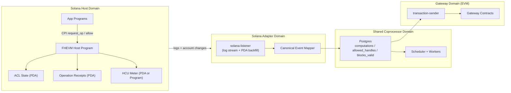
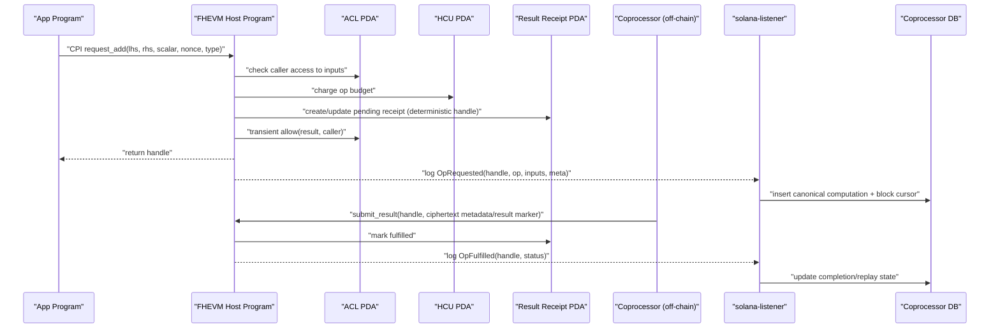

# Solana Host Integration Architecture

Date: 2026-02-09
Last synced: 2026-02-10
Status: Draft (exploration)

## Goal

Add a Solana host path without leaking Solana specifics into shared coprocessor core logic.

Gateway remains EVM payment/enforcement layer.

## Separation Principle

The protocol core should consume **canonical host events/jobs**, not chain-native payloads.

- Solana-specific parsing/finality/replay stays in `solana-listener`.
- Shared DB/job model stays chain-agnostic as much as possible.

## High-Level Component Diagram

## Trust and Ownership Model

## Authorities

1. **Program Upgrade Authority**
- Controls Solana program upgrades.
- Should be governance-controlled (multisig) in non-PoC environments.

2. **Protocol Config Authority**
- Controls runtime config PDA:
  - authorized coprocessor signers
  - pause flags
  - feature toggles
  - chain-id mapping used for handle metadata

3. **Coprocessor Signer Set**
- Allowed to submit `fulfill` transactions for pending receipts.
- Rotatable by config authority.

4. **App Caller / Requester**
- Can request symbolic ops and ACL changes through host API.
- Pays rent/fees for request receipts in PoC model.

## State Ownership

- Receipt PDAs are **program-owned**; only host program mutates status.
- ACL PDAs are **program-owned**; grants/revokes enforced by host rules.
- Fulfillment is accepted only from configured coprocessor signer set.

## CPI Layout Options

## Option A (PoC-first): Monolithic Host Program

- One host program owns:
  - symbolic op request entrypoints
  - ACL checks/updates
  - HCU/accounting logic
  - receipt lifecycle
- CPIs limited mostly to `SystemProgram` (create/resize/close PDAs).

Pros:
- fastest iteration, fewer moving parts.

Cons:
- weaker modular isolation.

## Option B (Hardened): Split Programs with explicit CPIs

- `HostRouterProgram` (entrypoint + deterministic handle derivation)
- `ACLProgram` (allow/allowForDecryption/delegation state)
- `HCUProgram` (budget metering)

Flow per request:
- App CPI -> HostRouter
- HostRouter CPI -> ACLProgram (`is_allowed` checks, transient allow result)
- HostRouter CPI -> HCUProgram (`charge_op`)
- HostRouter writes receipt PDA + emits `OpRequested`

Pros:
- clearer boundaries and easier independent auditing.

Cons:
- more operational complexity and CPI overhead.

## Recommended for exploration

Start with **Option A** for first validated loop, keep internal modules shaped like A/B boundaries so extraction later is low-risk.

## Request/Fulfill Sequence (PoC)

## Listener Strategy (critical for reliability)

Use hybrid ingestion:

1. **Fast path:** subscribe to logs (`msg!`/events) for low latency.
2. **Recovery path:** scan receipt/ACL PDAs by slot cursor for missed work.

No run is valid unless replay after restart yields no duplicate DB rows.

## Handle Compatibility Requirement

Handles produced from Solana host path must still satisfy gateway parsing and registration checks:

- chain id bytes must map to a registered host chain id
- type/version bytes must remain parseable

Relevant references:

- `host-contracts/contracts/FHEVMExecutor.sol`
- `gateway-contracts/contracts/libraries/HandleOps.sol`
- `gateway-contracts/contracts/shared/GatewayConfigChecks.sol`

## Scope for First Concrete Build

Implement only:

1. `request_add` symbolic path
2. persistent `allow` path
3. listener ingest + replay-safe cursor

Defer:

- delegation
- full op catalog
- `allowForDecryption` edge cases
- full worker/gateway end-to-end

## Architecture Decision Checkpoints

Re-evaluate after first validated local loop:

1. Should ACL/HCU become separate programs (Option B)?
2. Is logs+PDA hybrid sufficient, or do we need stronger indexing infra now?
3. Which abstractions can be safely shared with EVM listener without destabilizing current path?
