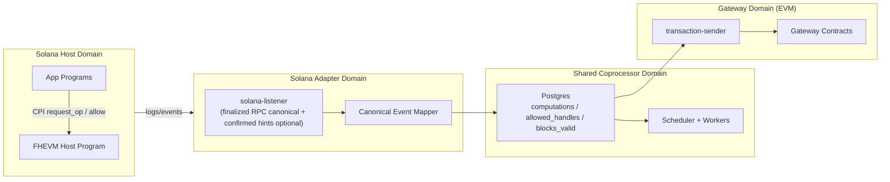
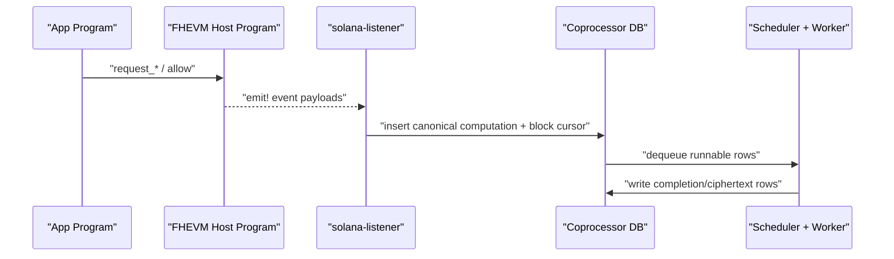

# Solana Host Integration Architecture

Date: 2026-02-09
Last synced: 2026-02-11
Status: Draft (exploration)

## Goal

Add a Solana host path without leaking Solana specifics into shared coprocessor core logic.

Gateway remains EVM payment/enforcement layer.

## Separation Principle

The protocol core should consume **canonical host events/jobs**, not chain-native payloads.

- Solana-specific parsing/finality/replay stays in `solana-listener`.
- Shared DB/job model stays chain-agnostic as much as possible.

## High-Level Component Diagram

## Baseline vs Deferred Tracks

1. Implemented baseline (active): log/event-driven host program + listener ingest.
2. Deferred track: stateful receipt/journal PDA designs, only if baseline fails correctness gates.

## Trust and Ownership Model

## Authorities

1. **Program Upgrade Authority**
- Controls Solana program upgrades.
- Should be governance-controlled (multisig) in non-PoC environments.

2. **Protocol Config Authority**
- Controls runtime config PDA:
  - authorized coprocessor signers
  - pause flags
  - feature toggles
  - chain-id mapping used for handle metadata

3. **Coprocessor Signer Set**
- Currently off-chain only in the PoC baseline (no on-chain fulfill path yet).
- On-chain signer-authorized fulfill paths are deferred with stateful receipt designs.

4. **App Caller / Requester**
- Can request symbolic ops and ACL changes through host API.
- Pays normal transaction fees for host instruction calls.

## State Ownership

Baseline:
- No long-lived receipt PDAs in the active PoC path.
- Canonical state lives in coprocessor DB after finalized ingest.

Deferred stateful track:
- Receipt/journal PDAs would be program-owned if adopted later.
- On-chain fulfillment authorization would use configured signer set if adopted.

## CPI Layout Options

## Option A (PoC-first): Monolithic Host Program

- One host program owns:
  - symbolic op request entrypoints
  - event emission contract for listener ingest
- CPI event transport is deferred from the active PoC baseline.

Pros:
- fastest iteration, fewer moving parts.

Cons:
- weaker modular isolation.

## Option B (Hardened): Split Programs with explicit CPIs

- `HostRouterProgram` (entrypoint + deterministic handle derivation)
- `ACLProgram` (allow/allowForDecryption/delegation state)
- `HCUProgram` (budget metering)
- optional receipt/journal program (if stateful ingestion is adopted)

Flow per request (future option):
- App CPI -> HostRouter
- HostRouter CPI -> ACLProgram / HCUProgram as needed
- HostRouter emits typed event and optionally writes stateful receipt

Pros:
- clearer boundaries and easier independent auditing.

Cons:
- more operational complexity and CPI overhead.

## Recommended for exploration

Start with **Option A** for first validated loop, keep internal modules shaped like A/B boundaries so extraction later is low-risk.

## Request/Ingest Sequence (PoC baseline)

## Listener Strategy (critical for reliability)

Use hybrid ingestion:

1. **Canonical path:** finalized RPC events/logs with durable cursor replay.
2. **Optional hint path:** confirmed websocket logs to reduce latency.
3. `msg!` is debug-only and not used as canonical typed ingestion payload.

No run is valid unless replay after restart yields no duplicate DB rows.

## Handle Compatibility Requirement

Handles produced from Solana host path must still satisfy gateway parsing and registration checks:

- chain id bytes must map to a registered host chain id
- type/version bytes must remain parseable

Relevant references:

- `host-contracts/contracts/FHEVMExecutor.sol`
- `gateway-contracts/contracts/libraries/HandleOps.sol`
- `gateway-contracts/contracts/shared/GatewayConfigChecks.sol`

## Scope for First Concrete Build

Implement only:

1. full symbolic op event surface + persistent `allow`
2. listener ingest + replay-safe cursor
3. representative e2e slice (`request_add`) for compute/decrypt sanity

Defer:

- delegation/decryption-specific ACL extensions
- `allowForDecryption` edge cases
- stateful receipt/journal alternatives

## Architecture Decision Checkpoints

Re-evaluate after first validated local loop:

1. Should ACL/HCU become separate programs (Option B)?
2. Is log-only finalized ingest sufficient, or do we need managed streams/stateful receipts?
3. Which abstractions can be safely shared with EVM listener without destabilizing current path?
