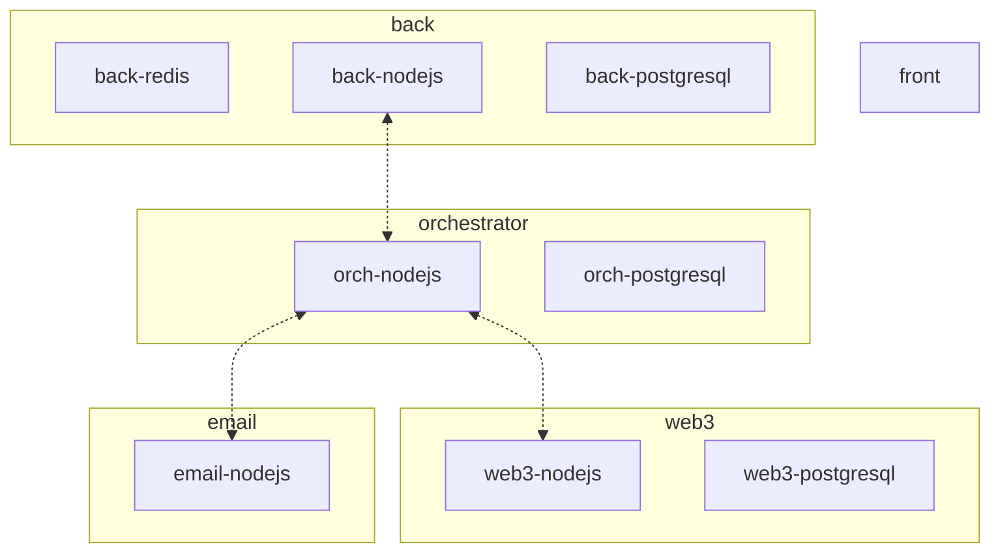

# apps

## /apps/front

A bunch of static assets (html, css, js & svg) loaded by the browser to interact with the `/back`

### Purpose

displays a nice ui to the user

### Interfaces:

- web url: https://console.zws.cloud

### Tech stack

React, Apollo-Client

### code & readme

[/apps/front/README.md](/apps/front/README.md)

## /apps/back

### Purposes:

- provide data to to the frontend
- authentifies users
- stores users & apps details
- stores usages data (& payment)
- authentifies & allow reencryptions ([conversation in progress](https://www.notion.so/zamaai/RFC-handle-async-reencryption-requests-1a45a7358d5e8028b07af0246cdf673a?pvs=4))

### Interfaces:

- HTTP /graphql
  - POST https://console-api.zws.cloud/graphql
  - WS wss://console-api.zws.cloud/graphql
- HTTP /relayer

  - POST https://console-api.zws.cloud/relayer/v1/reencrypt

- postgresql
- redis

* can read a SQS queue and publish on a SNS topic

### Tech stack

nodejs, nestjs, apollo-server, prisma, postgresql

### code & readme

[/apps/back/README.md](/apps/back/README.md)

## /apps/orchestrator

### Purpose

Route sqs messages between services

- Defines states of actions, success and failure dependencies
- Tells each service what to do to

### Interface

- can read a SQS queue and publish on a SNS topic
- postgresql

### Tech stack

nodejs, nestjs, xstate

More readings: [xstate](https://github.com/statelyai/xstate), [orchestration vs choregraphy](https://camunda.com/blog/2023/02/orchestration-vs-choreography/)

### code & readme

[/apps/orchestrator/README.md](/apps/orchestrator/README.md)

## /apps/web3

### Purpose

Interact with web3 ecosystem

- Tells a 3rd party indexer which user-submitted smart contract address to watch
- Listen to a 3rd party indexer when a user-submitted smart contract is found in the blockchain
- Tells a 3rd party blockchain dev platform to update our zama backend FHE smart contract to whitelist the user-submitted smart contract address

### Interfaces:

- can read a SQS queue and publish on a SNS topic
- can call a public https request to a 3rd party (etherscan, infura or a web3 node)
- postgresql

### Tech stack

nodejs, nestjs, ethers, viem

### code & readme

[/apps/web3/README.md](/apps/web3/README.md)

## /apps/email

unused, no need to deploy for now

### Purpose

- format a query to a 3rd party email router to send an email

### Interfaces:

- can read a SQS queue and publish on a SNS topic
- can call a public https request to a 3rd party (sendgrid)

## /apps/contract-event-listener

unclear, to be documented

# interactions between services

All services talk to the orchestrator

