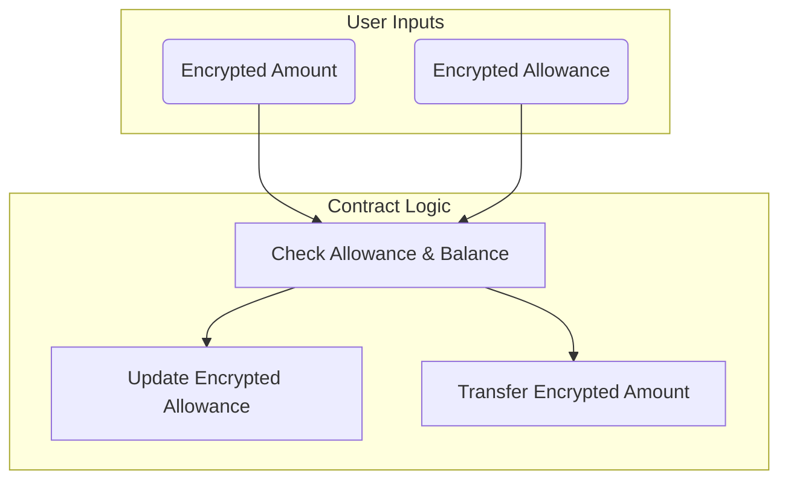
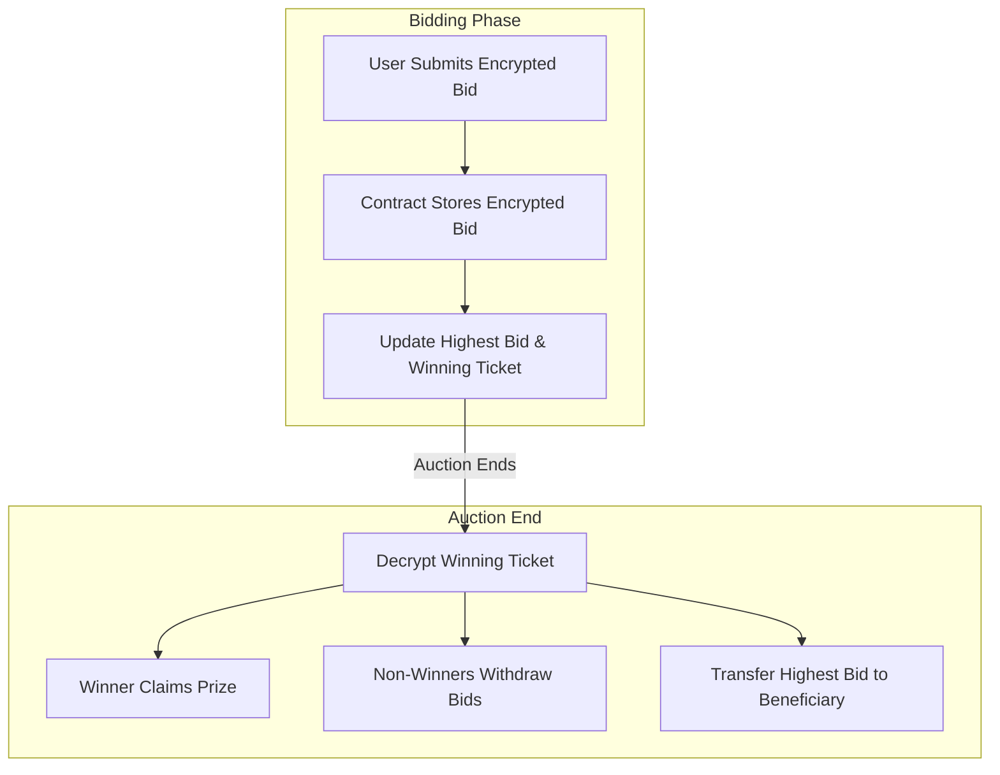

# FhEVM smart contract examples

This directory contains example contracts that demonstrate the usage of the fhEVM (Fully Homomorphic Encryption Virtual Machine) smart contract library. These contracts showcase various features and functionalities of encrypted computations on the blockchain, enabling privacy-preserving operations and opening up new possibilities for confidential blockchain applications.

## Quick overview

| Contract Name        | Description                              |
| -------------------- | ---------------------------------------- |
| EncryptedERC20.sol   | ERC20-like token with encrypted balances |
| TestAsyncDecrypt.sol | Asynchronous decryption testing          |
| BlindAuction.sol     | Blind auction using encrypted bids       |

## Usage

These contracts serve as examples and can be used as references when building your own fhEVM-compatible smart contracts. Make sure to have the necessary fhEVM library and dependencies set up in your development environment.

For more information, refer to the [fhEVM documentation](https://docs.zama.ai/fhevm).

## Contract summaries

### 1. **EncryptedERC20.sol**

An implementation of an ERC20-like token with encrypted balances and transfers. This contract demonstrates:

- Encrypted token balances
- Private transfer operations
- Allowance management with encryption

It showcases how traditional token systems can be made confidential using FHE techniques, allowing for private balance management on a public blockchain.

### 2. **TestAsyncDecrypt.sol**

Tests asynchronous decryption of various encrypted data types using the Gateway. This contract is essential for understanding how to safely decrypt data when needed, without compromising the overall security of the encrypted system.

### 3. **BlindAuction.sol**

Implements a blind auction system using encrypted bids. Key features include:

- Encrypted bid submission
- Timed auction periods
- Winner determination without revealing losing bids
- Claim and withdrawal mechanisms

This contract showcases how FHE can be used to create fair and private auction systems on the blockchain, ensuring bid confidentiality until the auction ends.

This diagram illustrates the main processes in the BlindAuction contract, from bid submission to the final distribution of funds and prizes.
