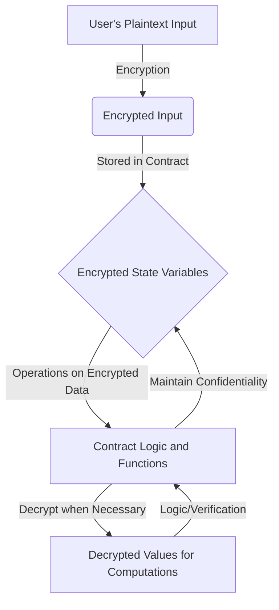
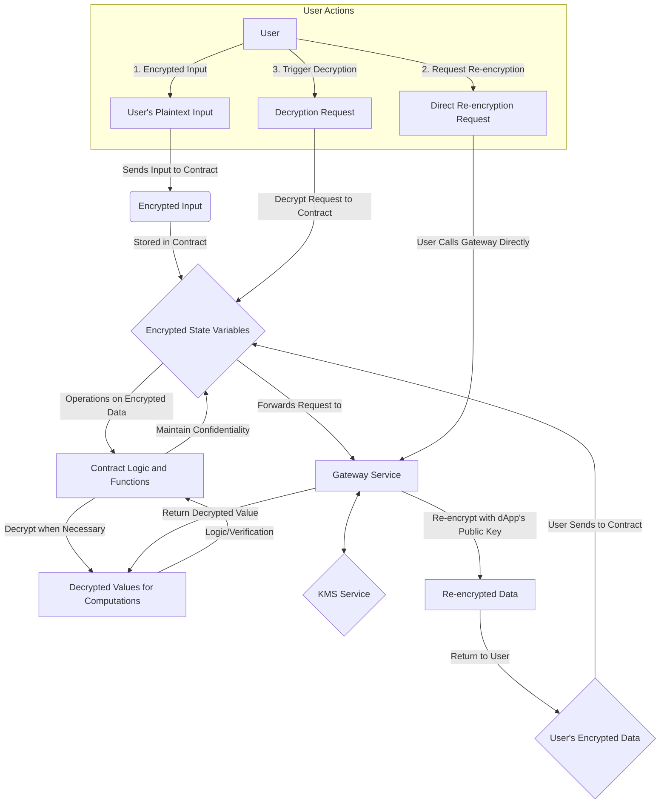

> Here will go all information about specific contracts, how are they designed and what are the considerations

### Overview of Encrypted and Decrypted Data Flow



[needs work]


```mermaid
graph TD
    %% User Interaction %%
    subgraph User Actions
        U[User] -->|1. Encrypted Input| A[User's Plaintext Input]
        U -->|2. Request Re-encryption| F[Direct Re-encryption Request]
        U -->|3. Trigger Decryption| K[Decryption Request]
    end

    %% Smart Contract Operations %%
    subgraph Smart Contract Operations
        C{Encrypted State Variables} -->|Operations on Encrypted Data| D[Contract Logic and Functions]
        D -->|Maintain Confidentiality| C
        A -->|Sends Input to Contract| B(Encrypted Input)
        B -->|Stored in Contract| C
        K -->|Decrypt Request to Contract| C
        C -->|Forwards Decrypt Request to| GC[Gateway Call from Contract]
        J -->|Return to User| M{User's Encrypted Data}
        %% Contract Decryption Flow %%
        GC -->|Return Decrypted Data to Contract| E[Decrypted Values for Computations]
        E -->|Logic/Verification| D

    end

        GC -->|Forward Request to| G[Gateway Service]
        G -->|Return Decrypted Value| GC
        G <--> N{KMS Service}
        F -->|User Calls Gateway Directly| G
        G -->|Re-encrypt with dApp's Public Key| J[Re-encrypted Data]

    %% Re-encrypted Data Flow %%
    M -->|User Sends to Contract| C


 3. `Counter.sol`:
    The `Counter` smart contract is a simple contract implemented in Solidity, designed to demonstrate basic state manipulation. Its main purpose is to maintain a counter (value) and provide functions to increment and view the current counter value.

 1. `EncryptedERC20.sol`:
   This contract implements an encrypted ERC20-like token with confidential balances using Zama's FHE (Fully Homomorphic Encryption) library.
   It supports typical ERC20 functionality such as transferring tokens, minting, and setting allowances, but uses encrypted data types.

### Approval and Transfer Operations

Here's a high-level overview of what is encrypted and decrypted in the `EncryptedERC20` smart contract:

```mermaid
graph TD
    subgraph User Inputs
        X1(Encrypted Amount)
        X2(Encrypted Allowance)
    end
    subgraph Contract Logic
        Y1[Check Allowance & Balance]
        Y2[Update Encrypted Allowance]
        Y3[Transfer Encrypted Amount]
    end
    X1 --> Y1
    X2 --> Y1
    Y1 --> Y2
    Y1 --> Y3
```

1. `TestAsyncDecrypt.sol`:
   A contract for testing asynchronous decryption using the Gateway. It handles various encrypted data types and demonstrates different decryption scenarios, including trustless decryption.

2. `FHEPaymentUpgradedExample.sol`:
   An upgraded version of the FHEPayment contract, adding version information.

4. `BlindAuction.sol`:
   Implements a blind auction using encrypted bids. It manages bidding, claiming, and withdrawing processes using homomorphic encryption.

5. `ACLUpgradedExample.sol`:
   An upgraded version of the ACL (Access Control List) contract, adding version information.

6. `KMSVerifierUpgradedExample.sol`:
   An upgraded version of the KMSVerifier contract, adding version information.

7. `ACLUpgradedExample2.sol`:
   Another upgraded version of the ACL contract, with a different version number.

8. `TFHEExecutorUpgradedExample.sol`:
   An upgraded version of the TFHEExecutor contract, adding version information.

9. `GatewayContractUpgradedExample.sol`:
   An upgraded version of the GatewayContract, adding version information.


2. `PaymentLimit.sol`:
   A contract designed to test FHE gas limits. It includes functions that perform different numbers of FHE operations to test various scenarios: well under the block FHE gas limit, close to the limit, and exceeding the limit.

3. `KMSVerifierUpgradedExample.sol`:
   An upgraded version of the KMSVerifier contract, adding version information. This contract is likely part of a key management system for the FHE operations.

4. `TracingSubCalls.sol`:
   A set of contracts designed to test various subcall scenarios in a blockchain environment. It includes:
   - A main contract that initiates different types of subcalls
   - Contracts that test creation with encrypted inputs
   - A contract with various functions to test success, failure, out-of-gas, and self-destruct scenarios

