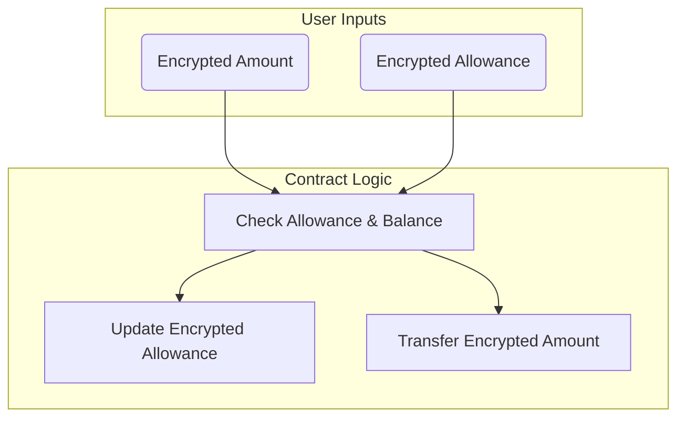

# fhEVM Smart Contract Examples

This directory contains example contracts that demonstrate the usage of the fhEVM (Fully Homomorphic Encryption Virtual Machine) smart contract library. These contracts showcase various features and functionalities of encrypted computations on the blockchain, enabling privacy-preserving operations and opening up new possibilities for confidential blockchain applications.

## Quick Overview

| Contract Name                   | Description                                    |
| ------------------------------- | ---------------------------------------------- |
| Counter.sol                     | Simple incrementable counter                   |
| EncryptedERC20.sol              | ERC20-like token with encrypted balances       |
| TestAsyncDecrypt.sol            | Asynchronous decryption testing                |
| BlindAuction.sol                | Blind auction using encrypted bids             |
| Rand.sol                        | Generation of random encrypted numbers         |
| Reencrypt.sol                   | Reencryption of various FHE data types         |
| Regression1.sol                 | Service and metadata management for testing    |
| SmartAccount.sol                | Smart account with batch transaction execution |
| TFHEExecutorUpgradedExample.sol | Upgraded TFHEExecutor with version info        |
| TracingSubCalls.sol             | Subcall tracing and scenario testing           |
| ACLUpgradedExample.sol          | Upgraded Access Control List with version info |

## Usage

These contracts serve as examples and can be used as references when building your own fhEVM-compatible smart contracts. Make sure to have the necessary fhEVM library and dependencies set up in your development environment.

For more information, refer to the [fhEVM documentation](https://docs.zama.ai/fhevm).

## Contract Summaries

### 1. **ACLUpgradedExample.sol**

An upgraded version of the Access Control List (ACL) contract that includes version information. It manages permissions and access control within a system, with the added benefit of tracking its own version for easier upgrades and compatibility checks.

### 2. **BlindAuction.sol**

Implements a blind auction system using encrypted bids. Key features include:

- Encrypted bid submission
- Timed auction periods
- Winner determination without revealing losing bids
- Claim and withdrawal mechanisms

This contract showcases how FHE can be used to create fair and private auction systems on the blockchain, ensuring bid confidentiality until the auction ends.

### 3. **Counter.sol**

A simple contract demonstrating basic state management with an incrementable counter.

### 4. **EncryptedERC20.sol**

An implementation of an ERC20-like token with encrypted balances and transfers. This contract demonstrates:

- Encrypted token balances
- Private transfer operations
- Allowance management with encryption

It showcases how traditional token systems can be made confidential using FHE techniques, allowing for private balance management on a public blockchain.

```mermaid
graph TD
    subgraph User Inputs
        X1(Encrypted Amount)
        X2(Encrypted Allowance)
    end
    subgraph Contract Logic
        Y1[Check Allowance & Balance]
        Y2[Update Encrypted Allowance]
        Y3[Transfer Encrypted Amount]
    end
    X1 --> Y1
    X2 --> Y1
    Y1 --> Y2
    Y1 --> Y3
```

### 5. **Rand.sol**

Generates random encrypted numbers of various bit sizes (8, 16, 32, 64 bits). It is useful for applications requiring secure, on-chain randomness that remains encrypted until needed.

### 6. **Reencrypt.sol**

Demonstrates the reencryption of various FHE data types, including booleans, integers of different sizes, addresses, and bytes. This contract is crucial for understanding how to manage and transform encrypted data within smart contracts.

### 7. **Regression1.sol**

A contract for managing services and metadata, useful for testing and regression purposes. It includes various operations and state changes to ensure the `fhEVM` system behaves correctly under different scenarios.

### 8. **SmartAccount.sol**

Implements a smart account with batch transaction execution capabilities. This contract showcases how complex, multi-step operations can be performed securely and efficiently using encrypted data.

### 9. **TestAsyncDecrypt.sol**

Tests asynchronous decryption of various encrypted data types using the Gateway. This contract is essential for understanding how to safely decrypt data when needed, without compromising the overall security of the encrypted system.

### 10. **TFHEExecutorUpgradedExample.sol**

An upgraded version of the `TFHEExecutor` contract with added version information. It likely handles core execution logic for FHE operations within the system.

### 11. **TracingSubCalls.sol**

Demonstrates tracing of subcalls and various success/failure scenarios in contract interactions. This is crucial for testing and understanding how encrypted operations behave in complex, multi-contract scenarios.
