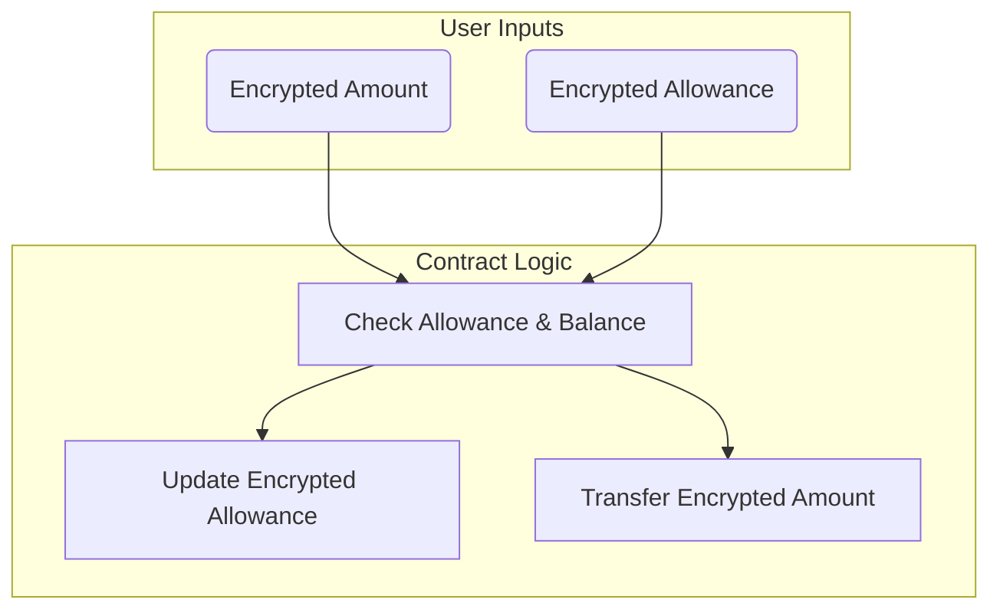
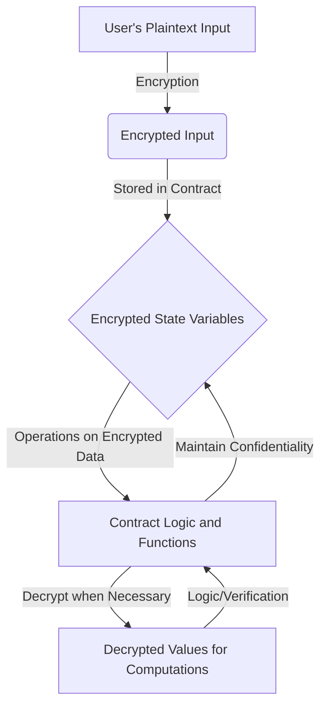

# fhEVM Smart Contract Examples

This directory contains example contracts that demonstrate the usage of the fhEVM (Fully Homomorphic Encryption Virtual Machine) smart contract library. These contracts showcase various features and functionalities of encrypted computations on the blockchain.

## Overview

The fhEVM library allows developers to perform computations on encrypted data within smart contracts. This enables privacy-preserving operations and opens up new possibilities for confidential blockchain applications.

## Quick Overview

| Contract Name | Description |
|---------------|-------------|
| Counter.sol | Simple incrementable counter |
| EncryptedERC20.sol | ERC20-like token with encrypted balances |
| TestAsyncDecrypt.sol | Asynchronous decryption testing |
| BlindAuction.sol | Blind auction using encrypted bids |
| Rand.sol | Generation of random encrypted numbers |
| ACLUpgradedExample.sol | Upgraded Access Control List with version info |
| Reencrypt.sol | Reencryption of various FHE data types |
| Regression1.sol | Service and metadata management for testing |
| SmartAccount.sol | Smart account with batch transaction execution |
| TFHEExecutorUpgradedExample.sol | Upgraded TFHEExecutor with version info |
| TracingSubCalls.sol | Subcall tracing and scenario testing |

## Contract Summaries

### ACLUpgradedExample.sol
An upgraded version of the Access Control List (ACL) contract that includes version information. This contract likely manages permissions and access control within a system, with the added benefit of tracking its own version for easier upgrades and compatibility checks.

### BlindAuction.sol
Implements a blind auction system using encrypted bids. Key features include:
- Encrypted bid submission
- Timed auction periods
- Winner determination without revealing losing bids
- Claim and withdrawal mechanisms

This contract showcases how FHE can be used to create fair and private auction systems on the blockchain.

### Counter.sol
A simple contract demonstrating basic state management with an incrementable counter. While straightforward, this contract serves as a good starting point for understanding how to manage encrypted state variables in fhEVM.

### EncryptedERC20.sol
An implementation of an ERC20-like token with encrypted balances and transfers. This contract demonstrates:
- Encrypted token balances
- Private transfer operations
- Allowance management with encryption

It showcases how traditional token systems can be made confidential using FHE techniques.

#### Approval and Transfer Operations

Here's a high-level overview of what is encrypted and decrypted in the `EncryptedERC20` smart contract:

```mermaid
graph TD
    subgraph User Inputs
        X1(Encrypted Amount)
        X2(Encrypted Allowance)
    end
    subgraph Contract Logic
        Y1[Check Allowance & Balance]
        Y2[Update Encrypted Allowance]
        Y3[Transfer Encrypted Amount]
    end
    X1 --> Y1
    X2 --> Y1
    Y1 --> Y2
    Y1 --> Y3
```

### Rand.sol
This contract showcases the generation of random encrypted numbers of various bit sizes (8, 16, 32, 64 bits). It's useful for applications requiring secure, on-chain randomness that remains encrypted until needed.

### Reencrypt.sol
Demonstrates the reencryption of various FHE data types, including booleans, integers of different sizes, addresses, and bytes. This contract is crucial for understanding how to manage and transform encrypted data within smart contracts.

### Regression1.sol
A contract for managing services and metadata, useful for testing and regression purposes. It likely includes various operations and state changes to ensure the fhEVM system behaves correctly under different scenarios.

### SmartAccount.sol
Implements a smart account with batch transaction execution capabilities. This contract showcases how complex, multi-step operations can be performed securely and efficiently using encrypted data.

### TestAsyncDecrypt.sol
Tests asynchronous decryption of various encrypted data types using the Gateway. This contract is essential for understanding how to safely decrypt data when needed, without compromising the overall security of the encrypted system.

### TFHEExecutorUpgradedExample.sol
An upgraded version of the TFHEExecutor contract with added version information. This contract likely handles core execution logic for FHE operations within the system.

### TracingSubCalls.sol
Demonstrates tracing of subcalls and various success/failure scenarios in contract interactions. This is crucial for testing and understanding how encrypted operations behave in complex, multi-contract scenarios.

1. `TestAsyncDecrypt.sol`:
   A contract for testing asynchronous decryption using the Gateway. It handles various encrypted data types and demonstrates different decryption scenarios, including trustless decryption.

2. `FHEPaymentUpgradedExample.sol`:
   An upgraded version of the FHEPayment contract, adding version information.

4. `BlindAuction.sol`:
   Implements a blind auction using encrypted bids. It manages bidding, claiming, and withdrawing processes using homomorphic encryption.

5. `ACLUpgradedExample.sol`:
   An upgraded version of the ACL (Access Control List) contract, adding version information.

6. `KMSVerifierUpgradedExample.sol`:
   An upgraded version of the KMSVerifier contract, adding version information.

7. `ACLUpgradedExample2.sol`:
   Another upgraded version of the ACL contract, with a different version number.

8. `TFHEExecutorUpgradedExample.sol`:
   An upgraded version of the TFHEExecutor contract, adding version information.

9. `GatewayContractUpgradedExample.sol`:
   An upgraded version of the GatewayContract, adding version information.

2. `PaymentLimit.sol`:
   A contract designed to test FHE gas limits. It includes functions that perform different numbers of FHE operations to test various scenarios: well under the block FHE gas limit, close to the limit, and exceeding the limit.

3. `KMSVerifierUpgradedExample.sol`:
   An upgraded version of the KMSVerifier contract, adding version information. This contract is likely part of a key management system for the FHE operations.

4. `TracingSubCalls.sol`:
   A set of contracts designed to test various subcall scenarios in a blockchain environment. It includes:
   - A main contract that initiates different types of subcalls
   - Contracts that test creation with encrypted inputs
   - A contract with various functions to test success, failure, out-of-gas, and self-destruct scenarios

 3. `Counter.sol`:
    The `Counter` smart contract is a simple contract implemented in Solidity, designed to demonstrate basic state manipulation. Its main purpose is to maintain a counter (value) and provide functions to increment and view the current counter value.

 1. `EncryptedERC20.sol`:
   This contract implements an encrypted ERC20-like token with confidential balances using Zama's FHE (Fully Homomorphic Encryption) library.
   It supports typical ERC20 functionality such as transferring tokens, minting, and setting allowances, but uses encrypted data types.

## Usage

These contracts serve as examples and can be used as references when building your own fhEVM-compatible smart contracts. Make sure to have the necessary fhEVM library and dependencies set up in your development environment.

### Overview of Encrypted and Decrypted Data Flow

```mermaid
graph TD
    A[User's Plaintext Input] -->|Encryption| B(Encrypted Input)
    B -->|Stored in Contract| C{Encrypted State Variables}

    %% Using encrypted data in the contract %%
    C -->|Operations on Encrypted Data| D[Contract Logic and Functions]
    D -->|Maintain Confidentiality| C

    %% Encryption and Decryption operations %%
    D -->|Decrypt when Necessary| E[Decrypted Values for Computations]
    E -->|Logic/Verification| D
```
