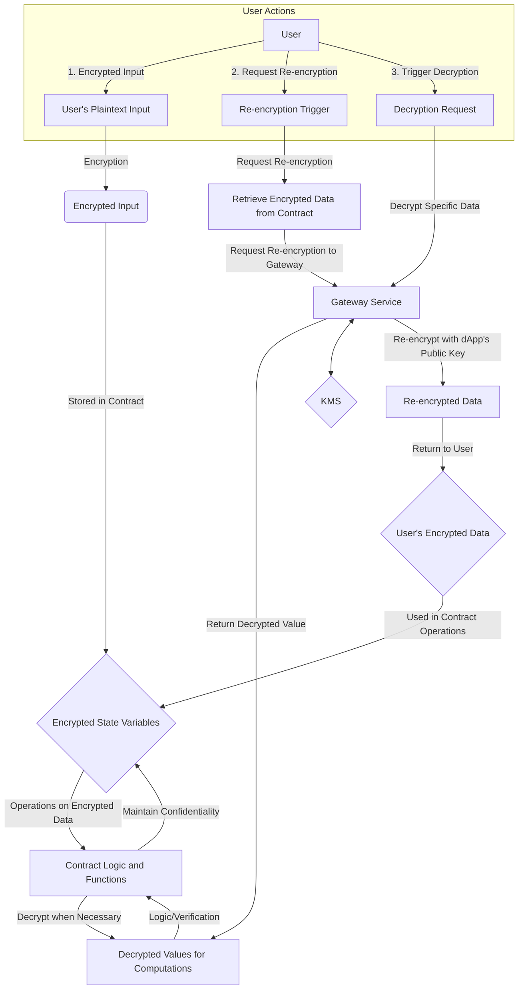

> Here will go all information about specific contracts, how are they designed and what are the considerations

### Overview of Encrypted and Decrypted Data Flow

[needs work]

# Counter.sol
The `Counter` smart contract is a simple contract implemented in Solidity, designed to demonstrate basic state manipulation. Its main purpose is to maintain a counter (value) and provide functions to increment and view the current counter value.

## EncryptedERC20.sol
This contract implements an encrypted ERC20-like token with confidential balances using Zama's FHE (Fully Homomorphic Encryption) library.
It supports typical ERC20 functionality such as transferring tokens, minting, and setting allowances, but uses encrypted data types.

### Approval and Transfer Operations

Here's a high-level overview of what is encrypted and decrypted in the `EncryptedERC20` smart contract:

