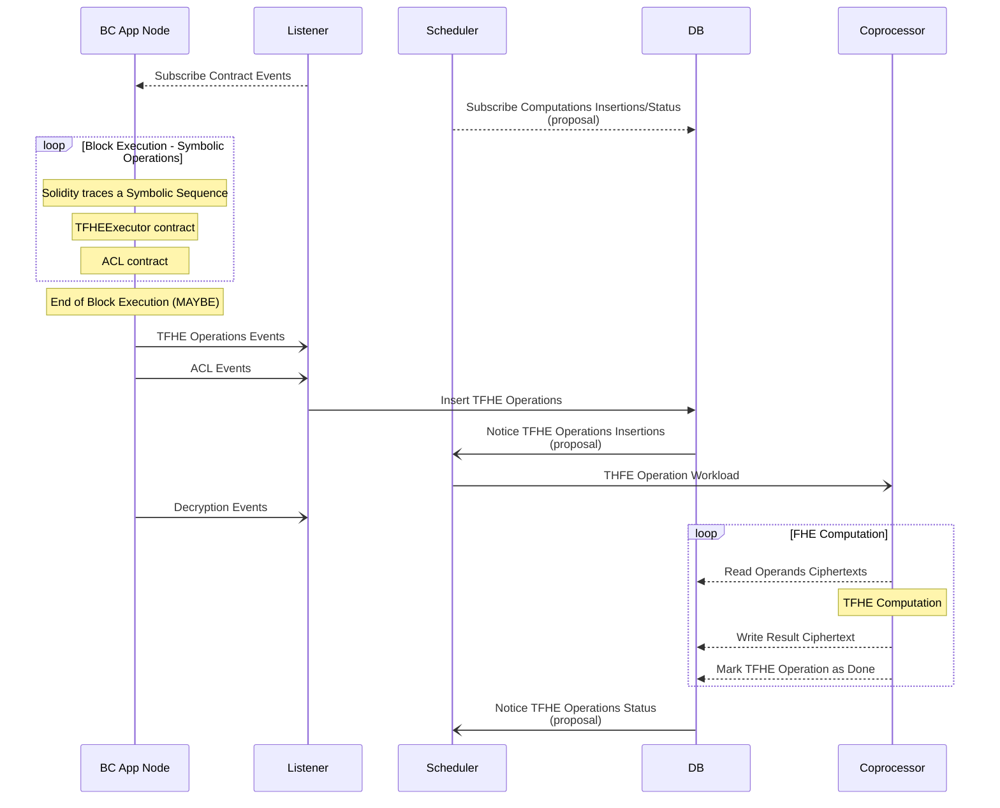
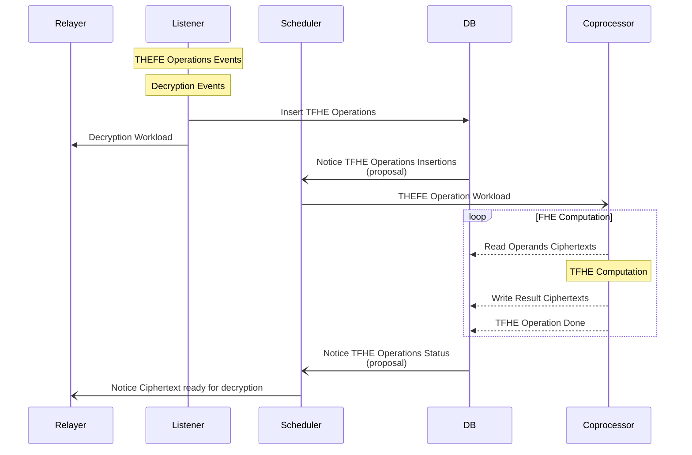

# Listener

The listener primary role is to observe the block chain execution and extend that execution off the chain.

## How

Our contracts actively emits events that forms the trace of a symbolic execution. These events can be observed via the blockchain node pubsub events feature.

## Command-line

WIP

## Events in FHEVM

### Blockchain Events
> Status: in progress
Blockchain events are used export the symbolic execution of TFHE operations from a blockchain node configured to accept pubsub requests.
A listener subscribe to the blockchain node and converts the events to a TFHE workload in a database.

There are 3 types of events related to:
- TFHE operations
- ACL, can be used to preprocess ciphertext for certain use case
- Public and User Decryption

### Database Events
> Status: proposal
Database events are used to hint the scheduler to dispath workload and to notice workload completion.

> https://stackoverflow.com/questions/56747634/how-do-i-use-the-postgres-crate-to-receive-table-modification-events-from-postgr

### Decryption Events
> Status: in progress

### Overview FHEVM
> **_NOTE:_**  Listener and scheduler could be in the same service.**

### Overview Relayer (maybe incorrect to be refined)

