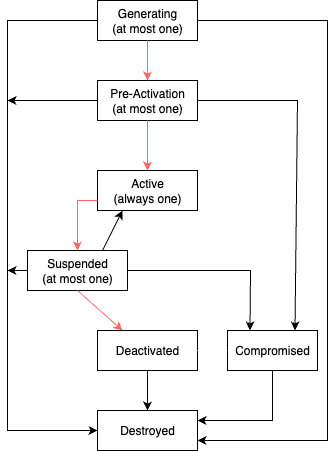

# CoprocessorContexts contract

This section describes the `CoprocessorContexts` contract. It is used to manage the lifecycle of coprocessors for the fhevm Gateway protocol.

Several settings are stored in the contract, which can be separated in several categories:

- [Coprocessor](#coprocessor)
- [Coprocessor context](#coprocessor-context)
- [Owner](#owner)

## Coprocessor

A coprocessor is part of a set of multiple coprocessors, called a coprocessor [context](#coprocessor-context). They are used to :

- perform FHE computations on ciphertexts
- verify inputs' zero-knowledge proof of knowledge (ZKPoK) based on requests from the `InputVerification` contract
- handle access controls to ciphertexts for all registered [host chains](./gateway_config.md#host-chains), which are centralized in the `MultichainAcl` contract

Several metadata are stored for each coprocessor:

- `name` : name of the coprocessor (indicative)
- `txSenderAddress` : see [Sender and signer](#sender-and-signer) below.
- `signerAddress` : see [Sender and signer](#sender-and-signer) below.
- `s3BucketUrl` : URL of the S3 bucket where the ciphertexts are stored. In the fhevm protocol, this URL is fetched by the KMS connector in order to download the ciphertexts needed for decryption requests.

The current list of [active](#lifecycle) coprocessors can be retrieved using the following view function:

- `getCoprocessors()`: get all the active coprocessors' metadata.

### Sender and signer

A coprocessor has both a transaction sender and a signer assigned to it:

- `txSenderAddress` : address of the account that will send transactions to the fhevm Gateway.
- `signerAddress` : address associated to the public key used to sign results sent to the fhevm Gateway.

The list of coprocessors' transaction senders and signers from a context can be retrieved using the following view functions:

- `getCoprocessorTxSendersFromContext(uint256 contextId)`: get all the active coprocessors' transaction senders from a context.
- `getCoprocessorSignersFromContext(uint256 contextId)`: get all the active coprocessors' signers from a context.

The transaction sender and signer addresses are allowed to be the same for a given coprocessor.

Additionally, the transaction sender address is used for identifying a coprocessor and may be referred to its "identity". In particular, these addresses can be used as inputs to the following view function:

- `getCoprocessorFromContext(uint256 contextId, address coprocessorTxSenderAddress)`: get an active coprocessor's metadata from a context.

The above functions can be combined with the `getActiveCoprocessorContextId()` function to get information about the coprocessors from the current [`active`](#lifecycle) context.

## Coprocessor context

A set of coprocessors is called a coprocessor context and must be constituted of at least 1 coprocessor. It stores the following metadata:

- `contextId`: unique non-zero identifier of the coprocessor context, defined using an incremental counter within the `CoprocessorContexts` contract.
- `previousContextId`: identifier of the previous coprocessor context.
- `featureSet`: feature set of the coprocessor context, used for updating the coprocessors' software.
- `coprocessors`: list of coprocessors in the coprocessor context.

It is possible to get information about the current [`active`](#lifecycle) coprocessor context using the following view functions:

- `getActiveCoprocessorContext()`: get the current active coprocessor context.
- `getActiveCoprocessorContextId()`: get the current active coprocessor context ID.

Currently, the initial coprocessor context is set at deployment of the `CoprocessorContexts` contract and put directly in the [`active`](#lifecycle) state. In this particular case, the `previousContextId` is set to 0 since there is no previous coprocessor context to refer to.

Coprocessor contexts can be updated over time by the owner for the following reasons:

- adding one or more coprocessors
- removing one or more coprocessors
- replacing one or more coprocessors with a new one
- updating one or more coprocessors' metadata (ex: feature set for software updates)

### Lifecycle

Coprocessor context updates follow a lifecycle approach, a general concept applied to other parts of the fhevm Gateway (ex: KMS nodes, Custodians, FHE keys). It is used to ensure a linear history of contexts and that there is no disruption in the protocol when updating them.

The lifecycle of a context is defined by the following states, although some of them are not currently used in practice for coprocessor contexts:

- `generating`: currently not used.
- `pre-activation`: the coprocessor context will be activated in a certain amount of blocks.
- `active`: the coprocessor context can be used for new requests, for example:
  - input verification requests
  - adding new ciphertext materials
  - new allows or delegations
- `suspended`: the coprocessor context cannot be used for new requests and will be deactivated after a certain amount of blocks. However, it can still be considered for on-going consensus phases, for example:
  - proof verification/rejection responses
  - on-going additions of ciphertext materials
  - on-going allows or delegations
- `deactivated`: the coprocessor context is deactivated and cannot be used for any purpose anymore.
- `compromised`: the coprocessor context is compromised and cannot be used for any purpose anymore.
- `destroyed`: currently not used.

Additionally:

- in case of emergency (ex: bad software update), the owner can directly move a context from `suspended` back to `active`, which deactivates the context with issues.
- an `active` context cannot be set to `compromised`,`deactivated` or `destroyed`, in order to ensure that the fhevm Gateway always has one active context.

The complete lifecycle of a coprocessor context is represented in the following diagram:

### Automatic status refresh

Coprocessor context statuses that need to be updated based on the current block timestamp are refreshed using the `refreshCoprocessorContextStatuses` function. This function can be called by anyone, but most importantly, it is called by any of the following functions as a pre-hook modifier:

- in `CiphertextCommits` contract:
  - `addCiphertextMaterial`
- in `MultichainAcl` contract:
  - `allowPublicDecrypt`
  - `allowAccount`
  - `delegateAccount`
- in `InputVerification` contract:
  - `verifyProofRequest`
  - `verifyProofResponse`
  - `rejectProofResponse`

This ensures that the statuses are always up to date when performing the above actions.

## Owner

Similarly to other contracts, the `CoprocessorContexts` contract is ownable. The `owner` account is allowed to perform several restricted actions:

- upgrade the contract
- add a new coprocessor context
- compromise a coprocessor context
- destroy a coprocessor context
- move a suspended coprocessor context back to active (in case of emergency)

More information about the owner can be found in the [GatewayConfig](./gateway_config.md#governance-accounts) section.
