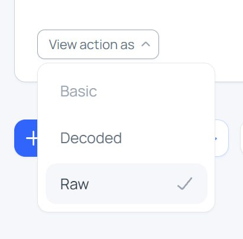

# LayerZero bridge wiring runbook: Ethereum + Polygon

Runbook to wire the `ConfidentialBridge` instances between Ethereum and Polygon,
on either mainnet or testnet, when governance owns both sides:

- Ethereum bridge ACL is owned directly by the Aragon DAO.
- Polygon bridge ACL is owned indirectly by the same Aragon DAO through
  `GovernanceOAppSender` on Ethereum and `GovernanceOAppReceiver` on Polygon.

| Environment | Ethereum chain   | Ethereum chainId | Ethereum EID | Polygon chain   | Polygon chainId | Polygon EID | Bridge LZ config              |
| ----------- | ---------------- | ---------------- | ------------ | --------------- | --------------- | ----------- | ----------------------------- |
| Mainnet     | Ethereum Mainnet | `1`              | `30101`      | Polygon Mainnet | `137`           | `30109`     | `layerzero.config.mainnet.ts` |
| Testnet     | Ethereum Sepolia | `11155111`       | `40161`      | Polygon Amoy    | `80002`         | `40267`     | `layerzero.config.testnet.ts` |

## Preconditions

- The host stacks are already deployed and verified on the selected environment.
- `CONFIDENTIAL_BRIDGE_CONTRACT_ADDRESS` is known on both chains.
- `GovernanceOAppSender` is deployed on Ethereum/Sepolia, owned by the Aragon DAO,
  funded with enough native token to pay LayerZero fees, and linked to Polygon/Amoy.
- `GovernanceOAppReceiver` is deployed on Polygon/Amoy, linked to the Ethereum
  sender, and has `adminSafeModule` set to the Safe module that can execute
  privileged bridge ACL operations. ACL on Polygon/Amoy is owned by the corresponding Safe account.
- The LayerZero configs have been reviewed: DVNs, confirmations, executor config
  and enforced options.

## Step 1 - Select the environment

From `fhevm/host-contracts`, set these variables for the target environment.

Mainnet:

```bash
export SRC_CHAIN_NAME=ethereum-mainnet
export DST_CHAIN_NAME=polygon-mainnet
export SRC_EID=30101
export DST_EID=30109
export SRC_CHAIN_ID=1
export DST_CHAIN_ID=137
export BRIDGE_LZ_CONFIG=layerzero.config.mainnet.ts
```

Testnet:

```bash
export SRC_CHAIN_NAME=sepolia
export DST_CHAIN_NAME=polygonAmoy
export SRC_EID=40161
export DST_EID=40267
export SRC_CHAIN_ID=11155111
export DST_CHAIN_ID=80002
export BRIDGE_LZ_CONFIG=layerzero.config.testnet.ts
```

Then export bridge addresses:

```bash
export SRC_BRIDGE_ADDRESS=<ETHEREUM_OR_SEPOLIA_CONFIDENTIAL_BRIDGE>
export DST_BRIDGE_ADDRESS=<POLYGON_OR_AMOY_CONFIDENTIAL_BRIDGE>
```

## Step 2 - Recreate bridge deployments

Prepare the LayerZero deployment artifacts:

```bash
cd lz-wiring
pnpm i
```

Update both deployment files for the selected environment:

```text
deployments/$SRC_CHAIN_NAME/ConfidentialBridge.json
deployments/$DST_CHAIN_NAME/ConfidentialBridge.json
```

Each file must contain the already deployed bridge address:

```json
{
  "address": "<ConfidentialBridgeAddress>"
}
```

Copy the ABI into those deployment artifacts:

```bash
npx ts-node scripts/copyAbiToDeployments.ts
```

## Step 3 - Generate LayerZero wiring transactions

Generate the Ethereum/Sepolia-side wiring transaction plan without submitting it:

```bash
printf 'nnnn' | npx hardhat lz:oapp:wire \
  --oapp-config "$BRIDGE_LZ_CONFIG" \
  --skip-connections-from-eids "$DST_EID" \
  --output-filename ethereum-bridge-wiring.json
```

Generate the Polygon/Amoy-side wiring transaction plan the same way, but skip
connections originating from Ethereum/Sepolia:

```bash
printf 'nnnn' | npx hardhat lz:oapp:wire \
  --oapp-config "$BRIDGE_LZ_CONFIG" \
  --skip-connections-from-eids "$SRC_EID" \
  --output-filename polygon-bridge-wiring.json
```

After running those 2 commands you should see those 2 new files written to disk inside `lz-wiring/` directory:

- `ethereum-bridge-wiring.json` contains transactions originating from Ethereum/Sepolia.
- `polygon-bridge-wiring.json` contains transactions originating from Polygon/Amoy.

## Step 4 - Augment previous wiring transactions with setDstChainId calls

`lz:oapp:wire` does not configure the FHEVM bridge specific `dstChainId` mapping. Rather
than executing it as a separate governance proposal, append the
`setDstChainId(uint32 dstEid, uint64 dstChainId)` calls directly to the two
wiring files generated in Step 3.

Run the helper script (it reads the environment variables set in Step 1 and
edits both wiring files in place):

```bash
npx ts-node appendSetDstChainId.ts \
  --src-wiring-filename ethereum-bridge-wiring.json \
  --dst-wiring-filename polygon-bridge-wiring.json
```

This appends to each file a `setDstChainId` call targeting the matching bridge:

- `ethereum-bridge-wiring.json`: `setDstChainId(DST_EID, DST_CHAIN_ID)` on `SRC_BRIDGE_ADDRESS`.
- `polygon-bridge-wiring.json`: `setDstChainId(SRC_EID, SRC_CHAIN_ID)` on `DST_BRIDGE_ADDRESS`.

## Step 5 - Execute Ethereum-side wiring via Aragon

Convert `ethereum-bridge-wiring.json` into an
Aragon proposal.

```bash
npx ts-node convertToAragonProposal.ts \
  ethereum-bridge-wiring.json \
  aragonProposal.json
```

Upload `aragonProposal.json` in the Aragon app when creating the proposal, then
vote and execute it.

This proposal should include all source-side LayerZero calls generated by
`lz:oapp:wire`, such as peer, send library, receive library, delegate/config and
enforced option changes + the FHEVM bridge specific `setDstChainId` call.

## Step 6 - Execute Polygon-side wiring via the governance OApp

Polygon/Amoy cannot be wired directly by Aragon. Instead, create an Aragon
proposal on Ethereum/Sepolia that calls
`GovernanceOAppSender.sendRemoteProposal(...)`.

First, convert `polygon-bridge-wiring.json` into the remote proposal format
expected by the governance toolkit:

```bash
npx ts-node convertToRemoteProposal.ts \
  polygon-bridge-wiring.json \
  remote-proposal-temp.json
```

This produces `remote-proposal-temp.json` with the parallel arrays consumed by
the governance toolkit:

- `targets`: Polygon/Amoy contracts to call (from each entry's `OmniAddress`).
- `functionSignatures`: empty string for every entry, since the wiring `Data`
  already embeds the 4-byte selector.
- `datas`: full calldata for each Polygon/Amoy wiring call (from each entry's
  `Data`).

Then copy the produced `remote-proposal-temp.json` into the [`scripts/governance-proposal-builder/`](https://github.com/zama-ai/protocol-apps/tree/main/scripts/governance-proposal-builder) directory of `protocol-apps` repo
to be able to feed it to the `fill-options-remote-proposal` script from the governance toolkit.
Inside this `governance-proposal-builder/` directory run this command (for the `destination` flag, use either `polygon-amoy-testnet` or `polygon-mainnet` depending on your environment):

```bash
npm run fill-options-remote-proposal -- --allowEmptyFunctionSignatures --destination <polygon-amoy-testnet|polygon-mainnet>
```

Upload the resulting `aragonProposal.json` in the Aragon app when creating the
proposal, then vote and execute it.

**WARNING:** Due to a bug in the Aragon App front-end in some versions (pending a fix which is currently work in progress by Aragon team), when you will upload this last instance of `aragonProposal.json` file, since all `functionSignatures` argument values will be empty in this last step, the Aragon App will not let you create the proposal once you upload the JSON file. A quick workaround to solve this issue at the moment is to click on `View action as` dropdown menu below the action and to select `Raw`, as in picture below, this will let you publish the proposal and then vote and execute it without any issue:



## Step 7 - Verify wiring

Check both directions:

- Each bridge has the other bridge set as peer for the remote EID.
- EndpointV2 delegates match governance on each chain.
- Send and receive libraries, DVNs, confirmations and enforced options match
  `$BRIDGE_LZ_CONFIG`.
- `getDstChainId(DST_EID) == DST_CHAIN_ID` on Ethereum/Sepolia.
- `getDstChainId(SRC_EID) == SRC_CHAIN_ID` on Polygon/Amoy.

Then you can run a small handle cross-chain transfer to confirm the bridge is working as expected in both directions, for instance by deploying and wiring an instance of `examples/HandlesListConfidentialOApp.sol` on both chains and then calling its `generateAndSendHandlesList` function on both chains.
