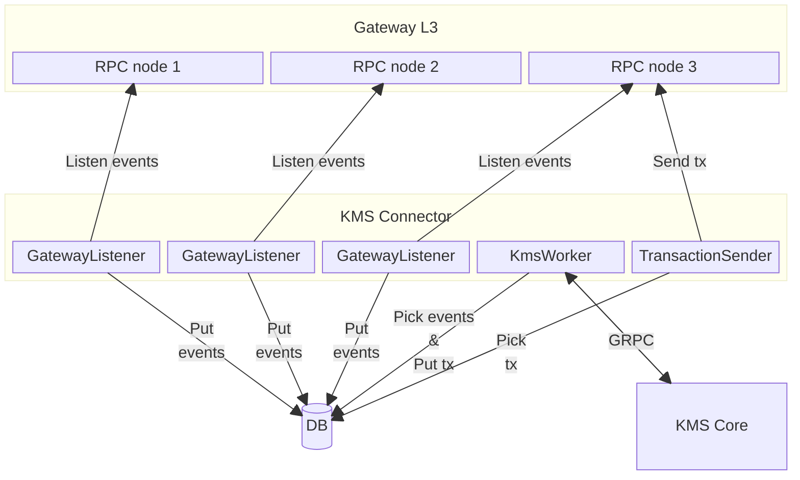
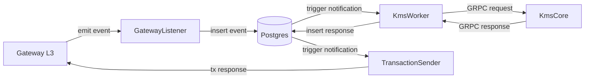

# KMS Connector Architecture

## Introduction

The role of the KMS Connector is to forward the Gateway's events to the KMS Core and the responses of
the KMS Core to the Gateway.

The ambition of `fhevm` is to be able to handle thousands of decryptions per second. If the KMS
Connector does not play its role, it would break the whole `fhevm` flow, so we must ensure that:
- it never misses any Gateway events
- it never misses any KMS Core responses
- it is able to catch up events/responses in case it has been down for some time

## Architecture overview

In order to achieve this, the KMS Connector has been divided into 3 components:
- **GatewayListener**
  - Multiple listeners, so we do not miss Gateway events if one is down
  - Each listener listens to an RPC node of the Gateway
    - Each listener can have backup RPC nodes URL in case the connection with the first one is lost
  - Each listener tries to write the events it catches in a Postgres DB (only 1 will succeed, the others will ignore the duplicate key error)
  - The number of listeners should be able to scale up to avoid missing events but also to scale down to not waste resources when it is not required

- **KmsWorker**
  - One or multiple workers
    - In the first place, we will probably start with only one worker
    - But we should be able to scale the number of workers to handle more events if required
  - Gets notified by the Postgres DB when new events are stored
  - Forwards the events' requests to the KMS Core, and stores its responses to DB
  - Removes the events from the DB once handled

- **TransactionSender**
  - Only one tx sender
  - Gets notified by the Postgres DB when new KMS Core responses are stored
  - Forwards the KMS Core responses to the Gateway by submitting transactions
  - Removes the responses from the DB once forwarded

Here is an overview of the architecture:



## KMS Connector flow

Here is an overview of the KMS Connector flow from the Gateway request event emitted to the
transaction response:



## Database design

Each event emitted by the Gateway or response received from the KMS Core has its table
representation in the DB, with a notification triggered when data is inserted within this table.

The `KmsWorker` and `TransactionSender` listen to these notifications and perform their jobs when
a notification is received.

Example with `PublicDecryptionResponse` received from the KMS Core:

```sql
CREATE TABLE IF NOT EXISTS public_decryption_requests (
    decryption_id BYTEA NOT NULL,
    sns_ct_materials sns_ciphertext_material[] NOT NULL,
    under_process BOOLEAN NOT NULL DEFAULT FALSE,
    created_at TIMESTAMP NOT NULL DEFAULT NOW(),
    PRIMARY KEY (decryption_id)
);

CREATE OR REPLACE FUNCTION notify_public_decryption_request()
    RETURNS trigger AS $$
BEGIN
    NOTIFY public_decryption_request_available;
    RETURN NULL;
END;
$$ LANGUAGE plpgsql;

CREATE OR REPLACE FUNCTION notify_user_decryption_request()
    RETURNS trigger AS $$
BEGIN
    NOTIFY user_decryption_request_available;
    RETURN NULL;
END;
$$ LANGUAGE plpgsql;
```

Queries to insert events/responses in the DB use `ON CONFLICT DO NOTHING` to ignore concurrency errors:

```rust
sqlx::query!(
    "INSERT INTO public_decryption_requests VALUES ($1, $2) ON CONFLICT DO NOTHING",
    id, sns_ciphertexts
)
.execute(&db_pool)
.await?;
```

When a `KmsWorker` picks events in the DB to process them, it sets the `under_process` field of the
associated requests to `TRUE`, to lock these events from other workers. Then it can remove them
when processed without concurrency issue:

```rust
let event = sqlx::query!(
    "
        UPDATE public_decryption_requests
        SET under_process = TRUE
        FROM (
            SELECT decryption_id
            FROM public_decryption_requests
            WHERE under_process = FALSE
        ) AS req
        WHERE public_decryption_requests.decryption_id = req.decryption_id
        RETURNING req.decryption_id, sns_ct_materials
    ",
    id
)
.fetch_one(&mut db_pool)
.await?;
```

Events are automatically deleted from the database when the associated response is inserted in the
database. If an error happens while processing an event, the `KmsWorker` restores the
`under_process` field of the associated request to `FALSE` to unlock the event.

Responses are deleted from the database once the transaction to the Gateway has been successfully
sent.

## Reliability

### Never miss Gateway events

As we will run multiple `GatewayListener` instances, we assume that they will not crash all
simultaneously, thus that all events emitted by the Gateway would be written in the DB.

There is also a `from_block_number` option in its configuration, to be able to recover all events
from a given block number.

So even if we run only one `KmsWorker` that crashes, it will have access to unhandled events when
restarted.

### Never miss KMS Core responses

Until the `KmsWorker` has received a response from the KMS Core, the associated event request will
stay in the DB. So if the `KmsWorker` or KMS Core crashes before the KMS Core responds, the
`KmsWorker` will be able to re-pick the event from the DB and re-send the request when the
connection with the KMS Core is re-established. Thus, no KMS Core responses should be missed.

### Catch up events/responses after downtime

The DB notifications are used to handle events/responses while the KMS Connector's components are
running. But what about events/responses that happened while the `KmsWorker` or the
`TransactionSender` was down?

Both the `KmsWorker` and the `TransactionSender` have a polling mechanism, in case no notification
are received from the DB during a certain period of time. If that timeout is reached, they will
fetch the DB for events/responses even if no notification are received. Thus, after downtime, both
these services would be able to catch up missed events/responses, even if no new events/responses
are produced.
