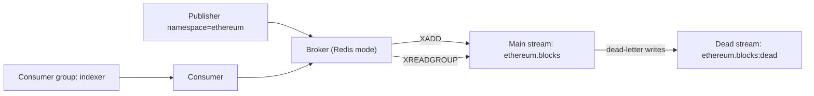
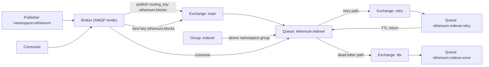

# broker

A simplified broker abstraction for Redis Streams and RabbitMQ.

## Features

- **Unified API** - Same code works on Redis or RabbitMQ
- **Direct Routing** - Messages to specific consumers
- **Fanout** - Broadcast to multiple consumer groups
- **Competing Consumers** - Load balancing within a group
- **Fluent Builder** - Easy configuration with sensible defaults
- **Graceful Shutdown** - CancellationToken support for clean consumer stop

## Quick Start

```rust
use broker::{Broker, Topic, routing, AsyncHandlerPayloadOnly};

#[tokio::main]
async fn main() -> Result<(), Box<dyn std::error::Error>> {
    // Connect to broker
    let broker = Broker::redis("redis://localhost:6379").await?;
    // Or: Broker::amqp("amqp://localhost:5672").build().await?;

    // Publisher
    let publisher = broker.publisher("ethereum").await?;
    publisher.publish("blocks", &serde_json::json!({"number": 12345})).await?;

    // Consumer
    let topic = Topic::new(routing::BLOCKS).with_namespace("ethereum");
    let handler = AsyncHandlerPayloadOnly::new(|block: serde_json::Value| async move {
        println!("Processing block: {:?}", block);
        Ok::<(), std::convert::Infallible>(())
    });

    broker.consumer(&topic)
        .group("indexer")
        .consumer_name("pod-1")
        .prefetch(100)
        .run(handler).await?;

    Ok(())
}
```

### RabbitMQ Topology Default

`Broker::amqp(...)` uses shared global exchanges by default:

- `main`
- `retry`
- `dlx`

Broker auto-declares this topology during publish/consume setup, so application
code does not need explicit AMQP topology calls.

## How Topic Works

`Topic` is the backend-agnostic route identifier.

```rust
let topic = Topic::new("blocks").with_namespace("ethereum");

assert_eq!(topic.key(), "ethereum.blocks");                // qualified key
assert_eq!(topic.dead_key(), "ethereum.blocks:dead");      // dead-letter key
assert_eq!(topic.routing_segment(), "blocks");             // unqualified segment
```

At runtime, broker maps this topic differently per backend:

- Redis: keys map to stream/dead-stream names.
- AMQP: key becomes the routing key on broker-managed shared exchanges.

So your app code always uses `Topic`, and only infra wiring differs by backend.

## Routing Model

For `Topic::new("blocks").with_namespace("ethereum")` and `.group("indexer")`, routing is
shown separately per backend.

### Redis Streams Model (Publish + Consume)



### RabbitMQ Model (Publish + Consume)



### Key Concepts

| Term | RabbitMQ | Redis |
|------|----------|-------|
| **Global Topology** | Exchanges `main/retry/dlx` + derived queues | Main + dead streams |
| **Exchange** | Fixed shared exchange (`main`) | N/A |
| **Namespace** | Routing key prefix | Stream prefix |
| **Routing** | Routing key suffix | Stream suffix |
| **Topic** | Full routing key (`namespace.routing`) | Full stream name (`namespace.routing`) |
| **Group** | Logical group name (queue derived as `namespace.group`) | Consumer group |
| **Queue Name** | Derived from `group` as `namespace.group` | N/A |
| **Consumer Name** | Consumer tag | Consumer name |

## Generic Agnostic Usage

The same publish/consume code path works for both Redis and AMQP.
Only broker construction differs.
This example runs **multiple consumers** (`blocks` + `forks`) with the same
application code on both backends.

```rust
use broker::{routing, Broker, Topic, AsyncHandlerPayloadOnly};

#[derive(Debug, Clone, serde::Serialize, serde::Deserialize)]
struct BlockEvent {
    number: u64,
}

#[derive(Debug, Clone, serde::Serialize, serde::Deserialize)]
struct ForkEvent {
    at_block: u64,
}

async fn build_broker(
    broker_type: &str,
    broker_url: &str,
) -> Result<Broker, Box<dyn std::error::Error>> {
    let broker = match broker_type {
        "redis" => Broker::redis(broker_url).await?,
        "amqp" => Broker::amqp(broker_url).build().await?,
        other => return Err(format!("unsupported broker type: {other}").into()),
    };

    Ok(broker)
}

async fn run_pipeline(broker: Broker) -> Result<(), Box<dyn std::error::Error>> {
    let blocks_topic = Topic::new(routing::BLOCKS).with_namespace("ethereum");
    let forks_topic = Topic::new(routing::FORKS).with_namespace("ethereum");

    // Publisher scoped by namespace
    let publisher = broker.publisher("ethereum").await?;
    publisher
        .publish_to_topic(&blocks_topic, &BlockEvent { number: 12345 })
        .await?;
    publisher
        .publish_to_topic(&forks_topic, &ForkEvent { at_block: 12340 })
        .await?;

    // Consumer setup is identical across backends.
    // Only group names and topics differ.
    let block_handler = AsyncHandlerPayloadOnly::new(|evt: BlockEvent| async move {
        println!("[blocks] processing block {}", evt.number);
        Ok::<(), std::convert::Infallible>(())
    });

    let fork_handler = AsyncHandlerPayloadOnly::new(|evt: ForkEvent| async move {
        println!("[forks] processing fork at {}", evt.at_block);
        Ok::<(), std::convert::Infallible>(())
    });

    let broker_blocks = broker.clone();
    let broker_forks = broker.clone();

    tokio::select! {
        result = broker_blocks
            .consumer(&blocks_topic)
            .group("indexer")
            .consumer_name("pod-1")
            .prefetch(100)
            .run(block_handler) => {
            eprintln!("blocks consumer exited: {:?}", result);
        }
        result = broker_forks
            .consumer(&forks_topic)
            .group("fork-handler")
            .consumer_name("pod-1")
            .prefetch(50)
            .run(fork_handler) => {
            eprintln!("forks consumer exited: {:?}", result);
        }
    }

    Ok(())
}
```

## Error Classification & Handler Variants

The broker distinguishes **transient** errors (infrastructure failures) from **permanent**
errors (bad message payload). This classification is backend-agnostic and drives two behaviors:

- **Retry budget**: Transient errors get infinite retries (message is fine, infra is broken).
  Permanent errors count against `max_retries` and route to dead-letter on exhaustion.
- **Circuit breaker**: When consecutive transient errors exceed a threshold, the consumer
  **pauses consumption** entirely — preventing DLQ pollution during outages. After a cooldown,
  one probe message is processed. If it succeeds, the circuit closes and consumption resumes.

| Handler | Closure signature | Error classification |
|---------|-------------------|---------------------|
| `AsyncHandlerPayloadOnly` | `Fn(T) -> impl Future<Output = Result<(), E>>` | All closure errors wrapped as `HandlerError::Execution` (permanent). Use when your handler only needs a success/fail distinction. |
| `AsyncHandlerPayloadClassified` | `Fn(T) -> impl Future<Output = Result<(), HandlerError>>` | Error classification **preserved** as returned by the closure. Use when your handler needs to distinguish transient from permanent failures. |
| `AsyncHandlerNoArgs` | `Fn() -> impl Future<Output = Result<(), E>>` | All errors wrapped as permanent. Use for side-effect-only handlers (heartbeats, timers). |

### Choosing a handler

Use `AsyncHandlerPayloadOnly` when all errors are equivalent, the consumer retries up to
`max_retries` and then dead-letters. This is the simplest option.

Use **`AsyncHandlerPayloadClassified`** when your handler calls external infrastructure
(database, RPC, API) and you need transient failures to trip the circuit breaker while
permanent failures (bad payload) go straight to the retry/DLQ path:

```rust
use broker::{AsyncHandlerPayloadClassified, HandlerError};

let handler = AsyncHandlerPayloadClassified::new(|block: BlockEvent| async move {
    // Transient: infrastructure is broken, not the message.
    // → Infinite retries, trips circuit breaker.
    db.save(&block).await.map_err(HandlerError::transient)?;

    // Permanent: the message itself is invalid.
    // → Counts against max_retries, resets CB transient counter.
    verify_block(&block).map_err(HandlerError::permanent)?;

    Ok(())
});
```

> **Key difference**: `AsyncHandlerPayloadOnly` wraps *all* closure errors as
> `HandlerError::Execution` (permanent), so transient infra failures never trip the
> circuit breaker. `AsyncHandlerPayloadClassified` lets the closure return
> `HandlerError::Transient` or `HandlerError::Execution` directly, preserving the
> classification the consumer loop relies on.

### Circuit breaker state machine

```text
  ┌──────────┐  threshold consecutive   ┌──────────┐  cooldown   ┌───────────┐
  │  Closed  │  transient failures  ──►  │   Open   │  expires ─► │ Half-Open │
  │ (normal) │                           │ (paused) │             │  (probe)  │
  └──────────┘                           └──────────┘             └───────────┘
       ▲                                                               │
       │  probe succeeds                                               │
       └───────────────────────────────────────────────────────────────┘
                             probe fails → back to Open
```

| State | Behavior |
|-------|----------|
| **Closed** | Normal consumption. Transient failures increment counter; successes/permanent failures reset it. |
| **Open** | No messages consumed. Waits for cooldown to expire. |
| **Half-Open** | One probe message processed. Success → Closed. Failure → Open (restart cooldown). |

### Full example with circuit breaker

```rust
use std::time::Duration;
use broker::{routing, Broker, Topic, AsyncHandlerPayloadClassified, HandlerError};

async fn run(broker: Broker) -> Result<(), Box<dyn std::error::Error>> {
    let topic = Topic::new(routing::BLOCKS).with_namespace("ethereum");

    let handler = AsyncHandlerPayloadClassified::new(|block: BlockEvent| async move {
        db.save(&block).await.map_err(HandlerError::transient)?;
        verify_block(&block).map_err(HandlerError::permanent)?;
        Ok(())
    });

    broker.consumer(&topic)
        .group("indexer")
        .prefetch(100)
        .max_retries(5)                                    // permanent errors: 5 attempts then DLQ
        .circuit_breaker(3, Duration::from_secs(30))       // 3 transient errors → pause 30s
        .run(handler)
        .await?;

    Ok(())
}
```

Works identically on Redis Streams and RabbitMQ — the circuit breaker state persists
across reconnections on both backends.

## Queue Inspection

`Broker::exists()` checks whether the underlying queue or stream for a topic has been
created, without requiring a consumer group to exist.

```rust
use broker::{Broker, Topic, routing};

let topic = Topic::new(routing::BLOCKS).with_namespace("ethereum");

if !broker.exists(&topic).await? {
    // Queue/stream hasn't been created yet — skip depth check
}
```

| Backend | Mechanism | Returns `true` when |
|---------|-----------|---------------------|
| **Redis** | `TYPE` command on the key | Key exists and is a `stream` |
| **AMQP** | Passive `queue_declare` | Broker acknowledges the queue (404 → `false`) |

## Consumer Patterns

### Direct Routing

Publisher sends to routing key, only matching queue/group receives:

```rust
// Only receives "blocks" messages
broker.consumer(&Topic::new("blocks").with_namespace("ethereum"))
    .group("block-processor")
    .run(handler).await?;
```

### Fanout (Multiple Groups)

Multiple groups bind to same routing key, all receive a copy:

```rust
let blocks_topic = Topic::new("blocks").with_namespace("ethereum");

// Both groups receive ALL block messages independently
broker.consumer(&blocks_topic).group("indexer").run(handler1).await?;
broker.consumer(&blocks_topic).group("analytics").run(handler2).await?;
```

### Competing Consumers (Load Balancing)

Same group, different consumer names, messages load-balanced:

```rust
// Pod 1
broker.consumer(&topic)
    .group("indexer")
    .consumer_name("pod-1")
    .run(handler).await?;

// Pod 2 - shares the load with pod-1
broker.consumer(&topic)
    .group("indexer")
    .consumer_name("pod-2")
    .run(handler).await?;
```

## Configuration Options

### Common Options

```rust
broker.consumer(&topic)
    .group("worker")                    // Required: group name
    .consumer_name("pod-1")             // Optional: instance name
    .prefetch(100)                      // Messages to buffer (default: 10)
    .max_retries(5)                     // Before dead-letter (default: 3)
    .circuit_breaker(3, Duration::from_secs(30))
    .run(handler).await?;
```

### Redis-Specific

```rust
broker.consumer(&topic)
    .group("worker")
    .redis_block_ms(10000)          // Block for 10s on empty stream
    .redis_claim_min_idle(60)       // Reclaim stuck messages after 60s
    .redis_claim_interval(10)       // Check every 10s
    .run(handler).await?;
```

### AMQP-Specific

```rust
broker.consumer(&topic)
    .group("worker")
    .amqp_retry_delay(10)               // 10s between retries
    .amqp_routing_pattern("ethereum.blocks.#")   // Wildcard subscription
    .run(handler).await?;
```

## Building and Running Consumers

### Option 1: Build and Run Immediately

```rust
broker.consumer(&topic)
    .group("worker")
    .run(handler).await?;
```

### Option 2: Build First, Run Later

```rust
// Build consumers
let blocks_consumer = broker.consumer(&Topic::new("blocks").with_namespace("ethereum"))
    .group("block-processor")
    .prefetch(100)
    .build()?;

let forks_consumer = broker.consumer(&Topic::new("forks").with_namespace("ethereum"))
    .group("fork-handler")
    .build()?;

// Run with tokio::spawn
let h1 = tokio::spawn(blocks_consumer.run(block_handler));
let h2 = tokio::spawn(forks_consumer.run(fork_handler));

futures::future::join_all(vec![h1, h2]).await;
```

## Multi-Namespace Setup

```rust
let broker = Broker::redis("redis://localhost:6379").await?;

for ns in ["ethereum", "polygon", "arbitrum"] {
    let topic = Topic::new("blocks").with_namespace(ns);
    let broker = broker.clone();

    tokio::spawn(async move {
        broker.consumer(&topic)
            .group("indexer") // AMQP queue becomes "{ns}.indexer"
            .consumer_name("pod-1")
            .run(handler).await
    });
}
```

## Graceful Shutdown

Use `CancellationToken` to stop consumers cleanly:

```rust
use broker::{Broker, Topic, routing, CancellationToken};

let token = CancellationToken::new();

let consumer = broker.consumer(&topic)
    .group("indexer")
    .with_cancellation(token.clone())
    .build()?;

// Run in a task
let handle = tokio::spawn(consumer.run(handler));

// Later, trigger graceful shutdown
token.cancel();
handle.await??;
```

## Routing Keys

Use custom routing keys:

```rust
let topic = Topic::new("erc20-transfers").with_namespace("ethereum");
```
