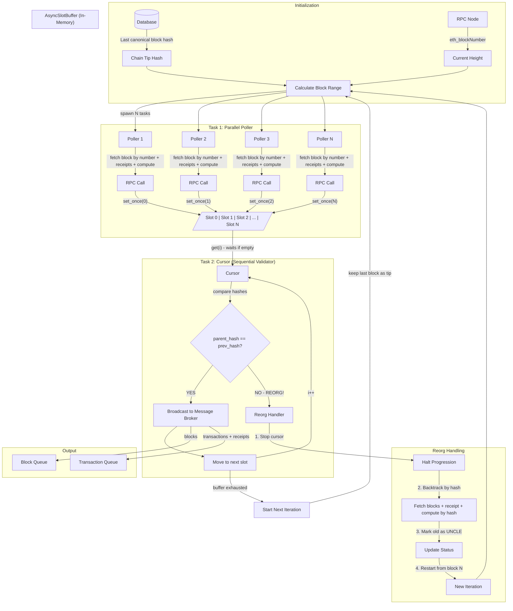
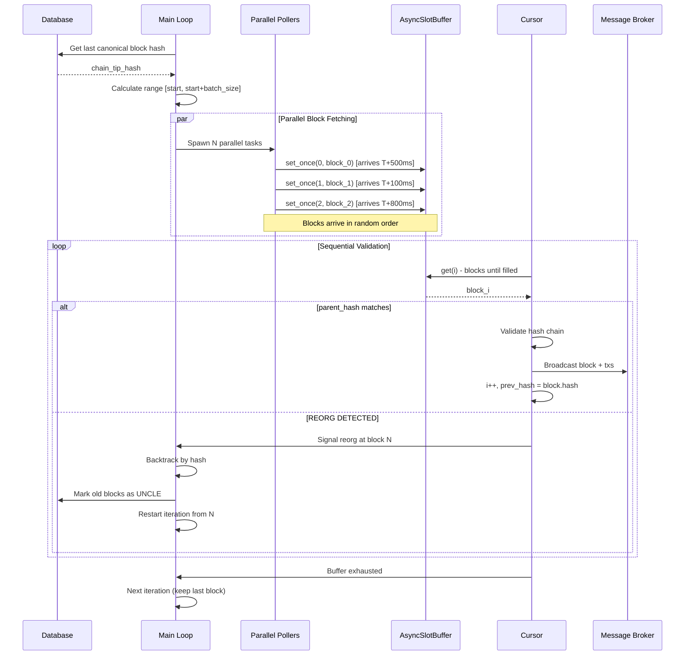
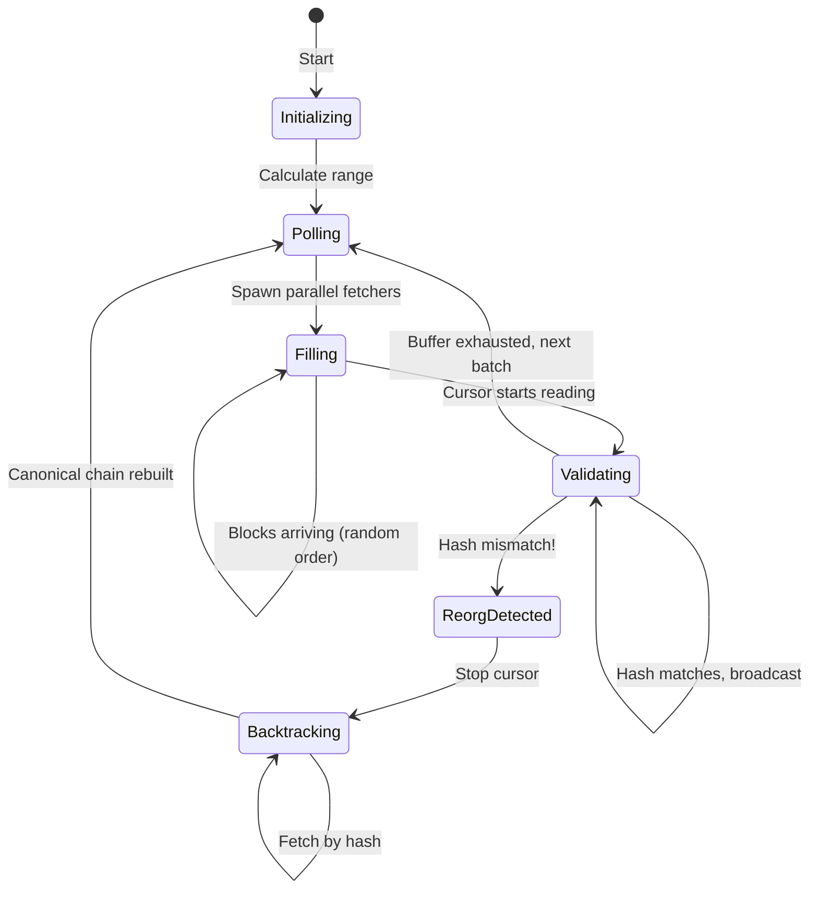

# Listener Core - Algorithm V2 (Cursor Algorithm)

## Overview

The Cursor Algorithm solves the block production speed problem by parallelizing block fetching while maintaining sequential validation through a cursor.

## Architecture Diagram

## Sequence Diagram

## Component State Diagram

## Key Components

| Component           | Status         | Description                                            |
| ------------------- | -------------- | ------------------------------------------------------ |
| `AsyncSlotBuffer`   | ✅ Implemented | Thread-safe buffer for parallel write, sequential read |
| `EvmBlockFetcher`   | ✅ Implemented | 5 strategies for fetching blocks + receipts            |
| `EvmBlockComputer`  | ✅ Implemented | Block hash verification (receiptRoot, txRoot)          |
| `SemEvmRpcProvider` | ✅ Implemented | Semaphore-controlled RPC provider                      |
| Cursor Loop         | ⚠️ Simulated   | `slot_buffer_sim_flow.rs` demo                         |
| Reorg Handler       | ❌ Not Yet     | Backtracking logic                                     |
| Message Broker      | ❌ Not Yet     | Redis Streams / RabbitMQ integration                   |
| Database Layer      | ❌ Not Yet     | Block status persistence (CANONICAL/UNCLE)             |

## Algorithm Properties

- **Parallel Fetching**: Overcomes HTTP latency for fast chains (Arbitrum, Monad)
- **Sequential Validation**: Cursor ensures hash chain integrity
- **Reorg Safe**: Detects reorgs via parent_hash comparison
- **Cancellation Support**: CancellationToken propagates through all tasks
- **Rate Limit Friendly**: Semaphore controls concurrent RPC calls
