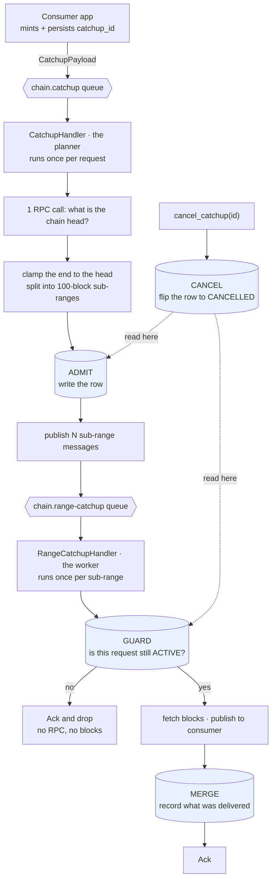
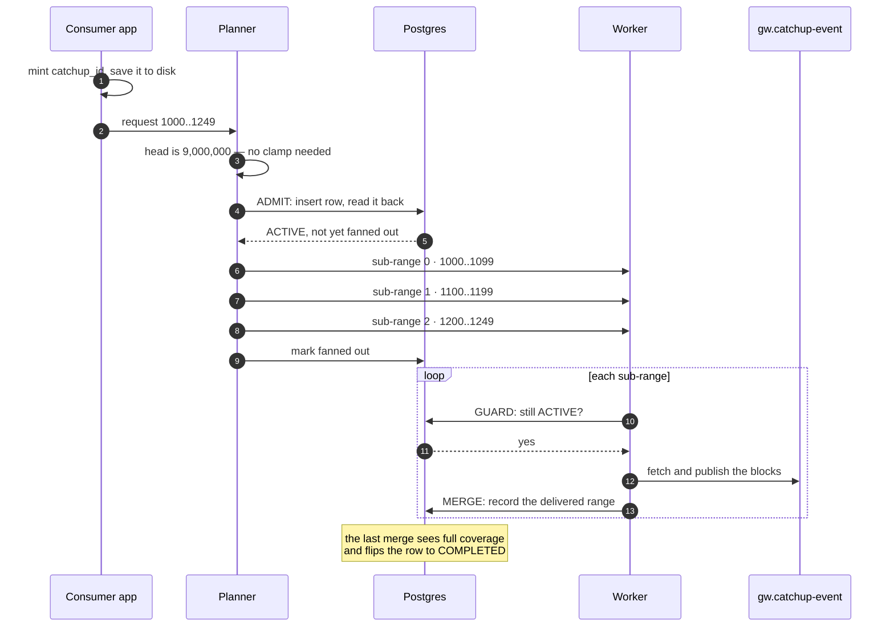
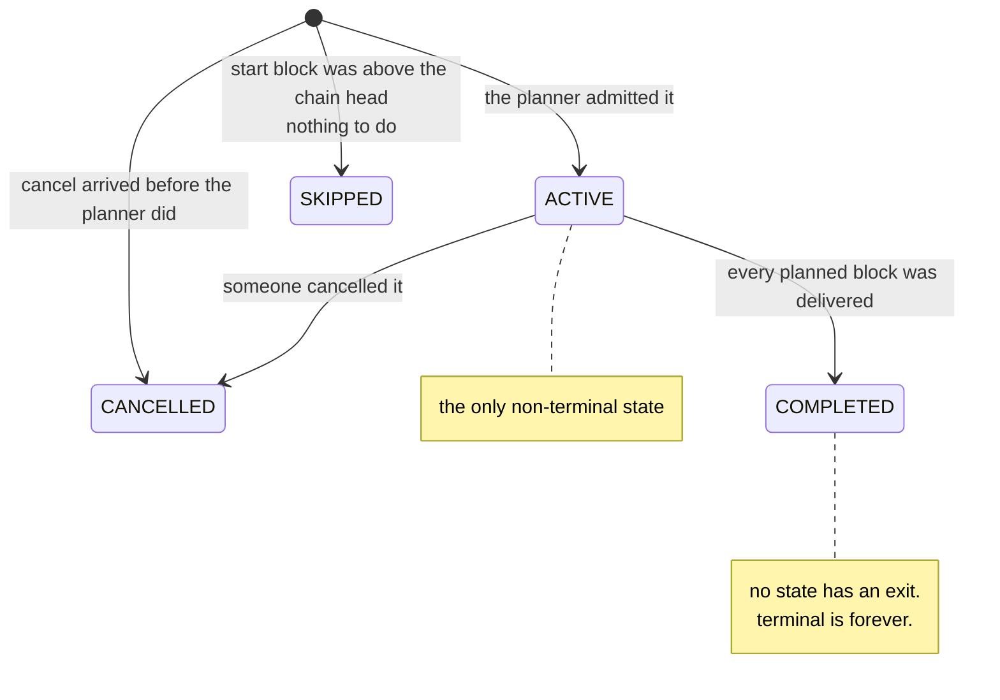
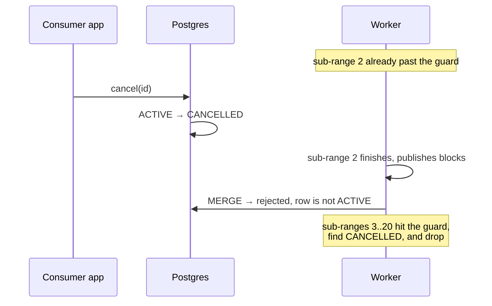
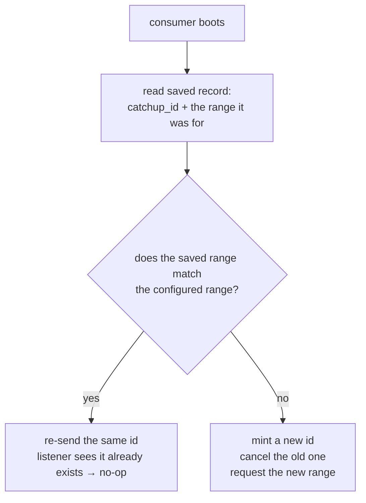

# Catchup lifecycle

How a catchup request is tracked, cancelled, and finished.

## The problem in one paragraph

A catchup is a request to replay a range of blocks. Before this design, a request had no name.
Once submitted it could not be stopped, queried, or connected to the blocks it produced. If an
operator mistyped a start block and asked for two years of history, the only way to stop it was
to stop the listener. Fixing the typo meant a redeploy, which submitted a *second* catchup next
to the first — with nothing to identify or retire the first one by.

The fix is to give every request an identity and a durable row. Everything else follows from that.

## The core idea

Three sentences:

1. **The consumer mints the id.** A UUIDv7, persisted on the consumer side *before* the request
   is published. The listener never invents one.
2. **One row per request.** The row holds the request's status and how much of it has been
   delivered. No sub-range table.
3. **Cancel does not interrupt anything.** It flips the row to `CANCELLED`. Each worker reads
   that row at its next decision point and stops on its own.

Point 3 is what makes this shippable without cross-pod signaling. There is no cancellation
channel, no token plumbing, no way to reach into a running fetch. There is only a row, and
workers that check it.

## The two tiers

A catchup passes through two handlers. The first one plans, the second one works.



The planner makes exactly **one** RPC call — asking for the chain head. All block fetching
happens in the worker tier.

The four shaded boxes are the only database interactions in the whole design. They are covered
in [The four things the database does](#the-four-things-the-database-does).

## The happy path

Consumer `gw` asks for blocks `1000..1249` on chain `137`. Sub-ranges are capped at 100 blocks,
so this becomes three of them.



Two things worth reading off this:

- Blocks reach the consumer **during** the loop, not at the end. A 250-block catchup arrives in
  three bursts.
- The row is written twice by the planner (admit, mark-fanned-out) and once per sub-range by the
  workers. Nothing else writes to it.

## The one table

```sql
CREATE TABLE catchup_requests (
    catchup_id    UUID PRIMARY KEY,   -- minted by the consumer
    flow          catchup_flow,       -- CATCHUP | FINAL_CATCHUP
    chain_id      BIGINT,
    consumer_id   TEXT,
    block_start   BIGINT,             -- nullable, see below
    block_end     BIGINT,             -- what was asked for
    status        catchup_status,     -- ACTIVE | CANCELLED | SKIPPED | COMPLETED
    fanned_out_at TIMESTAMPTZ,        -- NULL until every sub-range is published
    sub_ranges    INTEGER,            -- how many messages the split produced
    fanned_end    BIGINT,             -- what was actually planned, after clamping
    covered       INT8MULTIRANGE,     -- which blocks have actually been delivered
    terminal_at   TIMESTAMPTZ,
    created_at    TIMESTAMPTZ
);
```

Four columns carry the whole design. The rest is bookkeeping.

| Column | Why it exists |
|---|---|
| `status` | The single source of truth for "should this work still happen?" Every worker reads it. |
| `fanned_out_at` | Stops a re-sent request from fanning out twice. `NULL` means "plan it"; non-`NULL` means "already planned, do nothing". |
| `fanned_end` | The completion target. **Not** `block_end` — see [Why the target is not what you asked for](#why-the-target-is-not-what-you-asked-for). |
| `covered` | The set of blocks actually delivered, as a union of ranges. Compared against `fanned_end` to decide completion. |

Two details that look odd until you know the reason:

- **`block_start` and `block_end` are nullable.** A cancel can arrive before the planner has
  written the row. The cancel handler then creates the row itself and genuinely does not know
  the range. `0` would be a lie — it is a legal genesis replay — so the columns stay `NULL`.
- **Rows are never deleted.** The row *is* the idempotency record. Deleting a `CANCELLED` row
  un-cancels the catchup for every sub-range still queued against it, because a missing row and
  a never-written row are indistinguishable. A row costs about 200 bytes.

There is one index, covering the only query that is not a primary-key lookup:

```sql
CREATE INDEX idx_catchup_requests_active
    ON catchup_requests(chain_id, consumer_id, flow)
    WHERE status = 'ACTIVE';
```

## The four states



`ACTIVE` is the only state where work happens. The three terminal states differ only in what
they record about *why* the request stopped:

| State | Meaning |
|---|---|
| `ACTIVE` | The consumer wants this replayed, and it is not finished. |
| `COMPLETED` | Every block this request planned has been published. |
| `CANCELLED` | The consumer asked for it to stop. |
| `SKIPPED` | The start block was above the chain head, so there was nothing to plan. |

Terminal is permanent, and that is load-bearing in both directions. It is what makes re-sending
a finished `catchup_id` a no-op instead of a re-run, and what makes a cancelled id stay
cancelled the next time the consumer boots and replays its configuration.

## The four things the database does

Every database interaction in this design is one of these four.

### Admit — "does this request already exist?"

The planner inserts the row, then reads it straight back.

```sql
INSERT INTO catchup_requests (...) VALUES (...)
ON CONFLICT (catchup_id) DO NOTHING;

SELECT status, fanned_out_at FROM catchup_requests WHERE catchup_id = $1;
```

`DO NOTHING` means the stored row always wins. What comes back decides what happens next:

| Read-back | What the planner does |
|---|---|
| `ACTIVE`, not fanned out | Plan it: publish the sub-ranges. |
| `ACTIVE`, already fanned out | Nothing. This is a duplicate request. |
| Anything terminal | Nothing. It was cancelled or finished already. |

### Guard — "should I still do this work?"

Every worker, once per sub-range, before touching the RPC node:

```sql
SELECT status FROM catchup_requests WHERE catchup_id = $1;
```

| Result | What the worker does |
|---|---|
| `ACTIVE` | Run the sub-range. |
| Anything else | Ack and drop it. No RPC call, no blocks published. |
| No row found | Run it anyway, and log a warning. |

That last row looks backwards, so it is worth stating plainly: **the two mistakes are not
equally bad.** Running a sub-range whose request vanished wastes some RPC calls and publishes
blocks the consumer already de-duplicates. Dropping one because a row is missing silently loses
real work. When in doubt, do the work.

### Merge — "how much has been delivered?"

After a worker publishes a sub-range, it records what it delivered:

```sql
UPDATE catchup_requests
   SET covered = covered + int8multirange(int8range($2, $3)),
       status  = CASE WHEN <covered now spans the whole target>
                      THEN 'COMPLETED' ELSE status END
 WHERE catchup_id = $1 AND status = 'ACTIVE';
```

This one deserves its own section: [How completion is detected](#how-completion-is-detected).

### Cancel — "stop this request"

```sql
INSERT INTO catchup_requests (..., status, terminal_at)
VALUES (..., 'CANCELLED', NOW())
ON CONFLICT (catchup_id) DO UPDATE
    SET status = 'CANCELLED', terminal_at = NOW()
    WHERE catchup_requests.status = 'ACTIVE'
      AND catchup_requests.consumer_id = $4;
```

Create-or-flip, because the cancel may arrive before the request does. The two predicates do
different jobs:

- `status = 'ACTIVE'` stops a cancel from resurrecting a `COMPLETED` row or re-stamping one that
  was already cancelled.
- `consumer_id = $4` stops one consumer from cancelling another's request. This is the only
  statement that checks ownership, because it is the only place where an id arrives from outside
  the system. A cancel naming someone else's request is rejected, logged, and counted — but
  still acked, because retrying it would never succeed.

The predicates cannot apply to the insert branch: when the cancel wins the race there is no
stored row to compare against.

## How completion is detected

This is the least obvious part of the design, so here it is slowly.

### Why not just count sub-ranges?

The obvious approach: store `sub_ranges = 5`, increment a counter as each finishes, call it done
at 5. This is broken, and the way it breaks is silent.

The broker guarantees *at-least-once* delivery. A worker can publish its blocks, have its
acknowledgement lost to a connection error, and see the same sub-range redelivered. Now:

```text
 sub-range 0  ─── delivered ──→ counter = 1
 sub-range 1  ─── delivered ──→ counter = 2
 sub-range 0  ─── REDELIVERED → counter = 3   ← counted twice
 sub-range 2  ─── delivered ──→ counter = 4
 sub-range 3  ─── delivered ──→ counter = 5   ← "done!"

 sub-range 4  ─── never fetched. Nobody notices.
```

The request is marked complete with a fifth of its blocks missing, and nothing anywhere
reports a problem. Counting cannot distinguish "five sub-ranges finished" from "four sub-ranges
finished, one of them twice".

### What we store instead

A **set of block ranges**, not a number. Postgres has a native type for this: `int8multirange`.

```text
 request: blocks 1..500, split into five 100-block sub-ranges

 sub-range 0 arrives   [1────100]
 covered = {[1,101)}

 sub-range 2 arrives   [1────100]              [201──300]
 covered = {[1,101), [201,301)}                 ← out of order, fine

 sub-range 1 arrives   [1────100][101──200][201──300]
 covered = {[1,301)}                            ← Postgres coalesced them

 sub-range 0 AGAIN     [1────100][101──200][201──300]
 covered = {[1,301)}                            ← unchanged. This is the point.

 sub-range 3, 4        [1───────────────────────────────500]
 covered = {[1,501)}                            ← covers the target → COMPLETED
```

The redelivery at step 4 changes nothing, because adding a range that is already in the set is a
no-op. Set union is idempotent; addition is not. That single property is the whole reason for
the type.

It also handles out-of-order arrival for free, which matters because sub-ranges genuinely can
arrive out of order: a retried sub-range lands after the ones that followed it, and a message
reclaimed from a pod that died lands later still. (A second pod working the same queue would be
a third source, though the chart currently runs one listener per chain.)

### The completion test

Completion is a containment question, asked directly:

```text
 target   [1───────────────────────────────────500]
 covered  {[1,501)}

 does covered contain the target?   →  yes  →  COMPLETED
```

Not "have enough things finished", but "is every block accounted for". The `WHERE status =
'ACTIVE'` on the update means this can only fire once: a replay after completion updates zero
rows.

### Why the target is not what you asked for

The completion target is `fanned_end`, the last block actually planned — **not** `block_end`,
the block that was requested. The difference appears whenever a request reaches past the chain
head.

```text
 requested:  blocks 1 .. 1,000,000
 chain head: 500

 the planner clamps, and plans only:   [1──────500]
 blocks 501..1,000,000 do not exist yet and are never fanned out

 if the target were block_end (1,000,000):
     covered = {[1,501)}
     target  = [1, 1000001)
     gap     = {[501, 1000001)}      ← can never be filled
     status  = ACTIVE forever

 with the target as fanned_end (500):
     covered = {[1,501)}
     target  = [1, 501)
     gap     = {}                    ← COMPLETED, correctly
```

Because `fanned_end` is derived from the last sub-range the split produced, it is impossible for
the calling code to pass the requested end by mistake — the wrong value is not in scope.

### Finding what is missing

Because `covered` is a set, the gap is a subtraction. This is the query to run when a request is
stuck `ACTIVE` longer than it should be:

```sql
SELECT int8multirange(int8range(block_start, fanned_end + 1)) - covered AS missing
  FROM catchup_requests
 WHERE catchup_id = $1;
```

It returns the exact blocks that have not been delivered. An empty result means the request
should have completed.

## What cancel does and does not do

**Does:** stop every sub-range that has not started yet. For a mistyped two-year request that is
essentially all of them.

**Does not:** interrupt work already in flight. A sub-range that passed the guard before the
cancel landed will finish, publish its blocks, and only then discover the request is no longer
active. The consumer receives a bounded tail — at most a few hundred blocks — after cancelling.

This is a deliberate trade. Interrupting in-flight fetches means threading cancellation tokens
through the fetch path and racing them against publication. Accepting a bounded tail costs one
`SELECT` and no new machinery, and consumers already de-duplicate blocks.



## Recovering from a bad range

The requirement is that fixing a mistyped range and redeploying is *enough*. No UUID to write
down, no database to inspect, no second step to remember.

That works because the consumer persists its current `catchup_id` alongside the range it was
issued for. On every boot it compares the two:



The mismatch branch is the recovery. The operator edits the config, redeploys, and the consumer
itself issues the cancel. The listener is never asked to guess that a running catchup is no
longer wanted — it only ever executes the cancels and requests it is given.

## Failure modes

| What happens | What the system does |
|---|---|
| Consumer re-sends an id that already finished | Nothing. Admit reads `COMPLETED`, acks, publishes no sub-ranges. |
| Planner crashes part-way through publishing | `fanned_out_at` is still `NULL`, so redelivery re-plans the whole request. Sub-ranges are re-published; the merge absorbs the overlap; consumers de-duplicate. Wasted work, never lost work. |
| Worker publishes blocks but the ack is lost | The sub-range is redelivered and re-run. The merge adds a range already in `covered`, which changes nothing. |
| Cancel arrives before the request | The cancel handler creates the row as `CANCELLED` with a `NULL` range. When the request arrives, Admit reads `CANCELLED` and publishes nothing. |
| Cancel names someone else's request | Rejected, logged, counted. Still acked — retrying would not help. |
| Start block is above the chain head | The request is written `SKIPPED` immediately. No sub-ranges, no work. |
| The database is unreachable at the guard | Treated as transient: the message stays queued and is retried. |

## Metrics

All catchup metrics carry `chain_id` and a `flow` label (`catchup` or `final_catchup`), so one
query covers both flows and `sum by (flow)` splits them.

| Metric | Type | Fires when |
|---|---|---|
| `listener_catchup_iterations_total` | counter | A request reaches the planner. |
| `listener_catchup_subranges_total` | counter | Sub-ranges are published, after the full fan-out. |
| `listener_catchup_skipped_above_head_total` | counter | A request starts above the chain head. |
| `listener_catchup_subrange_discarded_total` | counter | The guard drops a sub-range. |
| `listener_catchup_completed_total` | counter | Coverage closes a request. |
| `listener_catchup_cancelled_total` | counter | A cancel takes effect. |
| `listener_catchup_cancel_rejected_total` | counter | A cancel names another consumer's request. |
| `listener_catchup_range_duration_seconds` | histogram | A sub-range finishes. |
| `listener_catchup_active_requests` | gauge | Polled from the database every 15s. |

A healthy backfill shows `subranges_total` climbing, `range_duration_seconds` counting up to
match, and `active_requests` returning to zero when it finishes. A request stuck `ACTIVE` with
`active_requests` pinned above zero and no duration activity is the signal to run the gap query
from [Finding what is missing](#finding-what-is-missing).
