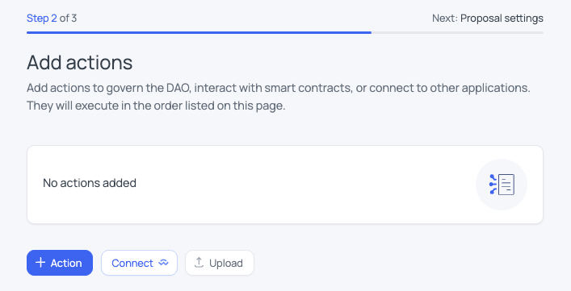

# How to add ZamaOFT on BNB Chain

Currently, we have `ZamaERC20` and `ZamaOFTAdapter` deployed on Ethereum mainnet, and `ZamaOFT` deployed on Gateway mainnet. The `ZamaOFTAdapter` contract's owner and delegate are already setup to be an Aragon DAO contract.

The goal of this runbook is to guide you step by step on how to deploy a `ZamaOFT` instance on BNB Chain, and how to wire it to the already deployed `ZamaOFTAdapter` on Ethereum, via the Aragon DAO. We only add a single bidirectional pathway: `BNB <-> Ethereum` (i.e there is no step to wire `BNB <-> Gateway`).

## Step 1 : Recreating deployments

The first step is to recreate deployments artifacts for the already deployed contract. This is inspired from the official [LayerZero V2 docs](https://docs.layerzero.network/v2/tools/create-lz-oapp-cli/recreating-deployments).

First, run `pnpm install` and setup your `.env` file with all required values (see [`.env.example`](./.env.example)).

Create a `/deployments` folder in the root of the [/token] directory. The eventual structure would look like this:

```
/deployments
    /ethereum-mainnet
      .chainId
      ZamaERC20.json
      ZamaOFTAdapter.json
    /gateway-mainnet
      .chainId
      ZamaOFT.json
```

`/deployments/ethereum-mainnet/.chainId` - this file should contain the chain ID for the network, i.e `1` for Ethereum mainnet.

`/deployments/ethereum-mainnet/ZamaERC20.json` - for now, the only key that is necessary in the JSON file is `address`, note that the `abi` key is also necessary but this will be added via a script at the end of current step. Insert your ERC20 address into the address field.

```
{
  "address": "<ZamaERC20Address>"
}
```

Follow the same similar steps for the remaining files, i.e `/deployments/ethereum-mainnet/ZamaOFTAdapter.json`, `/deployments/gateway-mainnet/.chainId` and `/deployments/gateway-mainnet/ZamaOFT.json`.

Then modifiy `hardhat.config.ts` by replacing `0x0` by the `ZamaERC20` address under the `ethereum-mainnet` field:

```typescript
oftAdapter: {
    tokenAddress: '0x0', // Replace `0x0` with the address of the ERC20 token you want to adapt to the OFT functionality.
}
```

Then, run `npx hardhat compile` to ensure relevant artifacts that are required by Hardhat helper tasks involving the EVM OFT are generated. 

Finally, in order to copy all the `abi` values in the `deployments` artifacts from the compilation artifacts located in `artifacts` folder, just run: 

```
npx ts-node scripts/copyAbiToDeployments.ts
```

## Step 2 : Deploy ZamaOFT on BNB Chain

Run `npx hardhat deploy --network bnb-mainnet --tags ZamaOFT` command.

You can then verify the contract on bscscan by running `pnpm verify:etherscan:bnb:mainnet`.

## Step 3 : Wire the BNB OFT to Ethereum OFTAdapter

This can be done easily, since your deployer hot wallet is still the owner and delegate of the `ZamaOFT` instance on BNB Chain - later, after full wiring on both chains, ownership and delegate roles should be transferred to governance on BNB Chain, which should be a Safe multisig deployed on BNB mainnet.

You just have to run: 

```npx hardhat lz:oapp:wire --oapp-config layerzero.config.mainnet.bnb.ts --skip-connections-from-eids <EID_ETHEREUM_V2_MAINNET>,<EID_ZAMA_V2_MAINNET>```

In previous command, replace `<EID_ETHEREUM_V2_MAINNET>` by `30101` and `EID_ZAMA_V2_MAINNET` by `30397`.

## Step 4 : Wire the Ethereum OFTAdapter to BNB OFT

This step is more complex, since the delegate of the OFTAdapter is an Aragon DAO, i.e it requires creating, approving and executing a DAO proposal via the Aragon DAO.

First, create an `ethereum-wiring.json` file containing the different transactions needed to be done, by running:

```
npx hardhat lz:oapp:wire --oapp-config layerzero.config.mainnet.bnb.ts --output-filename ethereum-wiring.json
```

When running previous command, select **no** when requested if you would you like to submit the required transactions (otherwise it would fail anyways). You should now have generated a new `ethereum-wiring.json` file in the root of the directory.

Now, run:

```
npx ts-node scripts/convertToAragonProposal.ts ethereum-wiring.json aragonProposal.json
```

This will convert the `ethereum-wiring.json` file to a new `aragonProposal.json` which could be directly uploaded inside the Aragon App UI, when creating an Aragon proposal, to streamling the process.

More precisely, in Aragon App, when you reach "Step 2 of 3" of proposal creation, click on the `Upload` button there, in select the newly created `aragonProposal.json` file to upload it and create the wiring proposal on Ethereum.



After voting and execution of the wiring proposal, your OFT is now successfully setup.

## Step 5 : Test OFT transfers

You can test that the OFT BNB has been correctly wired by sending some amount of tokens from Ethereum to BNB Chain, and the other way around, by using commands such as: 

```
npx hardhat lz:oft:send --src-eid 30101 --dst-eid 30102 --amount 0.1 --to <RECEIVER_ADDRESS> --oapp-config layerzero.config.mainnet.bnb.ts
```

to send 0.1 Zama token from Ethereum to BNB mainnet, and: 

```
npx hardhat lz:oft:send --src-eid 30102 --dst-eid 30101 --amount 0.1 --to <RECEIVER_ADDRESS> --oapp-config layerzero.config.mainnet.bnb.ts
```

to send 0.1 Zama token from BNB mainnet to Ethereum.

## Step 6 : transfer delegate and owner

Once the transfer tests are successful, don't forget to transfer the delegate and owners roles of the BNB OFT instance to governance (i.e BNB Safe Multisig).

Those `cast` commands are helpful for transferring roles:

To get current OFT owner address:

```
cast call <BNB_OFT_ADDRESS> "owner()(address)" --rpc-url <BNB_RPC_URL>
```

To get current `EndpointV2` address:

```
cast call <BNB_OFT_ADDRESS> "endpoint()(address)" --rpc-url <BNB_RPC_URL>
```

To get current delegate:

```
cast call <LZ_ENDPOINT_V2_ADDRESS> "delegates(address)(address)" <BNB_OFT_ADDRESS> --rpc-url <BNB_RPC_URL>
```

To transfer delegate role:

```
cast send <BNB_OFT_ADDRESS> "setDelegate(address)" <BNB_SAFE_ADDRESS> --rpc-url <BNB_RPC_URL> --private-key <DEPLOYER_PRIVATE_KEY>
```

To transfer owner role:

```
cast send <BNB_OFT_ADDRESS> "transferOwnership(address)" <BNB_SAFE_ADDRESS> --rpc-url <BNB_RPC_URL> --private-key <DEPLOYER_PRIVATE_KEY>
```
