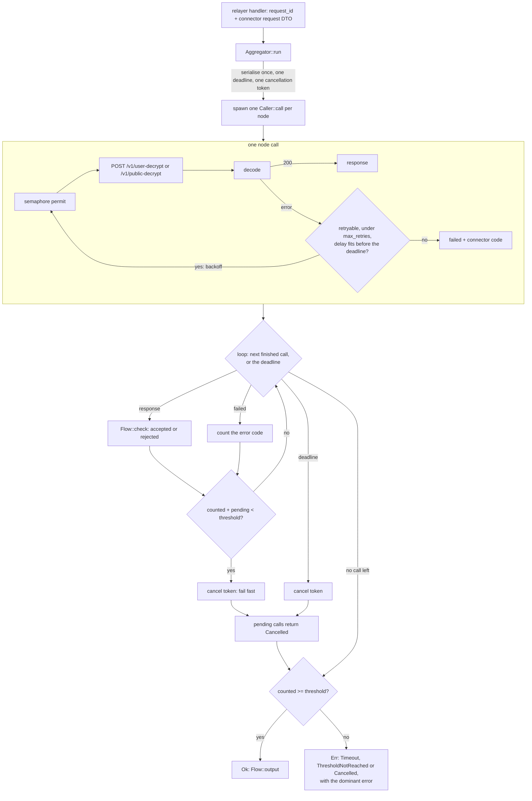
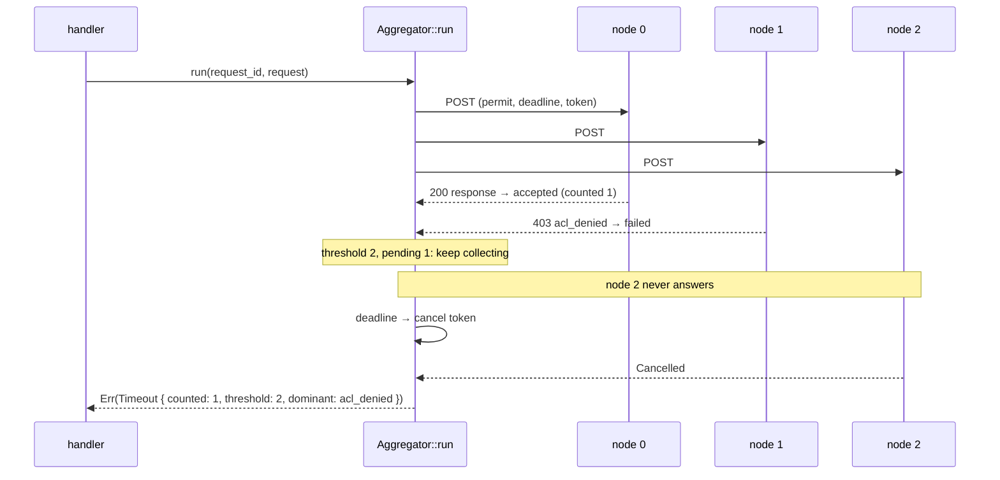
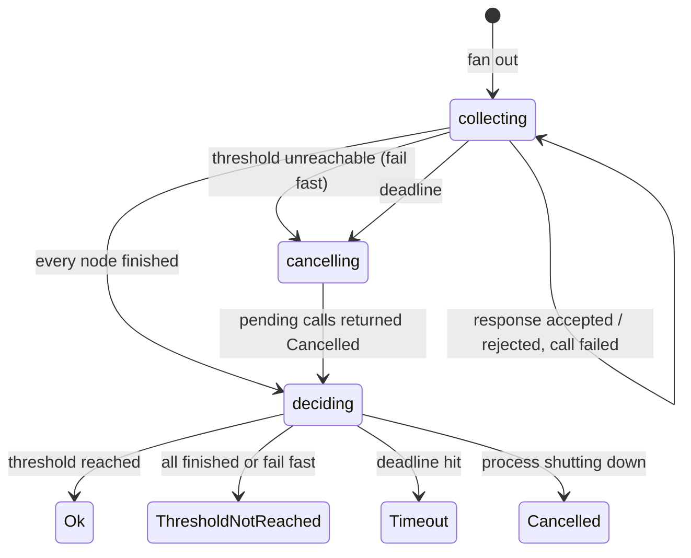

# kms_aggregator

Minimal first version. Posts one decryption request to every KMS connector endpoint and turns their answers into one
result. Reading order: this file, `aggregator.rs`, `call.rs`, `client.rs`, `flows/`, `config.rs`.

## 1. What it is

- Fans out `POST /v1/user-decrypt` or `POST /v1/public-decrypt` (request and response DTOs from the `kms-connector-api`
  crate) to the `n` configured nodes.
- Collects the answers until every node has finished or the deadline (`call.timeout`) passes.
- Answers `Ok(output)` when `counted >= threshold`, otherwise a typed error that carries the counts and the dominant
  connector error.
- Is called by the handlers in `endpoint/` (see `endpoint/docs.md`) with the relayer's own `request_id` and the
  connector request DTO. The handlers, and everything before them, are out of the scope of this file.

## 2. Overall scheme



One aggregation over time (three nodes, one hangs):



The decision, as a state machine:



## 3. Vocabulary

| term | meaning |
|---|---|
| node | one KMS connector endpoint (`endpoints[i]`, named in logs) |
| accepted | a `200` response that passed `Flow::check` |
| counted | accepted responses that count toward the threshold: all of them for user decrypt, the largest agreeing group for public decrypt |
| threshold | counted responses needed to answer (configured per flow, `1 <= threshold <= n`) |
| deadline | `call.timeout` after the start: the aggregation, and every call in it, ends by then |
| fail fast | `counted + pending < threshold`: even if every pending node answered we could not make it, so stop now |
| dominant error | the most frequent connector error code among the failed calls; carried by the error for the caller to act on |
| `request_id` | the relayer's own correlation id, passed to `run`, on every log line; never sent to the nodes |
| `decryptionId` | the connector's content hash of the request body, recomputed by every node; logged, never checked |

## 4. How an aggregation runs (`Aggregator::run`)

1. Serialise the request once. Spawn one task per node (`Caller::call`) sharing the body bytes, the deadline and a
   cancellation token (a child of the process shutdown token).
2. Loop on the next finished call or the deadline timer (the deadline is checked first).
3. A `200` goes through `Flow::check` and is accepted or rejected. A failed call is counted with its connector code. A
   cancelled call is counted.
4. After every result, fail fast if `counted + pending < threshold`: cancel the token; the pending calls return at once.
5. At the deadline: cancel the token, drain the pending calls (immediate), then decide.
6. Decide once, after the loop:

| state at the end | result |
|---|---|
| `counted >= threshold` | `Ok(Flow::output(accepted))` |
| process shutdown token cancelled | `Err(Cancelled)` |
| deadline hit | `Err(Timeout { counted, threshold, dominant })` |
| otherwise (every node finished, or fail fast) | `Err(ThresholdNotReached { counted, threshold, dominant })` |

Two consequences to keep in mind: a single hung node makes that request last the full `call.timeout` (accepted: the
answer then carries every share that arrived), and responses that would have arrived after the answer are cancelled,
not stored.

## 5. One node call (`Caller::call`)

`permit → POST → decode → retry?`, under the cancellation token.

- The semaphore (`max_concurrent_calls`) bounds HTTP calls in flight across all aggregations of the process. A permit
  is held for one attempt only, never while sleeping between attempts.
- Retries happen only for retryable errors, at most `max_retries` times, with delay `min(delay * 2^(k-1), backoff_max)`
  before retry `k`. The deadline is the real bound: a retry whose delay does not fit in the remaining time is skipped
  (the call gives up), so `max_retries` has no ceiling and no call outlives `call.timeout`.
- An authentication rejection is never retried: our key is wrong for that node.
- The reqwest client has `timeout(call.timeout)` and a 3 s connect timeout as safety nets for a socket that stops
  answering. The aggregator's deadline is the decision.

| connector answer | `AttemptError` | retried? |
|---|---|---|
| 2xx with a valid DTO | — | — |
| 2xx with an unreadable body | `Body` | no |
| any body above 4 MiB (declared `content-length`, or bytes received when the stream is cut) | `TooLarge(bytes)` | no |
| non-2xx with the connector error body | `Api { status, error }` | by `error.code`: `malformed`, `unsupported_attestation_type` (400), `sender_authentication_failed` (401), `kms_context_destroyed` (410), `unprocessable` (422) are final; `acl_denied`, `user_signature_rejected` (403), `ciphertext_not_found` (404), `kms_context_invalid` (412), `rate_limited` (429), `copro_consensus_failed`, `upstream_transient` (502), `overloaded` (503), `timeout` (504) retry with backoff; `unknown` follows the body's `retryable` flag |
| non-2xx without a JSON body (empty 404, HTML 502, a 3xx: never followed) | `Status` | 408 and 5xx only |
| connection refused or reset, TLS failure, client-side timeout | `Transport` | yes |

For the dominant error, a bare 401 counts as `sender_authentication_failed`, a transport failure or a bare 5xx as
`upstream_transient`, a bad 2xx body as `unknown`.

## 6. Response checks (`flows/`)

Always on:

| check | flow | why | on failure |
|---|---|---|---|
| the signature is 65 bytes | both | the SDK requires it on every share; one malformed node must not break the whole answer | `RejectReason::BadSignature`, the response is not counted |
| the signature bytes are not those of an already accepted response | both | one response per signer | `RejectReason::Duplicate` |
| only identical `(decryptedResult, extraData)` answers count together | public | one plaintext is expected; a divergent node lands in its own group | the answer is the largest group's result with that group's signatures only |

Optional, off by default (`user_decrypt.checks` in the configuration; a flow's checks are its `Flow::Checks` type,
built once at startup):

| check | config key | effect |
|---|---|---|
| the response's `decryptionId` is the request's content hash (the relayer computes it from the payload with the connector's crate) | `decryption_id_match` | a response with another id is rejected (`RejectReason::IdMismatch`) |
| only the shares carrying the majority `decryptionId` count | `decryption_id_majority` | `counted` is the size of the largest id group and only that group is returned |

Without them the `decryptionId` is correlation only: logged on the span, never compared. User-decrypt shares differ by
design: every accepted share counts and is returned, in acceptance order. Public decrypt has no optional check in this
version.

**Trust boundary.** Version 1 verifies no signature: the KMS core signs each response and the SDK verifies the
signatures against the KMS signer set client-side. A byzantine node can therefore place a garbage 65-byte signature
next to the honest public result, or a bogus user share among the counted ones; the SDK detects both. See section 12
for the optional verification that could be added later.

## 7. Outputs

Bytes are hex without `0x`; `extraData` keeps its `0x` prefix.

```jsonc
// user decrypt: every accepted share, acceptance order
{ "result": [ { "payload": "a1b2…", "signature": "1a2b…", "extraData": "0x00" }, … ] }
// public decrypt: the largest agreeing group
{ "decryptedValue": "0000…2a", "signatures": ["1a2b…", …], "extraData": "0x00" }
```

## 8. Configuration → behaviour

```yaml
kms_aggregator:
  allow_insecure_http: false   # local only: plain http and `auth: none` to non-loopback hosts (an api_key over http is sent in clear)
  max_concurrent_calls: 64     # semaphore size, >= number of endpoints; one aggregation takes up to n permits
  call:
    timeout: 5000ms            # the deadline (<= 60s)
    retries: { max_retries: 0, delay: 500ms, backoff_max: 4s }   # 0 < delay <= backoff_max <= timeout
  public_decrypt: { threshold: 5 }
  user_decrypt:
    threshold: 9
    checks: { decryption_id_match: false, decryption_id_majority: false }   # optional, section 6
  endpoints:
    - { name: kms_00, url: "https://kms-00.example.net:8443", auth: { type: api_key, value_env: KMS_00_API_KEY } }
```

- Validation (`KmsAggregatorConfig::validate`, also run by `Caller::new`): endpoints non-empty with unique names and
  URLs; `http(s)` with a host, no credentials, query or fragment; plain `http` or `auth: none` only towards loopback
  unless `allow_insecure_http`; `max_concurrent_calls >= n`; `timeout` within `1ms..=60s`;
  `0 < delay <= backoff_max <= timeout` when retries are on (`max_retries` itself has no ceiling); each `threshold`
  within `1..=n`. Every message names the field with its dotted path.
- The API key is read from the named env var at startup and sent as `authorization: Bearer <key>`; it is never in the
  config, the logs or any error message.
- `APP_KMS_AGGREGATOR__CALL__TIMEOUT=7s` overrides a field; durations need a unit.
- TLS uses the platform trust store: the container image needs CA certificates.

## 9. Cancellation and shutdown

- **Deadline or fail fast**: the aggregation cancels its token; every pending call returns `Cancelled` immediately with
  its attempt count and elapsed time, so the final log line accounts for every node.
- **Caller gone** (the future returned by `run` is dropped): the node tasks are aborted and their connections closed.
  Nothing outlives the request.
- **Process shutdown**: `main` cancels the process token on SIGINT or SIGTERM; every running aggregation ends with
  `Cancelled`.

## 10. Logging

Span `aggregation{flow, request_id, decryption_id, handles}` around `run`; the node tasks run inside it, so their
attempt lines carry the same identifiers. Events:

| event | level | fields |
|---|---|---|
| `aggregation started` | info | nodes, threshold, timeout_ms |
| `response accepted` | info | node, attempts, elapsed_ms, counted |
| `response rejected` | warn | node, elapsed_ms, reason |
| `attempt failed` | warn | node, attempt, elapsed_ms (this attempt), error, code, retry_in_ms (`null` when the call gives up): one line per failed attempt, retryable or final |
| `call failed` | warn | node, attempts, elapsed_ms, error: the node's outcome after its last attempt |
| `call cancelled at the deadline` | warn | node, attempts, elapsed_ms: the node was still running when the deadline passed (too slow, or hung) |
| `call cancelled` (fail fast or shutdown), `deadline reached`, `threshold unreachable` | debug | node, attempts / pending |
| `node task failed` | error | a panic inside a node task (counted as failed, no node name available) |
| `aggregation succeeded` / `aggregation failed` | info / warn | counted, accepted, rejected + rejected_nodes, failed + failed_nodes, cancelled + cancelled_nodes, deadline_hit, dominant, elapsed_ms |

Every line about one node carries its configured name (`node`), and the final line lists the names behind every
rejection, failure and cancellation, so a node that keeps failing, timing out or being rejected is identifiable from
the logs of one request. Together with the span fields this identifies a request end to end: `request_id` (the
relayer's), `decryption_id` (the connector's), `handles`, `node`.

Never logged: request or response bodies, shares, signatures, header values, URLs, API keys.

## 11. Testing

- Unit tests next to every function (`cargo test -p relayer-http`).
- Wire tests of the HTTP client against a `wiremock` server (headers, body, statuses, redirects, body cap).
- Scenarios in `scenarios/*.yaml`, run by `cargo test -p relayer-http yaml_scenarios` under paused tokio time (a 5 s
  scenario runs in microseconds and `elapsed` is exact). Adding a scenario is adding a file:

```yaml
flow: user_decrypt            # user_decrypt | public_decrypt
threshold: 9
timeout: 5s
max_retries: 0                # optional
delay: 10ms                   # optional, per attempt
nodes:                        # groups in node order
  - { count: 9, replies: [ok] }                    # ok | divergent | bad_signature | duplicate | hang | refused | <connector error code>
  - { count: 2, replies: [rate_limited, ok] }      # one reply per attempt, the last one repeats
expect:                       # every field except outcome is optional
  outcome: ok                 # ok | timeout | threshold_not_reached
  counted: 11
  responses: 11               # shares or signatures in the answer
  elapsed: 520ms
  dominant: acl_denied
  attempts: 13
```

Before every commit, from `relayer-http/`:

```sh
cargo fmt -- --check
cargo clippy --workspace --all-targets -- -W clippy::perf -W clippy::suspicious -W clippy::style -D warnings
cargo test --workspace
```

## 12. Version 1 scope, and later

Version 1 is the fan-out and the aggregation only.

- **No ACL check and no ciphertext-commit (readiness) check** in the relayer: the connector's worker performs them and
  answers `acl_denied` / `ciphertext_not_found`, which surface as the dominant error. They can come back as optional
  modules in front of the aggregator.
- **No storage of responses and no cache**: responses arriving after the answer are cancelled, so a response cache in
  front of the aggregator would first need every accepted response to be registered as it arrives.
- A new authentication scheme: `Endpoint.auth` becomes an enum, built by `Endpoint::from_config`.
- Transciphering: one more `Flow` implementation (request/response DTOs, route, check, counted, output).
- The module only depends on its `config.rs` structs and the api crate: it can move to its own crate when needed.
- **Everything the relayer may ever read on chain is read on a host chain (Ethereum), through host contracts. The
  relayer has no interaction with the gateway chain and no gateway-specific configuration, optional checks included.**

### Appendix: optional KMS signature verification (not implemented)

The KMS signature carried by each response (public-decrypt results and user-decrypt shares alike) could be verified by
the relayer as an optional, per-flow check plugged into `Flow::Checks`, using host-chain reads only. It is not
implemented in this version: it costs CPU and latency on every request, and the fhevm SDK performs this verification
client-side anyway. A detailed design exists outside this repository for a later implementation, if bandwidth allows.
