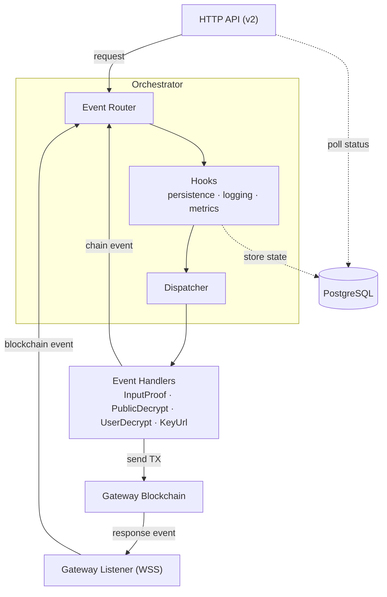

# Relayer Service

The Relayer is the bridge between fhevm host chains (e.g. Ethereum) and the Gateway.

It exposes the following capabilities:

- **Public Decryption**: Relay HTTP public decryption requests and return plaintext responses.
- **Input Proof Verification**: Relay HTTP input-proof verification requests and return validity attestations.
- **User Decryption**: Relay HTTP user decryption requests to re-encrypt data under a user-provided public key (with ciphertext-handle access control).
- **Key Material**: Expose key material URLs (FHE public key and CRS URLs).

## Table of Contents

- [Architecture](#architecture)
- [Project Structure](#project-structure)
- [Prerequisites](#prerequisites)
- [Self-Hosting](#self-hosting)
  - [Mainnet Quickstart](#mainnet-quickstart)
  - [Testnet Quickstart](#testnet-quickstart)
- [Development](#development)
- [API Endpoints](#api-endpoints)
- [Observability](#observability)
- [Request Timeout](#request-timeout)
- [Data Retention Policy](#data-retention-policy)
- [Troubleshooting](#troubleshooting)

## Architecture

The system follows an event-driven architecture with these key components:

- **Orchestrator**: Central coordinator for event flow and handling
- **Gateway listeners/handlers**: Listen and process gateway events
- **HTTP Handlers**: Process V2 API requests
- **SQL Repositories**: Persist request state and support status polling
- **Transaction Engine + Throttlers**: Reliable TX management and backpressure
- **Metrics + Tracing**: Runtime observability for APIs, queues and blockchain flows



## Project Structure

```text
src
├── bin/                     # Binary entry points
│   └── fhevm-relayer.rs     # Main relayer service binary
├── config/                  # Configuration loading and validation
├── core/                    # Core domain events, IDs, and shared types
├── gateway/                 # Gateway listeners, handlers, and tx engine
│   ├── arbitrum/            # Arbitrum listener and transaction processing
│   └── readiness_check/     # Readiness-check processing pipeline
├── http/                    # HTTP server, API handlers, and middleware
│   ├── admin/               # Runtime admin endpoints
│   ├── endpoints/           # API implementations (common, v2)
│   ├── middleware/          # OpenAPI/docs and request middleware
│   ├── retry_after/         # Dynamic Retry-After estimation
│   └── utils/               # Parsing and validation helpers
├── logging/                 # Structured logging helpers
├── metrics/                 # Prometheus metrics and dashboard docs
├── orchestrator/            # Event orchestration system
├── store/sql/               # SQL models and repositories
├── lib.rs                   # Library entry point
├── startup.rs               # Service startup wiring
├── startup_recovery.rs      # Startup recovery orchestration
└── tracing.rs               # Tracing initialization

relayer-migrate/             # Separate crate: DB migrations with connection retry and rollback support
config/local.yaml.example    # Local config template
dev/docker-compose.yaml      # Local Postgres compose
tests/                       # Integration and API tests
test-support/                # Test helpers (e.g. Ethereum RPC mock)
docs/                        # Supplemental project documentation
design-docs/                 # Design and architecture notes
openapi-async-design.yaml    # OpenAPI specification
Makefile                     # Test, lint, and migration helpers
```

## Prerequisites

- Rust toolchain + Cargo
- Docker + Docker Compose v2
- [Foundry (`cast`)](https://www.getfoundry.sh/) -- only needed for network onboarding (`make preflight-*`, `make mint-zama-*`, `make approve-payment-*`)
- Node.js + npm (for `make api-lint` only)

Run `make help` to see all available targets.

### Configuration

Configuration is handled via:

- YAML file (`config/local.yaml` by default if present)
- Optional CLI config file (`--config-file`)
- Environment variables with `APP_` prefix and `__` for nesting (override file values)
  - Example: `APP_GATEWAY__BLOCKCHAIN_RPC__HTTP_URL=https://rpc.example.org`

## Self-Hosting

For full deployment instructions, security considerations, and production configuration, see the [Self-Hosting Guide](docs/SELF_HOSTING.md).

The quickstart sections below cover the minimum steps to get a relayer running against Mainnet or Testnet.

### Mainnet Quickstart

```bash
make db-start            # Start local Postgres (Docker Compose, port 5433)
make db-migrate          # Apply database migrations
make preflight-mainnet   # Interactive: config, private key, balance checks, approval
make run-mainnet         # Start the relayer
make health              # Verify health endpoints
```

### Testnet Quickstart

```bash
make db-start            # Start local Postgres (Docker Compose, port 5433)
make db-migrate          # Apply database migrations
make preflight-testnet   # Interactive: config, private key, balance checks, approval
make run-testnet         # Start the relayer
make health              # Verify health endpoints
```

## Development

For build, test, lint, local stack, and CI instructions, see [docs/DEVELOPMENT.md](docs/DEVELOPMENT.md).
For contribution guidelines, see [../CONTRIBUTING.md](../CONTRIBUTING.md).

`make setup` is the dev-oriented shortcut (db-start + db-migrate + copies local mock config).

## API Endpoints

### Health Endpoints

| Endpoint        | Description              |
| --------------- | ------------------------ |
| `GET /liveness` | Liveness probe           |
| `GET /healthz`  | Readiness / health check |
| `GET /version`  | Build version info       |
| `GET /docs`     | OpenAPI documentation    |

### Ciphertext Operation and Key URL Endpoints

Ciphertext endpoints follow async job semantics: `POST` submits a request and returns a `job_id`, then `GET .../{job_id}` polls for the result.

| Operation                 | Endpoint                          |
| ------------------------- | --------------------------------- |
| Input proof verification  | `POST /v2/input-proof`            |
| Public decryption         | `POST /v2/public-decrypt`         |
| User decryption           | `POST /v2/user-decrypt`           |
| Delegated user decryption | `POST /v2/delegated-user-decrypt` |
| Key material URLs         | `GET /v2/keyurl`                  |

For complete schemas, see `GET /docs` or `openapi-async-design.yaml`.

### Admin Endpoints

```text
GET  /admin/config
POST /admin/config
```

Controlled by `enable_admin_endpoint` (returns `403 Forbidden` when disabled). Supports runtime tuning of throttler TPS and retry-after fields.

## Observability

- Logging and tracing policy: `LOGGING_POLICY.md`
- Metrics and dashboard guidance: `src/metrics/docs_and_dashboards/http_metrics.md`
- Application metrics: `GET /metrics` on port `9898`

## Request Timeout

A background worker marks requests stuck in `receipt_received` status as `timed_out` when the gateway chain has not responded within the configured timeout window.
This worker is **always enabled** and runs as a background cron job implemented in `src/store/sql/repositories/timeout_repo.rs`.

The timeout durations are configurable per request type in the `cron` section of your configuration:

| Config key                            | Default | Description                                    |
| ------------------------------------- | ------- | ---------------------------------------------- |
| `storage.cron.timeout_cron_interval`  | `60s`   | How often the worker checks for stale requests |
| `storage.cron.public_decrypt_timeout` | `30m`   | Timeout for public decryption requests         |
| `storage.cron.user_decrypt_timeout`   | `30m`   | Timeout for user decryption requests           |
| `storage.cron.input_proof_timeout`    | `30m`   | Timeout for input proof requests               |

## Data Retention Policy

The relayer can purge stale request data from the database to manage storage growth.
Old records for public decryption, user decryption, and input proof verification are periodically **deleted** based on configurable retention windows.
This cleanup process runs as a background cron job implemented in `src/store/sql/repositories/expiry_repo.rs`.

The expiry worker is **disabled by default**.
Stale data can be purged manually by running the equivalent `DELETE` queries against the database directly.
To enable automatic cleanup instead, set `expiry_enabled: true` in the `cron` section of your configuration,
and ensure the relayer's database user has `DELETE` permission on the relevant tables.

## Troubleshooting

### Postgres uses port 5433, not 5432

The local Postgres in `dev/docker-compose.yaml` maps to **port 5433** to avoid conflicts. If you see "connection refused" errors, check you are targeting port 5433.

### sqlx offline metadata must stay up to date

The Docker build relies on pre-computed query metadata in `.sqlx/`. After adding or modifying SQL queries, run `make sqlx-prepare` before building Docker images.

### Git worktrees break the relayer Docker build

The relayer Dockerfile mounts `.git/HEAD`, `.git/objects`, and `.git/refs` for build-time version embedding. In a Git worktree `.git` is a file (not a directory), so the mount fails. Build from a primary clone instead.

### Config template contains localhost/mock URLs

`config/local.yaml.example` ships with `localhost:8757` RPC URLs and `0.0.0.0:3001` key URLs that only work against a local mock stack. When targeting Testnet or Mainnet, use `make preflight-testnet` / `make preflight-mainnet` which copies the correct example config automatically.

### Docker memory for full local stack

Running `./fhevm-cli deploy` requires at least **12 GB** of Docker memory.

## License

BSD 3-Clause Clear License
