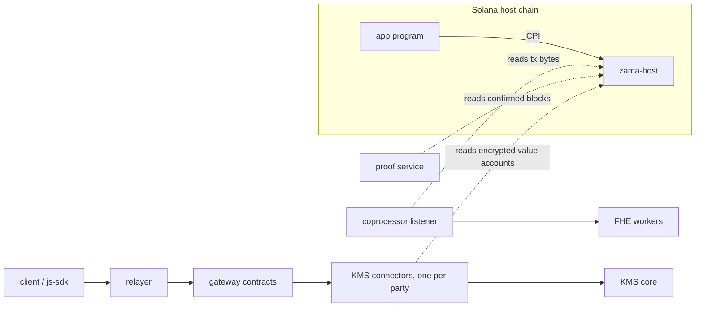

# Solana fhevm (POC)

This workspace ports the Zama fhevm host to Solana. It keeps the EVM fhevm
trust model — the same ACL semantics, input verification, and threshold-KMS
decryption — and re-expresses it in Solana idiom (accounts, PDAs, CPI, signer
propagation) instead of transliterating Solidity.

It is a proof of concept with one production-shaped vertical: encrypt an
input, execute FHE ops as one atomic execution, and decrypt the result publicly or
per-user, end to end against the real coprocessor, gateway, and a threshold
KMS. The final product shape is deliberately not settled here — see
[`docs/FUTURE_DESIGN.md`](docs/FUTURE_DESIGN.md).

Vocabulary in this file and everywhere else follows
[`docs/GLOSSARY.md`](docs/GLOSSARY.md), which is normative. The guarantees the
system makes (and deliberately does not make) are registered in
[`docs/INVARIANTS.md`](docs/INVARIANTS.md).

## Architecture



Solid arrows are calls; dashed arrows are chain reads. The host program never
calls anything off-chain — every off-chain component observes it.

Each component owns exactly one kind of trust decision:

| Component | Where | Decides |
|---|---|---|
| `zama-host` program | `solana/programs/zama-host` | All on-chain authorization: who may execute on which values, input attestations (threshold secp256k1, verified on-chain), public-decrypt certificates + MMR proofs, HCU caps. |
| Coprocessor listener + workers | `coprocessor/fhevm-engine` | Nothing. It reconstructs executions from transaction bytes and schedules FHE compute eagerly; a wrong fork wastes compute but cannot release plaintext (INVARIANTS #31). |
| Proof service | `solana-proof-service/` | Nothing. It serves MMR inclusion proofs; every proof is re-verified against live on-chain peaks by its consumers (INVARIANTS #30). |
| Gateway + relayer | `gateway-contracts/`, `relayer/` | Routing, fees, and request-shape conformance only. User requests are signed; neither can alter who asks or for what (INVARIANTS #42). |
| KMS connector | `kms-connector/` | Decrypt authorization. Each KMS party's connector independently re-verifies the user's ed25519 signature and reads the encrypted value account from the host chain, using the same compiled `zama_solana_acl` code the program runs (INVARIANTS #42, #45). |
| KMS core | `zama-ai/kms` repo | Chain-blind threshold decryption; binds each response to the requester's typed pubkey and encryption key. |

The division worth remembering: the host program is the authorization
authority on-chain, the KMS connectors are the authorization authority for
decryption, and everything else is availability infrastructure that is never
trusted for authorization.

## Design choices that shape everything

- **Instruction data is the reconstruction source.** The ACL lifecycle is
  event-free (DD-033): the listener re-derives every output handle from raw
  transaction bytes with the program's own derivation functions, so replay
  from bytes alone reconstructs full history (INVARIANTS #28, #29).
- **Account-based ACL.** One canonical PDAn encrypted value account per encrypted value
  ID. Handles are stored inside the account and never used as PDA seeds, so
  apps can pre-allocate output accounts before the compute result exists.
- **MMR-sealed history.** Each encrypted value account seals its handle history into an
  append-only MMR; replaced and public handles stay provable forever inside
  a fixed-size account (`docs/MMR_ACL_MVP.md`).
- **The 1,232-byte packet is a design input.** Execution wire data interns
  repeated 32-byte values in a dictionary; the KMS settle transaction requires
  a v0 transaction plus one address lookup table. Both bounds are pinned by
  tests, not assumed.
- **The chain-type high bit.** Solana chain ids set bit 63, which lets 32-byte
  handles ride the shared gateway and coprocessor infrastructure while every
  consumer can branch on chain type where the shapes genuinely differ.
- **Roles are account positions, not `msg.sender`.** An execution names a
  payer, a compute subject (metered, ACL identity), and per-output authority
  signers as distinct accounts; a transaction with three signers is
  unambiguous about which one is "the caller".
- **Eager scheduling, decoupled authorization.** The coprocessor computes on
  confirmed (not finalized) state and never unwinds; safety comes from the
  KMS re-checking the chain at decrypt time (DD-025, DD-034).

The numbered decision log with rationale and status is
[`docs/DESIGN_DECISIONS.md`](docs/DESIGN_DECISIONS.md) — read it before
changing ACL, input verification, decrypt, KMS context, or event transport
behavior. [`docs/EVM_PARITY.md`](docs/EVM_PARITY.md) maps every EVM fhevm
capability to its Solana counterpart.

## Code map

Inside this workspace (`solana/`):

```text
programs/zama-host              Protocol host program: encrypted value accounts, execution
                                (fhe_execute), input attestations, public-decrypt verification,
                                KMS contexts, HCU metering.
programs/confidential-token     App program: minimal confidential-token wrapper (ERC-7984 spirit):
                                wrap, transfer, burn, redeem, disclose. Drives zama-host by CPI.
programs/confidential-batcher   App program (DD-042): aggregates encrypted deposits per batch,
                                reveals only the KMS-certified batch total to the demo vault, pays
                                each user an encrypted proportional cut.
programs/demo-vault             Minimal public share-mint vault the batcher fronts; plain SPL.
crates/zama-fhe                 Program-facing SDK: typed execution builder (`FheExecution`), `Encrypted<T>`, account
                                resolution for fhe_execute.
crates/zama-solana-acl          The shared ACL crate: account layout, decode, MMR verification,
                                authorization functions. Compiled into the program AND the KMS
                                connector, so both sides run identical code.
crates/solana-ed25519-instruction  Ed25519 instruction-sysvar helpers.
runtime-tests                   Fast evaluator contracts plus real-SBF Mollusk suites
                                (docs/TESTING.md explains what each layer proves).
demo-dapp                       The confidential vault demo frontend.
scripts/                        Workspace tooling (scripts/README.md) and live e2e scripts
                                (scripts/e2e) against a local validator + fhevm-cli stack.
geyser                          Yellowstone plugin build helpers for the event stream.
```

The rest of the vertical lives elsewhere in this repository:

```text
coprocessor/fhevm-engine/host-listener   Solana ingestion: solana_adapter.rs (mapping into the
                                         coprocessor schema), solana_reconstruct.rs (handle
                                         re-derivation), solana_grpc_listener.rs (Yellowstone).
solana-proof-service/                    MMR proof ingestion + HTTP service.
gateway-contracts/                       Gateway (EVM) contracts, incl. the typed Solana
                                         decryption entrypoint.
relayer/                                 HTTP relayer: v3 typed Solana requests, chain-aware
                                         validation, fee handling.
kms-connector/                           Per-party decrypt authorization (imports zama_solana_acl).
sdk/js-sdk/src/solana                    Client SDK: encrypt, user/public decrypt, proofs.
test-suite/fhevm/demo                    Demo seeding and orchestration.
```

KMS-side Solana code (request validation, WASM bindings source) lives on
`zama-ai/kms` branch `feature/solana`; the js-sdk vendors its WASM via
`sdk/js-sdk/scripts/regen-tkms-wasm.sh`.

## Build and test

From `solana/`:

```bash
# Verify the production IDL/ABI snapshot, then rebuild the local SBF artifacts
# the Mollusk runtime tests need.
bash scripts/check-zama-host-idl.sh

cargo test --workspace
cargo fmt --check
cargo clippy --workspace --all-targets -- -D warnings
```

If the ZamaHost Anchor IDL changes intentionally, refresh the vendored
listener snapshot with `bash scripts/sync-zama-host-idl.sh`. After an
intentional Mollusk CU change, regenerate baselines with
`bash scripts/update-cost-snapshots.sh`. [`docs/TESTING.md`](docs/TESTING.md)
lists focused commands, what each test layer proves, and build traps.

Live end-to-end run against a local validator (mainnet-safe, validator pinned
to `127.0.0.1:8899`):

```bash
bash scripts/e2e/clean-e2e.sh              # bring up fhevm-cli + Solana side-stack
bash scripts/e2e/full-vertical.sh          # compute -> public-decrypt -> user-decrypt
bash scripts/e2e/adversarial-l4.sh         # negative: relayer-bypass + cert-reuse rejection
```

## Integrating an app

An app program drives compute by CPI into `zama-host`, using
`crates/zama-fhe`:

- Consume a verified external input as a `VerifiedInput` operand of
  `fhe_execute` (the Solana analog of `FHE.fromExternal`): the host
  re-verifies the coprocessor attestation inside the execution and allows the
  input transiently, for that execution only. Bind the attestation to your
  program's compute-authority PDA and check the attested `user_address`
  yourself — the host only enforces that the attestation names your compute
  subject.
- Compose atomic multi-account effects (debit sender + credit receiver) as
  one execution with per-output authority signers, using `FheExecution::build`.
- To receive confidential funds, expose your own instruction that CPIs
  `confidential_transfer` with the user as sole signer (authority propagates
  through the CPI); see `confidential-batcher::join`. There is no
  receiver-callback path — that EVM workaround is unnecessary on Solana.

## Documentation

- [`docs/GLOSSARY.md`](docs/GLOSSARY.md) — normative vocabulary.
- [`docs/INVARIANTS.md`](docs/INVARIANTS.md) — the guarantee register
  (what the system guarantees, then sizes, limits, and how it is run).
- [`docs/DESIGN_DECISIONS.md`](docs/DESIGN_DECISIONS.md) — numbered decisions
  with status and rationale.
- [`docs/EVM_PARITY.md`](docs/EVM_PARITY.md) — EVM capability mapping.
- [`docs/FUTURE_DESIGN.md`](docs/FUTURE_DESIGN.md) — forward requirements and
  open decisions.
- [`docs/TESTING.md`](docs/TESTING.md) / [`docs/TESTING_STRATEGY.md`](docs/TESTING_STRATEGY.md)
  — test layers and evidence.
- Rustdoc in `programs/*` is authoritative for account layouts, roles, PDA
  seeds, and instruction invariants.
