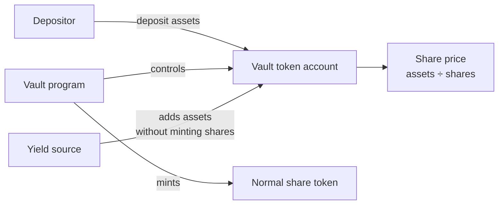
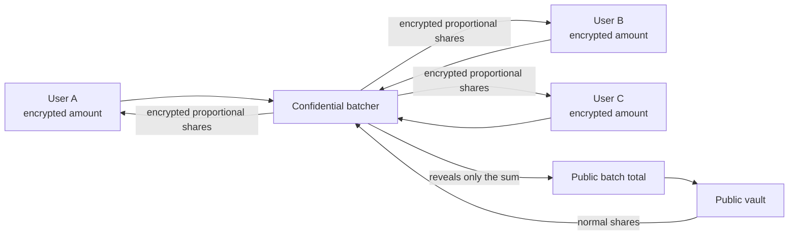
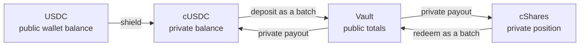
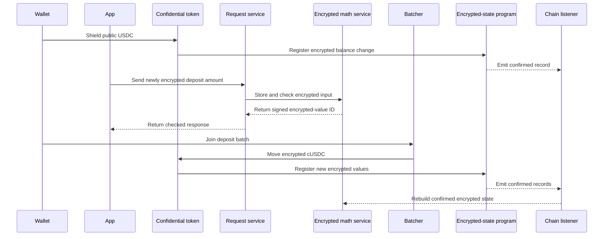
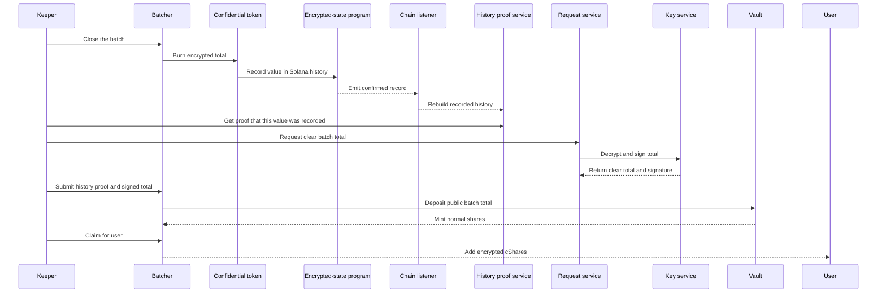

# Solana confidential vault demo

This local demo shows one way to earn yield without publishing private-token balances. The batcher
does not publish each deposit or redemption amount, although surrounding public activity can still
reveal it. The confidential deposit and redemption path runs against real local services. The
chain, assets, keys, timing, and yield source are set up for a demo.

## Run it

Requirements: Docker using Linux containers with at least 4 CPUs and 8 GiB of memory, Bun,
Node/npm, Rust/Cargo, Solana CLI, Anchor, and Foundry.

```sh
git clone --branch feature/solana https://github.com/zama-ai/fhevm.git
cd fhevm
bun run demo:start
```

Open `http://127.0.0.1:5173/`. The built-in wallet works immediately. Phantom or another wallet
that supports Solana Localnet can also connect. The demo gives the wallet fee SOL and test USDC.

```sh
bun run demo:stop
```

The first run downloads and builds the stack. Keep tens of GiB free. Later runs reuse the build
cache. On Apple Silicon, the stack stays on arm64 except for the centralized key service image,
which currently runs under amd64 emulation.

`bun run demo doctor --observability` checks the machine without starting anything. The
[local stack guide](../scripts/demo/README.md) covers status, logs, reseeding, teardown,
Prometheus, and Jaeger.

## Design

### The Solana vault model

The toy vault is not a copy of one protocol. It follows the tokenized-vault shape used by Kamino,
Jupiter Earn, Meteora, and liquid-staking vaults: deposit one asset, receive shares, and burn shares
to withdraw.



The program controls the asset account and share mint. The displayed price tracks `assets ÷ shares`.
Deposits and withdrawals add one extra asset and share to the formula to reduce first-depositor
attacks. Adding assets without minting shares raises the value of every share.

Solana has no widely adopted vault format like Ethereum's standard ERC-4626 vault format. A
small standalone vault was therefore clearer than importing a production vault with strategies,
price feeds, and administrator controls. The batcher calls this exact vault directly. Replacing it
with a vault that uses different accounts or calls requires changes to the batcher's settlement
code.

### The Zama DeFi model

The privacy design comes from Zama's Ethereum vault work: a confidential batcher sits in front of a
public Morpho vault using the standard ERC-4626 format. This demo keeps that split and replaces the
Ethereum mechanics with Solana programs and accounts.



The vault remains public because it must divide assets by shares. The batcher adds user amounts
while they remain encrypted, then reveals only their sum. It does not hide information leaked by
the transactions around the batch. This split avoids dividing one encrypted value by another.

### The three assets



| Asset | Meaning | What others can see |
| --- | --- | --- |
| USDC | Token used as the vault asset | Balance and transfers |
| cUSDC | Encrypted USDC balance | Account and activity, not balance |
| cShares | Encrypted vault position | Account and activity, not balance |

## User flow

### Connect

The app connects a wallet, supplies missing fee SOL and test USDC, then reads any existing position
from Solana. An external wallet keeps its key and approves its own requests.

### Deposit from USDC or cUSDC

The app keeps the 2 sources separate:

- **Deposit USDC** first shields public USDC, then deposits the resulting cUSDC. This takes
  2 wallet transactions.
- **Deposit cUSDC** asks for one message signature if the balance is hidden, then joins the batch
  directly in 1 wallet transaction.

Shielding and joining use different programs, checks, and proof data. The app gives each transaction
a high work allowance; that allowance is not measured use. Combining both actions has not been
proven to fit reliably. If a USDC deposit's second transaction fails, the user still owns the cUSDC
created by the first.

The 2-transaction USDC path is:



Solana stores the current encrypted-value ID, who may use it, which app it belongs to, and its
place in recorded history. The larger encrypted data stays with the encrypted math service.

### Settle and receive cShares

The local automation service, called the keeper, performs the remaining work. These actions do not
need the user's wallet.



Solana checks both the history proof and the key service's signed result before settlement. Anyone
may close, settle, or claim a ready batch. A claim can only credit the confidential token account
derived for that user.

The public batch total is intentional. A one-person batch reveals that person's amount. The USDC
deposit path shields and deposits the same amount back-to-back from one wallet, so an observer can
often link them. Shielding earlier, keeping cUSDC, and waiting between actions reduce that link.

### Reveal a balance

The wallet signs a decryption request for this reveal, not a transaction. The request service
checks the signature and the account's access rules. The key service decrypts the current value.
The clear balance stays in page memory until it is hidden or the page reloads; it is not saved.

### Redeem

The user chooses a percentage and presses **Redeem**. The app briefly decrypts the cShare balance,
encrypts the chosen amount, and joins the redeem batch. The vault burns the batch's normal shares,
returns public USDC, and each user receives private cUSDC.

Deposit and redeem use separate batches, so a pending deposit does not block an exit.

### Demo yield

**Fast-forward 1 year** gives the vault assets equal to 7% of its current assets without minting
shares. This raises the share price. It is a local demo control, can be repeated, and is independent
from redemption.

## Decisions and assumptions

| Choice | Reason |
| --- | --- |
| Public vault, private batcher | Keeps normal vault pricing and avoids costly encrypted division |
| Public batch totals | Lets an ordinary Solana vault accept the batch while individual balances stay encrypted |
| Separate deposit and redeem batches | Entries never delay exits |
| Separate USDC and cUSDC deposit sources | Users with cUSDC can deposit directly without shielding again |
| Separate shield and deposit transactions | Clear failure recovery; a combined transaction has not been shown to fit |
| Automatic keeper and claims | A claim can only add funds to that user's fixed confidential account; it cannot debit or redirect them |
| No minimum batch size | One actor could fake many participants; the demo states the privacy limit instead |
| Share value rises instead of token balances growing | Matches common Solana vault behavior |
| Centralized key service | Exercises the real request path with one local key holder; production should spread trust across several |

The demo assumes:

- local test keys and test assets have no value;
- the key service, request service, encrypted math service, and history proof service are available;
- the host's blocked-address grant list and per-user accounting for encrypted work are disabled;
  ordinary transaction and service limits still apply;
- yield is a donation chosen by the demo, not income from a real strategy;
- addresses, participation, transaction timing, vault totals, share price, and batch totals are
  public;
- the on-chain program lets a user leave a pending batch, but this app does not expose that action;
- there is no timeout exit after the batch has been closed;
- one authorized signer is trusted to approve encrypted inputs sent by the browser;
- the encrypted math worker is trusted to compute and store the encrypted results required by the
  operations recorded on Solana;
- the centralized key service is trusted to keep values private and sign correct clear results.

On-chain signature checks prove that an authorized service signed a result. They do not prove that a
compromised authorized service behaved honestly.

## Risks and defenses

| Risk | Current treatment |
| --- | --- |
| One user in a batch | The total reveals that user's amount; useful privacy requires independent users |
| Known deposits are subtracted from a batch total | No minimum-participant privacy claim is made |
| A shield is linked to the deposit that follows it | The demo states the link; production can shield earlier, keep cUSDC, and separate the actions in time |
| Fake participants defeat a minimum-size rule | No minimum-size rule |
| First depositor tries to profit from a donation | The price starts with one extra asset and share; extraction is costly, but a large donation can still block deposits |
| Tokens are sent directly into batch or payout accounts | Each batch has its own accounts; settlement counts only the vault call's change |
| A keeper stops | Anyone can close, settle, or claim; the program supports leaving a pending batch, but the demo UI does not |
| Key or proof services stop after a batch closes | Settlement waits; the demo has no timeout recovery after closing |
| Rounding distributes too much | Deposit, redeem, and per-user payout calculations round down |
| A tiny deposit rounds to zero shares at a very high share price | The vault rejects it; recovery of an already closed batch is not implemented |
| A demo control is exposed | Controls listen only locally and require the current run's token |
| The centralized key service is compromised | It can expose values and sign accepted results; production should spread the key across several holders |
| The input signer is compromised | It can approve invalid encrypted inputs; production should require several independent signers |
| The encrypted math worker is compromised | It can corrupt or withhold encrypted results, but cannot change operations or result IDs recorded on Solana |
| A wallet or browser is compromised | The attacker can act as that user; the protocol cannot protect a stolen signing key |

## What is real

No component in the confidential deposit and redemption path is mocked or skipped.

| Real in this demo | Demo setting |
| --- | --- |
| Solana transactions; vault, batcher, token, and host programs | Local validator, test USDC, and toy vault |
| Encrypted inputs, balances, math, and stored encrypted data | Test keys and local workers |
| Chain listener and confirmed-state reconstruction | Local event stream |
| History proof generation and Solana verification | Short local history |
| Request service, decryption worker, key service, and signed results | One centralized key service |
| Wallet signing and authorized balance reveals | Built-in or external wallet; one signature per reveal |
| Closing, settlement, and claims | Local keeper |
| Metrics and traces | Local Prometheus and Jaeger |

Yield is different: the demo faucet mints test USDC and a demo-only vault instruction donates it.
This proves share-price accounting, not a connection to a real yield strategy.

Expand **Developer evidence** in the app to copy transaction signatures, compute use,
encrypted-value accounts, and encrypted-value IDs. The local explorer shows each transaction. An
encrypted-value ID can be searched in Jaeger for decryption-job intake, checks, key-service
requests, polling, and result forwarding. It does not trace the key service internals, request
service, encrypted computation, or native chain listener. Prometheus shows decryption-job
measurements, including latency.
