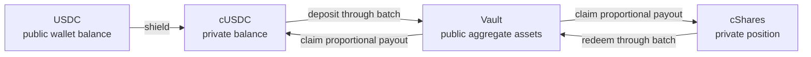

# Solana confidential vault demo

This localnet dApp shows the complete confidential-vault lifecycle with real Solana programs,
encrypted state, coprocessor execution, centralized KMS decryption, and on-chain verification.

## Start from a clean clone

The demo is source-first: the start command obtains the pinned images, builds the local source
components, deploys the Solana programs, seeds the world, and serves the dApp.

```sh
git clone --branch feature/solana https://github.com/zama-ai/fhevm.git
cd fhevm
bun run demo:start
```

Open `http://127.0.0.1:5173/`. Choose the built-in demo wallet for immediate testing, or connect a
Wallet Standard wallet configured for Solana Localnet. Fee SOL and mock USDC are funded
automatically.

In another terminal, stop only the stack owned by this demo:

```sh
bun run demo:stop
```

The preflight reports missing dependencies before changing local state. It requires Docker in
Linux-container mode with at least 4 CPUs and 8 GiB of memory, plus Bun, Node/npm, Rust/Cargo,
Solana CLI, Anchor, and Foundry. The first run downloads images and builds the Solana programs and
local services, so plan for tens of GiB of free disk; later runs reuse those caches. On Apple
Silicon, only the centralized `kms-core` image runs under amd64 emulation because its pinned image
has no arm64 manifest. The rest of the stack remains native arm64.

Before starting a stack, use `bun run demo doctor --observability` for a read-only preflight. It
reports conflicting occupied ports unless they belong to the current healthy demo. See the
[lifecycle reference](../scripts/demo/README.md) for status, logs, reseeding, collision protection,
and observability commands.

## The three assets

The dApp keeps three balances distinct:

| Asset | Meaning | Visibility |
| --- | --- | --- |
| USDC | Public SPL-style wallet balance used as vault collateral | Public |
| cUSDC | Confidential token wrapping USDC | Encrypted; user can reveal |
| cShares | Confidential receipt for the user's vault position | Encrypted; user can reveal |



The wallet inventory is current state. **Latest activity** retains the latest deposit lifecycle;
the latest redemption is shown separately. Completing, repeating, or reversing an action does not
change the meaning of the wallet inventory.

## End-to-end actions

### Connect

The browser selects a signer, loads the seeded localnet configuration, funds missing SOL and mock
USDC through the loopback-only faucet, and recovers any pending deposit or redemption from on-chain
accounts. The burner key is served only by the local demo backend. An external wallet signs its own
requests.

### Shield and deposit

The current implementation uses two independently recoverable transactions with different
authorization and proof boundaries. Shield requests a ceiling of 1.2M compute units and join
requests 800k; those ceilings are not measured consumption, and combining both paths within one
transaction has not been established.

```mermaid
sequenceDiagram
    participant User as Wallet
    participant App as Browser + SDK
    participant Relayer
    participant Copro as Coprocessor
    participant Token as Confidential token program
    participant Host as Zama host
    participant Batch as Confidential batcher
    participant Listener as Solana listener

    User->>App: Shield & deposit amount
    App->>Token: Tx 1: wrap public USDC
    Token-->>User: Debit USDC; update encrypted cUSDC balance
    Token->>Host: Register encrypted evaluations
    Host-->>Listener: Emit reconstructable state events
    Listener-->>Copro: Reconstruct confirmed encrypted state
    App->>App: Encrypt join amount
    App->>Relayer: Submit input proof
    Relayer->>Copro: Persist and attest input ciphertext
    Copro-->>Relayer: Attested ciphertext handles
    Relayer-->>App: Validated input-proof response
    App->>Batch: Tx 2: join with confidential transfer
    Batch->>Token: Move encrypted cUSDC into the batch
    Token->>Host: Register encrypted evaluations
    Host-->>Listener: Emit pending joined-value work
    Listener-->>Copro: Reconstruct confirmed encrypted state
```

The shield amount is public because the public USDC transfer is public. The join amount is a fresh
encrypted `uint64`. On chain, an encrypted-value PDA stores the current handle, ACL domain and
subjects, application binding, label, and MMR state—not the large ciphertext or its derived value
key. The listener reconstructs confirmed events; the coprocessor persists the ciphertext and
evaluates the encrypted state transition.

### Automatic settlement and cShare claim

The local keeper advances a full batch without asking the user to operate infrastructure:

```mermaid
sequenceDiagram
    participant Keeper
    participant Batch as Confidential batcher
    participant Token as Confidential token program
    participant Host as Zama host
    participant Yellowstone as Yellowstone listener
    participant Proof as Solana proof service
    participant Relayer
    participant KMS as Centralized KMS
    participant Vault

    Keeper->>Batch: Dispatch batch
    Batch->>Token: Burn encrypted aggregate to a born-public handle
    Token->>Host: Bind handle and append public-decrypt MMR leaf
    Host-->>Yellowstone: Emit confirmed host events
    Yellowstone-->>Proof: Reconstruct MMR state
    Keeper->>Proof: Resolve MMR inclusion proof
    Keeper->>Relayer: Request certificate bound to handle and MMR state
    Relayer->>KMS: Decrypt aggregate
    KMS-->>Relayer: Clear aggregate + signature
    Keeper->>Batch: Settle with proof and KMS certificate
    Batch->>Vault: Deposit public aggregate; receive public shares
    Keeper->>Batch: Permissionless claim for user
    Batch-->>Batch: Encrypted proportional payout
    Batch-->>User: cShares added to confidential balance
```

Settlement intentionally makes the aggregate batch total public. The settle transaction verifies
both the historical MMR inclusion proof and the KMS certificate on Solana. Claim is a sponsored,
permissionless transaction: it can only credit the payout token account derived for that user, so
the user does not need to sign it.

### Reveal a private balance

Reveal reads the encrypted-value PDA's current handle and requests user decryption through the SDK.
The wallet signs an exact off-chain authorization message; it does not sign a transaction. The
relayer checks authorization and ACL context, the centralized KMS decrypts the ciphertext, and only
that browser displays the clear value. The clear balance is not stored by the dApp.

### Accrue demo yield

**Fast-forward 1 year** is an explicit local demo control, not a user vault action. The faucet mints
the configured 7% illustrative yield to the keeper, which donates it to the vault and increases the
public share price. It is repeatable and independent from redemption.

### Redeem

The browser reveals the current cShare balance for calculation, encrypts the selected percentage,
then submits one confidential batch join. The same dispatch, MMR proof, KMS certificate, on-chain
settlement, and permissionless claim path runs in reverse. The public vault returns aggregate USDC;
the user's proportional payout arrives as private cUSDC. Redemption does not require yield to have
been fast-forwarded.

## What is real, and what is demo-only?

| Real protocol behavior | Local demo convenience |
| --- | --- |
| Solana transactions and program execution | Local validator and mock USDC |
| Encrypted inputs, handles, PDAs, ACL checks, and coprocessor evaluation | One seeded vault and short batches |
| Public-decrypt MMR proof and KMS certificate verified on chain | Centralized KMS instead of threshold KMS |
| User-authorized KMS decryption | Automatic faucet, keeper, settlement, and claims |
| Confidential cUSDC and cShare balances | Fast-forward yield control |

A one-user batch demonstrates confidentiality of state, not an anonymity set: its published
aggregate can reveal that user's joined amount.

For evidence, expand **Developer evidence** in the dApp. It exposes copyable transaction
signatures, compute use, encrypted-value accounts, and ciphertext handles. Explorer links inspect
the exact localnet transactions. A copied handle can be matched to connector traces in Jaeger, and
Prometheus exposes connector decryption latency. The lifecycle reference documents the precise
filters and the limits of those measurements.
